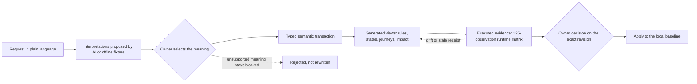
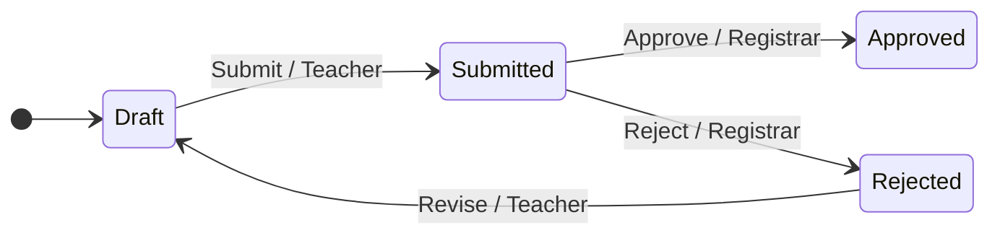
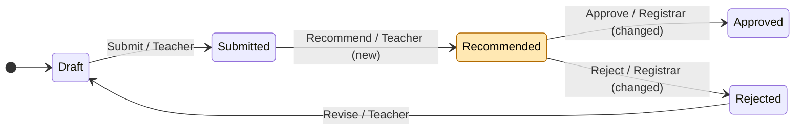
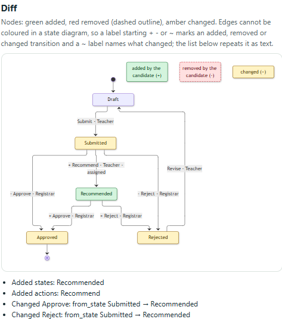

<p align="center">
  
</p>

# EIJA Studio

**Review the meaning of a change, not every generated line.**

EIJA (Executable Intent and Journey Assurance) is an open-source assurance kernel. An agent proposes a change to a model of your business rules; the kernel turns it into a typed transaction, regenerates the views, exercises the result and records evidence; a human owner decides. *AI proposes. The kernel checks. The local owner decides.*

[](LICENSE)
[](pyproject.toml)
[](docs/TECHNICAL_LEAD_REVIEW.md)
[-lightgrey.svg)](docs/adr/0017-local-quality-gates.md)

Local gate, stated as text so it cannot go stale silently: <!-- GATE-STATUS -->2026-09-29, Windows 11, Python 3.12.10, `main` at `ddc43b9`: `pytest` 95 passed; with the oss lane, `nox -t full` passed (111 tests plus the docs gates). The owner-only release fixture check does not pass on `main` (see the quickstart).<!-- /GATE-STATUS --> Reproduce it yourself with `nox -t full`; there is no hosted CI to trust instead of your own run. Hosted CI is unavailable for this repository ([ADR-0017](docs/adr/0017-local-quality-gates.md)).

> **Scope, stated up front.** EIJA v0.2 is a bounded local proof of concept. The one supported domain is a synthetic school-excursion approval workflow. It is a semantic compiler for that class of state-machine rules, not a universal code reviewer, theorem prover or application generator. What is finished, in progress and planned is listed in the [roadmap](docs/ROADMAP.md).

## The problem

Agents write code faster than people can read it. A reviewer who is handed a 900-line generated diff has to reconstruct what business rule changed, who now has authority to do what, and what else depends on it, before they can say yes. Most reviews cannot afford that, so they approve on a green check and a plausible summary. The characteristic failure is not a syntax error; it is a silent change of meaning: an approval step that quietly lost a prerequisite, a role that gained a power.

## Why use it

| You get | How |
|---|---|
| **Review the change to the model, not the diff.** | A change is a typed `SemanticTransaction` over a `Workflow`. The rule table, state diagram and journey text are all derived from the same executable transitions, so they cannot disagree. |
| **See the ripple.** | A fixed-point impact closure (`domain/impact.py`) lists the states, actions, roles and effects a change reaches. The visual before/after diff is in progress (see below). |
| **Agents cannot approve their own work.** | Provider output is an untrusted proposal. There is no approve or apply port for providers, authority is re-checked at commit time, and selecting a meaning, approving and applying are three separate owner actions. |
| **Evidence you can recompute.** | A receipt keeps its raw observations, and eligibility is recomputed from them; a green label on a receipt is not trusted. Human understanding stays `UNKNOWN` until a human answers. |
| **Local and open.** | Loopback-only server, SQLite, no telemetry, Apache-2.0. Live model calls need explicit flags and per-request consent. |

## The loop



Only the two diamonds are human. The kernel rejects a candidate that changes protected authority, and it does not silently rewrite an unsupported meaning into a supported one.

## A visual example, generated from the real model

The excursion workflow before and after the owner selects the `recommend_only` meaning of "Let teachers sign off excursions." Teachers get a *recommend* step; the registrar keeps final approval and rejection.

<!-- BEGIN GENERATED: excursion-diff (scripts/gen_readme_diagram.py; do not edit by hand) -->
**Before**: the baseline workflow (`domain.policy.baseline()`).



**After**: the `recommend_only` candidate (`apply_transaction(baseline, enable_recommendation)`). The amber state is new; edge labels say `(new)` or `(changed)`.



What the kernel says changed (computed by diffing the two typed models, not written by hand):

- new state `Recommended`
- added `TR-RECOMMEND` Teacher: Submitted -> Recommended
- changed `TR-APPROVE` from_state: Submitted -> Recommended
- changed `TR-REJECT` from_state: Submitted -> Recommended

`check_policy(baseline)` -> `[]`. `check_policy(candidate)` -> `[]`. A candidate that lets a Teacher approve is rejected: `check_policy(unsafe)` -> `['PROTECTED_AUTHORITY:Approve']`.

<!-- TODO(visual lane): when docs/assets/visual-diff.png exists on main, add  here and drop this block. -->
<!-- END GENERATED: excursion-diff -->

The block above is not hand-drawn: `python scripts/gen_readme_diagram.py --check` (nox session `readme_diagram`) fails if it differs from what `domain.policy` produces today. It shows structure only. It does not show human understanding, and it is not a proof.

## 60-second quickstart

Requires Python 3.11 or later and git. No Node or frontend build. Installation downloads Python packages, so the first install is not air-gapped.

macOS or Linux:

```bash
git clone https://github.com/45ck/eija-studio.git && cd eija-studio
python3 -m venv .venv && source .venv/bin/activate
python -m pip install -e '.[dev]'
eija doctor
eija serve --open
```

Windows (PowerShell):

```powershell
git clone https://github.com/45ck/eija-studio.git; cd eija-studio
py -3 -m venv .venv
.\.venv\Scripts\Activate.ps1
python -m pip install -e ".[dev]"
eija doctor
eija serve --open
```

Open the private launch URL that `eija serve` prints (keep the `#fragment`; it is the session capability, do not share it). Create a case with the default request, generate interpretations with the offline fixture, select **recommendation only**, and preview the candidate under **Try**.

Without a browser:

```bash
eija compile examples/excursion-candidate.json --out output/compiled   # model, projections, impact
python -m pytest -q                                                     # 95 passed on main on the date above
```

> **Known state of `main`.** The verification and apply gates check that the running source matches an owner-stamped release fixture. Kernel changes merged after v0.2.0 (for example the Windows durability fix) mean the fixture does not match, so `eija doctor` reports `release_fixture_matches: false` and `eija demo`, `--verify` and the Studio's Verify button return `SOURCE_REVIEW_REQUIRED`. That is by design and only the maintainer can re-stamp the fixture; agents never do. Everything else above works. Full detail, provider setup (OpenRouter, Codex) and the verification commands are in [docs/getting-started.md](docs/getting-started.md).

## Use it from your agent

What works **today, on `main`**: any agent that can read [`AGENTS.md`](AGENTS.md) and run shell commands can drive the CLI, and the repository ships a skill file at [`.agents/skills/eija-studio/SKILL.md`](.agents/skills/eija-studio/SKILL.md). For example, paste this into your agent:

```text
Read AGENTS.md. Run: eija compile examples/excursion-candidate.json --out output/compiled
Summarise policy_errors, projections and impact from output/compiled/compiled.json.
Do not approve, apply, read receipt.key or fabricate review answers.
```

What is **in progress, not on `main`** (statuses as of 2026-09-29; see the [roadmap](docs/ROADMAP.md)):

| Agent | As proposer (agent suggests interpretations) | Over MCP (agent inspects and verifies) |
|---|---|---|
| Codex | offline/OpenRouter/Codex on `main`; multi-CLI adapter suite in open PR #4 | in open PR #8 |
| Claude Code | open PR #4 | open PR #8 |
| OpenCode | open PR #4 | open PR #8 |
| Gemini CLI | open PR #4 | open PR #8 |

The MCP server is designed so an agent can read, compile and verify but never approve or apply. One-minute setup for each agent will be in [docs/agents/quickstart.md](docs/agents/quickstart.md) when the agents lane merges. Until then there is no MCP server in this repository, and this README will not claim one.

## Why you can trust it

"What you see matches the code" is the guarantee we are building toward. This table separates what is on `main` from what is not. Statuses as of 2026-09-29.

| Claim | Mechanism | Status |
|---|---|---|
| Views match the model | Rules, state cards and journey text are `projections(model)`; nothing is written by AI or by hand | on `main` |
| Diagrams match the model | Mermaid, PlantUML and DOT generated from the typed `Workflow`, plus a visual before/after diff ([ADR-0019](docs/adr/0019-diagrams-generated-from-executable-model.md)); the README example above already comes from `domain.policy` | generators in open PR #6; README example on `main` |
| Receipts are computed, not asserted | `assess_receipt` recomputes claim, subject, observations and coverage from raw data; an HMAC seal gives local integrity, not external certification | on `main` |
| Authority cannot be replayed or borrowed | Current-authority check before operation replay, CAS versions, audit and outbox in the same transaction; providers have no approve or apply port | on `main` |
| One-step behaviour of the candidate | 5 actors x states x 5 actions runtime matrix against the real runtime (125 observations). The oracle is same-author | on `main` |
| Implementation identity | Source must match an owner-stamped fixture before verify or apply | on `main` (currently mismatched; owner re-stamp pending) |
| Local gates | `nox -t fast`, `-t full`, `-t release` ([ADR-0017](docs/adr/0017-local-quality-gates.md)); linting, typing and architecture contracts in open PR #3 | tests and docs gates on `main` |
| Machine-checked laws over all action sequences | Bend 2 laws generated from the model ([ADR-0018](docs/adr/0018-formal-vv-portfolio.md)); evidence kind `bend_proof` | planned |
| Safety invariants over the workflow and commit protocol | TLA+ with TLC, up to declared bounds; `tlc_model_check` | planned |
| Policy soundness across the transaction grammar | Z3 SMT proof; bounded exhaustive runtime search | branch `lane/smt-bmc` pushed, no PR |
| Runtime agrees with an independent reference model | Hypothesis stateful tests; `property_test` | planned |
| The tests can detect faults | Mutation analysis; `mutation_score` measures detection power, not correctness | planned |

Each technique is a distinct kind of evidence and none may be relabelled as another. A proof about a model is not a proof about the Python runtime; conformance between them is a separate claim. Hashes show integrity, not truth. Read the limits in [Security and trust](docs/SECURITY_AND_TRUST.md).

## How it compares

EIJA is a complement to these, not a replacement, and its scope today is much narrower than all of them.

| Approach | Strong at | Gap when agents write most of the change | Relationship to EIJA |
|---|---|---|---|
| Plain code review | Design judgment, spotting a wrong idea, teaching | Reviewer must reconstruct the changed meaning from lines; cost grows with generation volume | EIJA reviews the meaning of a change in the modelled domain; code review still covers everything outside it |
| AI review bots on PRs | Fast, broad, good at bugs and style | Probabilistic, often the same kind of system that wrote the code, no separation of authority, no recomputable evidence | EIJA treats AI output as an untrusted proposal that cannot approve |
| TLA+ (or another model checker) alone | Exhaustive checking of a hand-written specification | The specification can drift from the code; needs expertise to write and read | Planned: generate the TLA+ from the executable model and replay traces against the runtime |
| Specification documents and ADRs | Recording rationale and intent | Prose is not executable and drifts; nothing fails when it is wrong | Keep ADRs for *why*; the executable model is the source for *what* |

## Built on open source

EIJA adopts mature open source and writes only EIJA-specific generators, adapters and glue ([ADR-0016](docs/adr/0016-oss-first-adapters-not-engines.md)): FastAPI, Uvicorn, Pydantic, httpx, SQLite, pytest, nox and MADR today, MkDocs Material for the docs site, and Mermaid, PlantUML, Graphviz, Bend, TLA+, Z3, Hypothesis and others as the lanes land. Every tool adopted and every custom module is in the [OSS register](docs/oss/REGISTER.md), with the alternatives checked and the replacement path.

## Architecture decisions

Decisions follow [MADR](https://adr.github.io/madr/) and are never rewritten, only superseded. The index, including reserved number blocks for every lane, is [docs/adr/README.md](docs/adr/README.md).

| ADR | Decision | Status |
|---|---|---|
| [0000](docs/adr/0000-poc-decision-log.md) | v0.2 POC decision log (modular monolith, frozen vocabulary, AI proposal-only, SQLite unit of work, computed evidence, single local owner) | accepted |
| [0015](docs/adr/0015-open-source-under-apache-2.md) | Publish as open source under Apache-2.0 | accepted |
| [0016](docs/adr/0016-oss-first-adapters-not-engines.md) | OSS first: build adapters, not engines | accepted |
| [0017](docs/adr/0017-local-quality-gates.md) | Local quality gates: nox sessions and noslop enforcement | accepted |
| [0018](docs/adr/0018-formal-vv-portfolio.md) | Formal V&V portfolio: each technique is a distinct evidence kind | proposed |
| [0019](docs/adr/0019-diagrams-generated-from-executable-model.md) | Diagrams are generated projections of the executable model | proposed |
| [0020](docs/adr/0020-multi-provider-agent-adapters.md) | Proposal providers: Codex, Claude Code, OpenCode, Gemini CLI, OpenRouter | proposed |
| [0043](docs/adr/0043-readme-truthfulness-and-docs-site.md) | The README is verifiable: generated diagrams, dated status, MkDocs Material docs site | proposed |

ADRs from lanes that have not merged yet appear in the index when they do.

## Where to go next

| Purpose | Entry point |
|---|---|
| Install, run, provider setup, verification commands | [docs/getting-started.md](docs/getting-started.md) |
| Engineering decisions and readiness | [docs/TECHNICAL_LEAD_REVIEW.md](docs/TECHNICAL_LEAD_REVIEW.md) |
| Domain boundaries, ubiquitous language, contracts | [docs/architecture/ARCHITECTURE.md](docs/architecture/ARCHITECTURE.md), [`contracts/`](contracts/) |
| Risks and trust assumptions | [docs/SECURITY_AND_TRUST.md](docs/SECURITY_AND_TRUST.md) |
| Reproduce measured results | [docs/verification/VERIFICATION.md](docs/verification/VERIFICATION.md), [`evidence/`](evidence/) |
| Operate, back up, upgrade | [docs/OPERATIONS.md](docs/OPERATIONS.md) |
| Roadmap and lane status | [docs/ROADMAP.md](docs/ROADMAP.md) |
| Hand off to an agent | [AGENTS.md](AGENTS.md) |

Build the docs site locally with `python -m pip install -e ".[docs]"` and `mkdocs serve`. It is not deployed anywhere.

## Contributing, security, community

Read [CONTRIBUTING.md](CONTRIBUTING.md) (lanes, gate tiers, OSS-first, ADRs, evidence honesty). Report vulnerabilities privately as described in [SECURITY.md](SECURITY.md). Participation is governed by the [Code of Conduct](CODE_OF_CONDUCT.md). To cite this software, see [CITATION.cff](CITATION.cff). Changes are recorded in [CHANGELOG.md](CHANGELOG.md).

## License

Apache License 2.0; see [LICENSE](LICENSE) and [NOTICE.md](NOTICE.md). This does not relicense the original research packs, which remain separate archival material.
