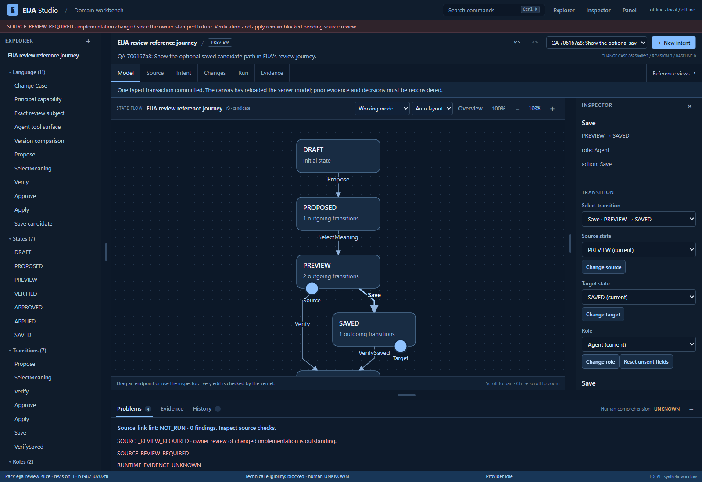

# EIJA Studio

**Review the meaning of a change, not every generated line.**

EIJA (Executable Intent and Journey Assurance) is an open-source code/model workbench under development for **UML-literate engineers who build with AI**. Its purpose is to let engineers inspect the concepts, rules and consequences behind an agent's changes, follow those concepts into actual source, and judge evidence without reconstructing every generated line. A deterministic assurance kernel checks supported model edits; the local owner selects meaning and decides. **AI proposes. The kernel checks. The local owner decides.**

## Two outcome goals

1. **A complete, polished IDE experience that makes a world-class WOW demo possible.** Build a coherent, non-linear workbench with an explorer, model editors, source navigation, agent changes, review, evidence, history, keyboard control and clear feedback. Engineers should be able to move freely through the supported workflow, understand what changes and recover safely. Walkthroughs and showcase clips must come from that usable product, not a thin happy-path presentation. The four flagship scenes remain the demonstration roadmap; unfinished capabilities stay labeled as planned.
2. **A reproducible GitHub POC and POF.** Demonstrate the supported IDE experience end-to-end (**proof of concept**) and let another engineer clone, launch, use it and replay its scoped evidence (**proof of feasibility**). Publish clear setup, supported coverage, actual UX and test results, limitations, license/OSS records and demo artifacts together when that product experience is ready.

**Delivery order:** finish the coherent EIJA self-dogfood IDE, exercise normal use and recovery paths, meet the visual and interaction quality bar, then produce the GitHub package and videos from retained runs. A wizard, attractive shell or isolated passing demonstration does not close this goal. The supported semantics remain explicit; a full IDE experience does not mean a universal solver or unmeasured superiority. Current status is **in development; the full IDE experience and both outcome goals remain unconfirmed**. This documentation update publishes the goals and acceptance contract; it does not deliver the IDE implementation or a completed POC/POF release. The [mission and readiness criteria](docs/engineering/MISSION.md) govern these goals; the [run record](docs/engineering/SELF-DOGFOOD-ACCEPTANCE.md#run-record) supplies execution evidence.

**Build on OSS.** Reuse maintained frameworks, parsers, diagram tooling and verification engines. EIJA adds domain contracts, adapters and generators; record adoption decisions before building a replacement engine. Use one coordinated integration path with a named writer for each file and a visible milestone/evidence ledger. [OSS register](docs/oss/REGISTER.md)

The first acceptance target is **EIJA's own checkout**. External applications come after this self-dogfood flow works. Repository intake, structural extraction, behavior bindings and verified properties are separate coverage levels; accepting a codebase does not imply that EIJA understands or verifies all of it. This is an engineering preview, with no measured claim of superior V&V or reduced human comprehension burden.

[IDE design reference](docs/design/README.md): a generated visual quality target, explicitly labeled as a concept rather than a screenshot or execution evidence. Showcase recordings will use the real application.

## Recorded integration preview

**Latest workspace checkpoint (3 October):** the [Run and Evidence review](docs/design/2026-10-03-RUN-EVIDENCE-REVIEW.md) records truthful runtime outcomes, a subject-bound evidence ledger and clearer workspace actions, with separate browser observations for runtime, model/source review and Rules. A [recorded Run commit and refusal](https://raw.githubusercontent.com/45ck/eija-studio/0957269149e0270d60881633318404009128376c/pr/29/run-commit-refusal-20261003.gif) shows the current working behavior. HCI still fails density and the modeled task-time budget; the complete ten-surface UX, supported IDE and GitHub POC/POF remain open. The implementation checkpoint is **e80efabded0e2b311254ec5efff2f74cc2e54786**; this docs-only update does not add that code to main. The [earlier Rules record](docs/design/2026-10-03-RULES-REVIEW.md) retains its immutable observations.

**3 October checkpoint:** the [code/model review observations](docs/design/2026-10-03-CODE-REVIEW-VALIDATION.md) and [historical navigation proof](docs/demos/2026-10-03-NAVIGATION-RECOVERY-PROOF.md) record the new review capabilities, exact evidence subjects and remaining acceptance work. The corresponding implementation is pinned at [`1f1b07f64889`](https://github.com/45ck/eija-studio/tree/1f1b07f648890d8e03f81d4269fa479d80a0f46a). This docs-only update does not add that implementation to main or declare the full IDE/POC/POF goals complete.

The [2 October preview and reproduction record](docs/demos/2026-10-02-IDE-PREVIEW.md) shows the working source-connected model IDE from a fresh GitHub checkout: semantic before/after review, captured source, checked model edits, history and recovery. It includes actual screenshots, an unedited browser recording and the exact tested revision. The implementation remains in [draft PR #29](https://github.com/45ck/eija-studio/pull/29); this documentation does not merge that code onto main.



At the 2 October checkpoint, fresh Windows installation, real CLI startup and 20 recorded browser checks passed within that preview's declared scope. Full IDE acceptance remains open: the HCI density budget fails, source review is required, and human comprehension and live-provider usefulness are unmeasured. The generated design concepts above describe the target; the linked recording shows the actual product.

## Available code and work in progress

At the documentation baseline (`8712d6c`, 2 October 2026), main contains the local synthetic excursion workflow, typed semantic transactions, generated views, runtime evidence, browser/CLI surfaces and an agent MCP interface. These are foundations. The v0.2 instructions and retained verification records below describe their earlier scope; this documentation change has not revalidated their historical results.

The **source-connected self-dogfood IDE is in development and is not delivered by this documentation PR**. Its acceptance target is a configured, read-only connection to EIJA's own checkout, supported tracked Python and annotated UI structure, a domain explorer, server-checked model editors, source/impact navigation, agent-change review, evidence and history. Planned agent additions include read-only pack context, affordances, edit checks and repository impact. They must be implemented, integrated and exercised before being advertised as available on main.

The [self-dogfood acceptance contract](docs/engineering/SELF-DOGFOOD-ACCEPTANCE.md) defines engineering and UX observations. Its [run record](docs/engineering/SELF-DOGFOOD-ACCEPTANCE.md#run-record) is **PENDING**. An initial model edit changes the supported candidate; it does not rewrite the connected repository. `SOURCE_REVIEW_REQUIRED` must remain visible until the maintainer legitimately reviews changed implementation. Live model validation and the engineer study are **NOT_RUN** for this milestone.

Read the [product thesis](docs/engineering/PRODUCT-THESIS.md), [current alternatives](docs/research/2026-10-02-current-alternatives.md) and [V&V protocol](docs/research/2026-10-02-vv-protocol.md) for the rationale and evaluation plan. Existing products already offer substantial specification, modeling and guided-review capabilities; EIJA's novelty and superiority are unproven.

## Existing local kernel: v0.2 reference

The sections below retain the existing runnable kernel instructions and their historical limitations. They are useful for inspecting the foundations, but their earlier results do not establish the new IDE's readiness. Use the current acceptance/run record above for the new product milestone.

## Start here

| Purpose | Entry point |
|---|---|
| Run it | Instructions below; `start.sh` or `start.ps1` |
| Understand engineering decisions and readiness | `docs/TECHNICAL_LEAD_REVIEW.md` |
| Inspect domain boundaries and contracts | `docs/architecture/ARCHITECTURE.md`, `contracts/` |
| Review risks and trust assumptions | `docs/SECURITY_AND_TRUST.md` |
| Reproduce measured results | `docs/verification/VERIFICATION.md`, `evidence/` |
| Audit source continuity | `provenance/PROVENANCE.md`, `provenance/source-inputs.json` |
| Hand off to an agent | `AGENTS.md`, `.agents/skills/eija-studio/SKILL.md` |

## Install

Requires Python **3.11 or later**. This release was exercised on **Linux/Python 3.13.5**; the other supported-intent platforms are not yet validated. No Node/frontend build is required. Runtime dependencies install from Python package indexes; dependencies are **not vendored**, so first installation is not air-gapped.

From this directory, on macOS/Linux:

```bash
python3 -m venv .venv
source .venv/bin/activate
python -m pip install -e '.[dev]'
eija doctor
eija serve --open
```

Windows PowerShell:

```powershell
py -3 -m venv .venv
.\.venv\Scripts\Activate.ps1
python -m pip install -e ".[dev]"
eija doctor
eija serve --open
```

An already-created virtual environment may also install the supplied wheel instead of editable source:

```bash
python -m pip install dist/eija_studio-0.2.0-py3-none-any.whl
```

The launchers create a virtual environment on first run. They do not install Codex or provide provider credentials. To update an existing environment, rerun the installation command explicitly. `--open` may launch the browser just before the listener is ready; refresh the private launch URL if needed.

The server listens on **127.0.0.1 only**. Open the complete private URL printed in the terminal, including its fragment. Do not share that URL. A new session token is generated on restart; use the new launch link. No login credential is needed for the offline fixture.

## OpenRouter

Choose a model identifier supported by your account that supports strict structured outputs. No model, price or availability is hard-coded. In your local terminal:

```bash
eija serve --provider openrouter --model 'provider/model-id' --allow-network --ask-key --open
```

Replace `provider/model-id` with a real identifier. `--ask-key` uses a non-echoing terminal prompt; the application does not persist the key. Alternatively supply `OPENROUTER_API_KEY` through your own secret-management environment. Do not paste keys into ChatGPT, a Change Case, a checked-in `.env`, or a browser field.

Before pressing **Ask for interpretations**, select the explicit egress-consent checkbox. Both the startup network flag and per-request consent are required. The provider receives the request and bounded synthetic baseline, not the workspace database, receipts, account directory or repository. User text itself may contain sensitive information: keep this demo synthetic.

The adapter requests schema-constrained JSON and required-parameter support, then validates locally. Unsupported schema/model combinations, tool calls, malformed output, authentication errors and timeouts fail visibly. There is no automatic provider fallback or retry. A timed-out call may still incur provider usage. Output limits are not a hard dollar budget. See official references in `provenance/PROVENANCE.md`.

## ChatGPT sign-in through Codex

Install the official Codex CLI separately, sign in using its **ChatGPT** option, then run:

```bash
codex login
codex login status
eija doctor --provider codex
eija serve --provider codex --allow-network --open
```

EIJA calls `codex exec`, reusing the saved CLI authentication. It does not implement an unofficial OAuth flow, extract `auth.json`, or treat your subscription as a generic OpenAI API key. Availability, limits and billing remain governed by your account and current Codex support.

`doctor` checks for the required CLI features and a recognisable ChatGPT login. It intentionally refuses unknown/API-key authentication for this adapter. It does **not** execute a paid model probe. The proposal subprocess gets an empty temporary working directory, schema-constrained final output, read-only execution policy, explicit disabled shell/app/search features, ignored user configuration, and an environment allowlist. Live compatibility/effective-policy validation is still required on your machine.

Both live adapters have mock-boundary tests. **The retained v0.2 release record reports no real authenticated model call.** This documentation update makes no new live-provider claim.

## First demonstration

Create a case with the default excursion request. Generate the three interpretations using the offline fixture, or a configured live provider. Select **recommendation only**. Final teacher approval is deliberately blocked, not downgraded to a supported meaning behind your back.

Under **Try**, reset to Draft. As `teacher-assigned`, Submit then Recommend. As `registrar`, Approve. Switch to `teacher-unassigned` or `teacher-revoked` to observe denied actions. These names represent synthetic fixture actors, not real staff authentication.

Under **Evidence & Decision**, run verification. The candidate has 125 one-step actor/state/action observations. Human understanding remains **UNKNOWN**. Acknowledge the critical consequences and the local-only boundary. Approve the exact revision, then separately apply it to the local baseline.

Before applying, changing the registrar rejection prerequisite through either the rule table or state view demonstrates semantic invalidation. Re-verification is required; the original receipt is retained. Layout controls currently save coordinate metadata rather than provide a drag-and-drop canvas.

## Compiler and agent use

```bash
# Compile/verify an explicit supported workflow without the browser.
eija compile examples/excursion-candidate.json --out output/compiled --verify

# Produce a synthetic demonstration case with no approval or apply.
eija demo --out output/demo-case.json

# Explicit external inference, only when the owner authorises the spend/egress.
eija propose 'Let teachers sign off excursions.' \
  --provider codex --allow-network --consent

eija list
eija verify CASE_ID --expected-version CURRENT_REVISION
eija export CASE_ID --out output/change-case.json
eija check-export output/change-case.json
```

`compile` outputs the normalized model, projections, mapped impacts and optional runtime receipt. It is a **bounded semantic compiler**, not an arbitrary Python/TypeScript/repository compiler, theorem prover or automatic application generator. Unsupported semantics are rejected. Main also includes an agent-facing MCP server (`eija mcp`, requiring the `agents` extra); see the [agent contract](docs/agents/contract.md) and [quickstart](docs/agents/quickstart.md). This does not imply the planned source-connected tools are available. The CLI, Python ports and included repository skill remain integration surfaces.

## Verify and operate

```bash
python scripts/verify_release.py
python scripts/http_smoke.py
# Optional: install Playwright separately and provide a Chromium executable.
python scripts/browser_component_smoke.py --chromium /path/to/chromium
python scripts/browser_smoke.py --chromium /path/to/chromium

eija backup --out backups/studio-backup.sqlite3
```

The retained v0.2 verification record reports that ordinary browser navigation was blocked in its release environment, while Chromium DOM integration and TCP/server tests were exercised separately. That historical result is not a new browser-to-server acceptance run; the current milestone requires one.

Do not publish workspace databases or `receipt.key`. Read the backup, recovery and upgrade boundaries in `docs/OPERATIONS.md`. Source modifications invalidate the shipped implementation fixture; ordinary approval cannot repair that. The maintainer stamping command is not an end-user “make green” button.

Package byte integrity can be checked with `python scripts/check_manifest.py`. This checks shipped file hashes, not authorship, truth or approval.
