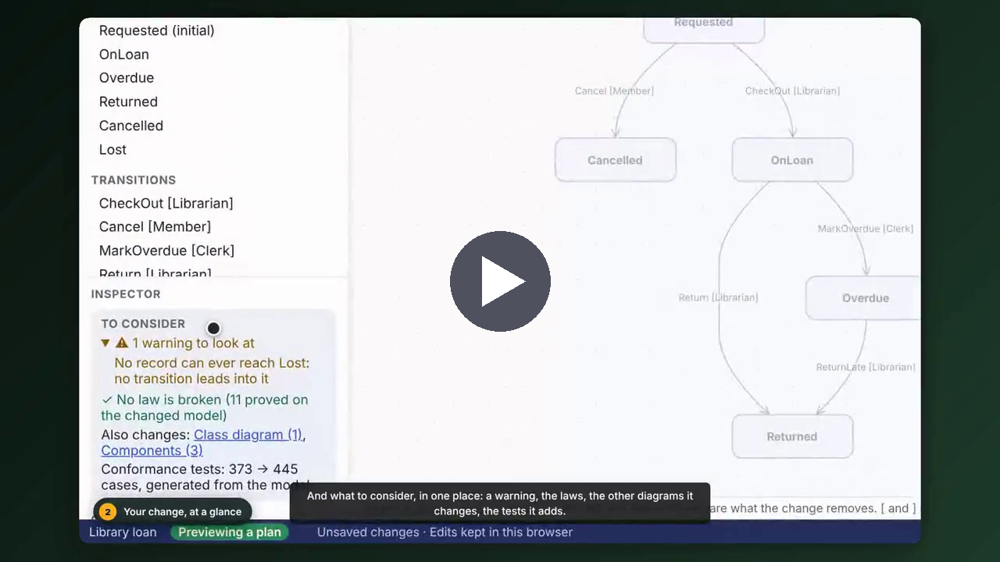
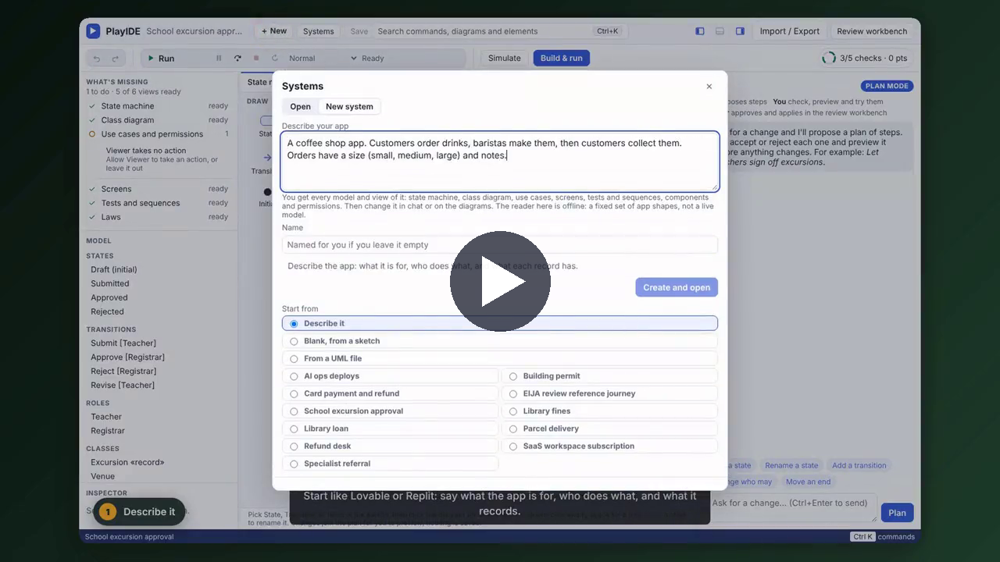
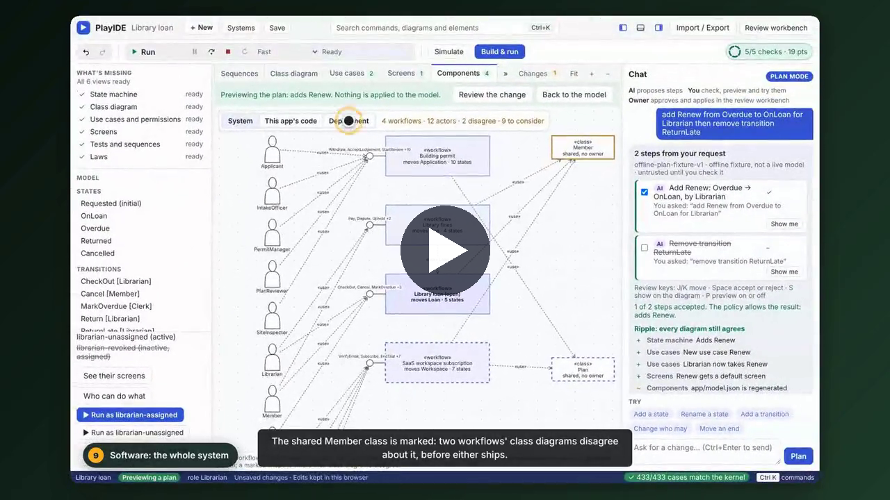
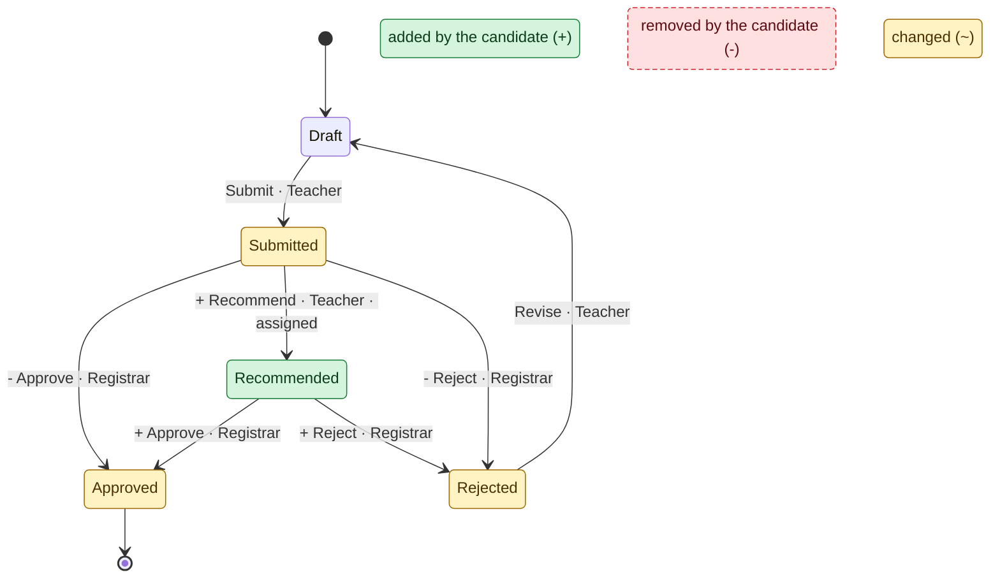
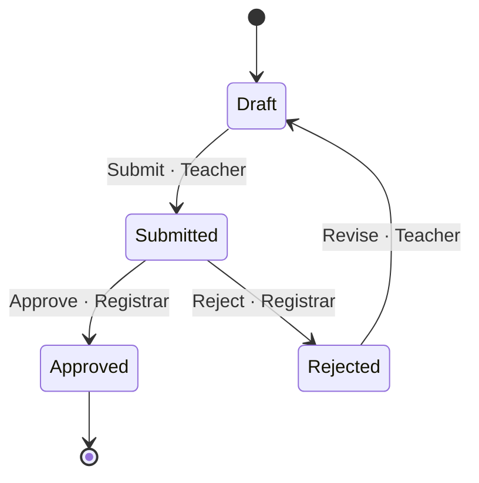
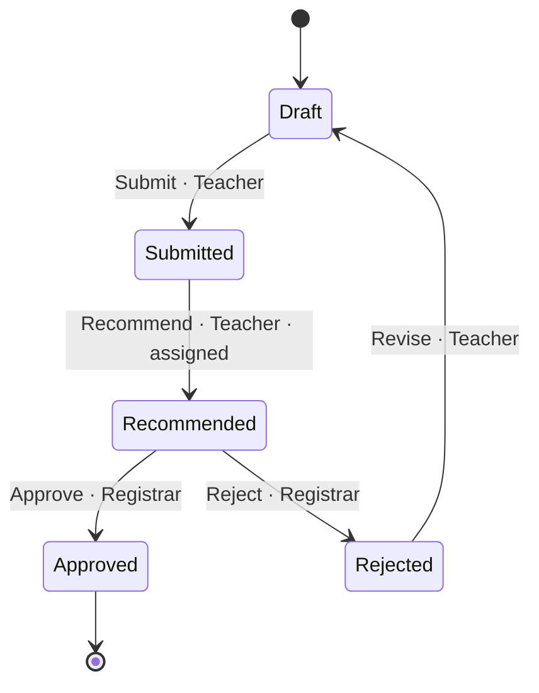

<p align="center">
  
</p>

# PlayIDE (EIJA Studio)

**Design a system in UML, press play, and check every change before you accept it.**

PlayIDE is a local, open-source IDE for engineers who already read UML. You design a system as a state machine, class, use case, sequence, screen, component and deployment diagrams that all come from one model. The model is the program: PlayIDE builds a real web app, API and database from it and checks the app against the model on every case. When you or an AI change the model, you see the change on the diagrams, with what to consider before you accept it: the laws it breaks, the tests it fails, the other views it touches. A deterministic kernel decides what every change means, not the AI.

[](LICENSE)
[](pyproject.toml)
[](#how-close-is-it)
[-lightgrey.svg)](docs/adr/0017-local-quality-gates.md)

## See it

**Highlights (3:50).** Your change and the AI's change at a glance, what to consider, recording a test the change needs, the proof, the people who use the app, and an AI agent on a refund desk that the laws stop from approving refunds itself.

[](docs/demos/assets/playide-showcase/playide-highlights.mp4)

**Start from a sentence (4:52).** Describe an app in one box and get every model and view. Then change it by chat and on the diagrams, round after round, with "What's missing" saying what is left.

[](docs/demos/assets/playide-showcase/playide-greenfield.mp4)

**The full tour (13:52).** Everything above plus sequence diagrams, tests, permissions, the accessibility check on the generated screens, the whole system as components and a deployment diagram with its API contract, a review-only view for stakeholders, UML import and export (PlantUML, XMI, Mermaid, draw.io) and real-sector templates.

[](docs/demos/assets/playide-showcase/playide-showcase.mp4)

Each video is one unedited take of the real app in Chromium, and every step asserts what the page shows. The chat is an offline phrase reader, not a live model, and the videos say so. The storyboards list every beat and how to re-record: [showcase](docs/demos/PLAYIDE-SHOWCASE-STORYBOARD.md), [greenfield](docs/demos/PLAYIDE-GREENFIELD-STORYBOARD.md).

## Try it

You need Python 3.11 or later and git. No Node or frontend build.

```bash
git clone https://github.com/45ck/eija-studio.git && cd eija-studio
python3 -m venv .venv && source .venv/bin/activate      # Windows: py -3 -m venv .venv; .\.venv\Scripts\Activate.ps1
python -m pip install -e ".[dev]"
eija serve --pack packs/library-loan --open
```

The server prints two private links. Open the PlayIDE one (it ends in `/play#…`; the part after `#` is your session key, so don't share it). Then try **Simulate**, **Build & run**, the diagram tabs, or ask the chat for a change such as `add Renew from Overdue to OnLoan for Librarian`. **Systems › New system** starts your own, from a sentence, a sketch, a UML file or a template. Everything runs on your machine: a loopback server, SQLite, no telemetry, and no network calls unless you turn on a live model provider.

The [PlayIDE guide](docs/playide.md) explains every view. [Getting started](docs/getting-started.md) covers the command line, providers and verification.

## How close is it

Close for a demo, not yet a tool you can ship changes with. Everything in the videos runs on the real app. What is not real yet: the AI, applying a change to the model in force, and the owner's verify and approve step.

| Part | Status |
|---|---|
| UML views from one model: state machine, class, use case, sequence, screens, components, deployment | **Works** on the real app |
| Edit on the diagrams, undo and redo, see your change and the AI's with what to consider | **Works** |
| Laws proved over every run the kernel allows, tests and sequences run through the kernel | **Works**, for the law kinds the kernel has ([#151](https://github.com/45ck/eija-studio/issues/151) lists missing ones) |
| Build & run: a web app, API and SQLite database checked against the kernel on every conformance case | **Works**, for the modelled cases and the pack's fixture actors ([how far](docs/build-an-app.md)) |
| Simulate, see the app as a role, Run as | **Works**, with seeded simulated users, not real people |
| UML import and export, new systems from templates, sketches or UML files | **Works**, and says what it could not carry |
| AI chat in plan mode | **Partial**: an offline phrase reader that understands fixed phrasings such as `add Renew from Overdue to OnLoan for Librarian`. No live model is wired up, and a request outside its phrasings is refused or can be read as a different supported change ([#152](https://github.com/45ck/eija-studio/issues/152)) |
| Describe your app in a sentence | **Partial**: an offline reader with a fixed set of app shapes, not a general model |
| Accepting a change | **Partial**: plans and edits are previewed, built, simulated and saved as drafts, but never become the model in force ([#89](https://github.com/45ck/eija-studio/issues/89), [#80](https://github.com/45ck/eija-studio/issues/80)) |
| Class diagram | **Partial**: only the record class is built; other classes and associations are drawn, not built ([#145](https://github.com/45ck/eija-studio/issues/145)) |
| Several workflows as one system | **Partial**: drawn and checked for disagreements; at run time each keeps its own data and they don't message each other ([#93](https://github.com/45ck/eija-studio/issues/93)) |
| Verify, approve and apply (the ship step) | **Not built into the demo**: skipped in the videos until the owner's source review ([#80](https://github.com/45ck/eija-studio/issues/80)) |
| Who may start a record, separation of duties, one action from several states | **Not modelled yet** ([#142](https://github.com/45ck/eija-studio/issues/142), [#149](https://github.com/45ck/eija-studio/issues/149), [#148](https://github.com/45ck/eija-studio/issues/148)) |
| A live AI provider, a study with real engineers, hosted CI | **Not done**: live calls need the owner's permission for spend; quality gates run locally (`nox -t fast`, `nox -t full`) |

## How it works

A change is a typed transaction over an executable model, not a text diff. The kernel checks it against the model's laws, re-derives every view from it, and refuses what it cannot give a meaning to rather than guessing. AI output is only ever an untrusted proposal: it cannot choose a meaning, approve or apply. **AI proposes. The kernel checks. The owner decides.** [Security and trust](docs/SECURITY_AND_TRUST.md) states the limits, and [Executable UML on the EIJA engine](docs/architecture/executable-uml.md) says which views the kernel runs.

<details><summary>A diagram generated from the real model, checked by a gate</summary>

The excursion workflow before and after the owner selects the `recommend_only` meaning of "Let teachers sign off excursions."

<!-- BEGIN GENERATED: excursion-diff (scripts/gen_readme_diagram.py; do not edit by hand) -->
**Diff** (`eija render --workflow examples/excursion-candidate.json --view diff --format mermaid`): green is added, amber is changed, a `+` label is a new or changed transition and a `-` label is a transition the candidate no longer has. The first two comment lines carry the semantic hashes of the two workflows the diagram was generated from.



<details><summary>The same two workflows as separate state diagrams (<code>--view state</code>, baseline then candidate)</summary>

Baseline:



Candidate (`recommend_only`):



</details>

What changed, from `diff_summary` over the two typed models (not written by hand):

- new state `Recommended`
- new action `Recommend`
- `Approve` from_state: `Submitted` becomes `Recommended`
- `Reject` from_state: `Submitted` becomes `Recommended`

The kernel's own impact closure, `domain.impact.model_impact(baseline, candidate)`, reaches 20 artefacts from the changed actions `Approve`, `Recommend`, `Reject` (`complete: True`). It follows a fixed rule, runtime, state view, journey, obligation, receipt, review packet, local decision chain per action, so it is the encoded projection mapping, not every real-world consequence. Draw it with `--view impact`; the affected artefacts are:

- `journey:` Approve, Recommend, Reject
- `local-decision`
- `obligation:` Approve, Recommend, Reject
- `receipt:` Approve, Recommend, Reject
- `review-packet`
- `rule:` Approve, Recommend, Reject
- `runtime:` Approve, Recommend, Reject
- `state-view:` Approve, Recommend, Reject

`check_policy(baseline)` -> `[]`. `check_policy(candidate)` -> `[]`. A candidate that lets a Teacher approve is rejected: `check_policy(unsafe)` -> `['PROTECTED_AUTHORITY:Approve']`.
<!-- END GENERATED: excursion-diff -->

The block above is not hand-drawn: `python scripts/gen_readme_diagram.py --check` (nox session `readme_diagram`) fails if it differs from what `domain.policy` produces today.

</details>

## Learn more

| Purpose | Entry point |
|---|---|
| Every PlayIDE view and its limits | [docs/playide.md](docs/playide.md) |
| Install, command line, providers, verification | [docs/getting-started.md](docs/getting-started.md) |
| Build an app from the model | [docs/build-an-app.md](docs/build-an-app.md) |
| Agents over MCP | [docs/agents/quickstart.md](docs/agents/quickstart.md), [contract](docs/agents/contract.md) |
| Architecture and decisions | [docs/architecture/ARCHITECTURE.md](docs/architecture/ARCHITECTURE.md), [ADR index](docs/adr/README.md) |
| How it compares | [Current alternatives](docs/research/2026-10-02-current-alternatives.md) |
| Open source we build on | [OSS register](docs/oss/REGISTER.md) |
| Earlier checkpoints, the v0.2 quickstart and dated gate results | [README history](docs/README-HISTORY.md) |

## Contributing and license

Read [CONTRIBUTING.md](CONTRIBUTING.md) and [AGENTS.md](AGENTS.md). Report vulnerabilities as described in [SECURITY.md](SECURITY.md). Participation follows the [Code of Conduct](CODE_OF_CONDUCT.md). Cite with [CITATION.cff](CITATION.cff); changes are in [CHANGELOG.md](CHANGELOG.md).

Apache License 2.0; see [LICENSE](LICENSE) and [NOTICE.md](NOTICE.md).
