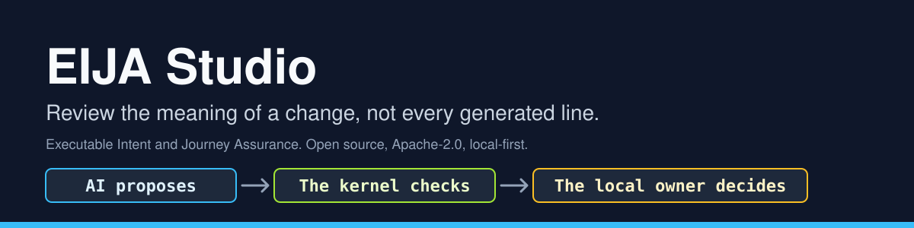
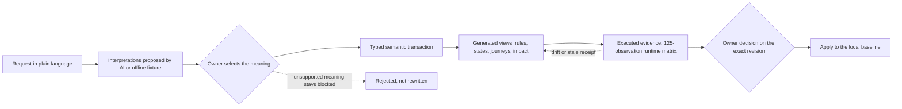
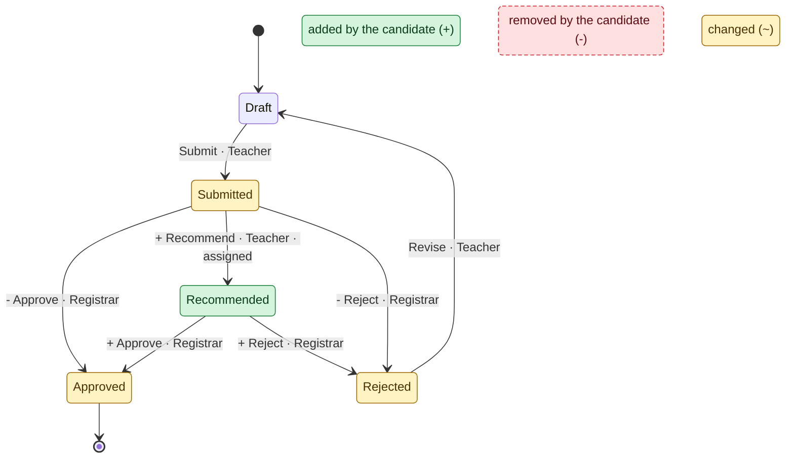
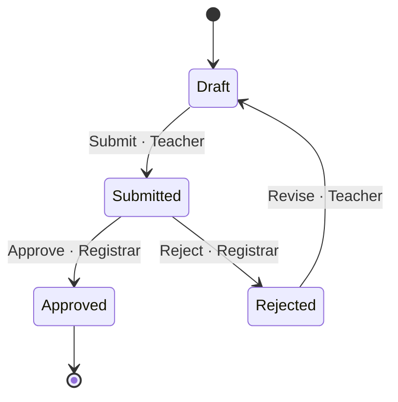
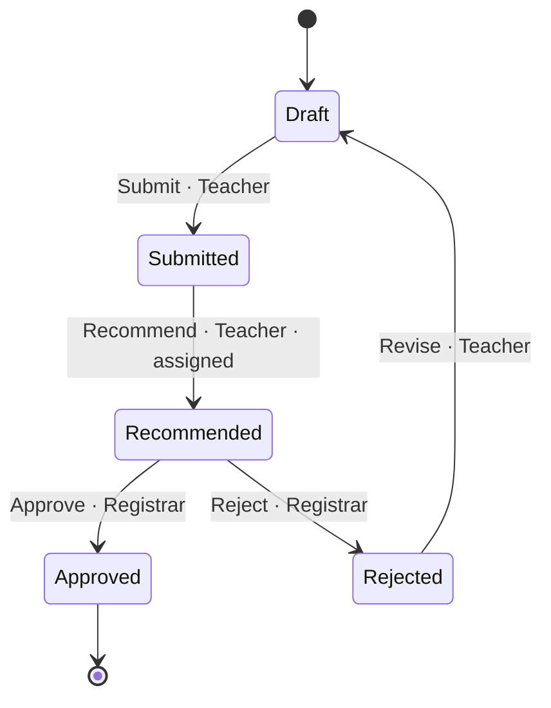

<p align="center">
  
</p>

# EIJA Studio

**Review the meaning of a change, not every generated line.**

EIJA (Executable Intent and Journey Assurance) is an open-source code/model workbench under development for **UML-literate engineers who build with AI**. Its purpose is to let engineers inspect the concepts, rules and consequences behind an agent's changes, follow those concepts into actual source, and judge evidence without reconstructing every generated line. A deterministic assurance kernel checks supported model edits; the local owner selects meaning and decides. **AI proposes. The kernel checks. The local owner decides.**

## Two outcome goals

1. **A complete, polished IDE experience that makes a world-class WOW demo possible.** Build a coherent, non-linear workbench with an explorer, model editors, source navigation, agent changes, review, evidence, history, keyboard control and clear feedback. Engineers should be able to move freely through the supported workflow, understand what changes and recover safely. Walkthroughs and showcase clips must come from that usable product, not a thin happy-path presentation. The four flagship scenes remain the demonstration roadmap; unfinished capabilities stay labeled as planned.
2. **A reproducible GitHub POC and POF.** Demonstrate the supported IDE experience end-to-end (**proof of concept**) and let another engineer clone, launch, use it and replay its scoped evidence (**proof of feasibility**). Publish clear setup, supported coverage, actual UX and test results, limitations, license/OSS records and demo artifacts together when that product experience is ready.

**Delivery order:** finish the coherent EIJA self-dogfood IDE, exercise normal use and recovery paths, meet the visual and interaction quality bar, then produce the GitHub package and videos from retained runs. A wizard, attractive shell or isolated passing demonstration does not close this goal. The supported semantics remain explicit; a full IDE experience does not mean a universal solver or unmeasured superiority. Current status is **in integration; the full experience and both outcome goals remain unconfirmed**. The [mission and readiness criteria](docs/engineering/MISSION.md) govern these goals; the [run record](docs/engineering/SELF-DOGFOOD-ACCEPTANCE.md#run-record) supplies execution evidence.

**Build on OSS.** Reuse maintained frameworks, parsers, diagram tooling and verification engines. EIJA adds domain contracts, adapters and generators; record adoption decisions before building a replacement engine. Use one coordinated integration path with a named writer for each file and a visible milestone/evidence ledger. [OSS register](docs/oss/REGISTER.md)

The first acceptance target is **EIJA's own checkout**. External applications come after this self-dogfood flow works. Repository intake, structural extraction, behavior bindings and verified properties are separate coverage levels; accepting a codebase does not imply that EIJA understands or verifies all of it. This is an engineering preview, with no measured claim of superior V&V or reduced human comprehension burden.

[](LICENSE)
[](pyproject.toml)
[](docs/TECHNICAL_LEAD_REVIEW.md)
[-lightgrey.svg)](docs/adr/0017-local-quality-gates.md)

## Recorded integration preview

The [2 October preview and reproduction record](docs/demos/2026-10-02-IDE-PREVIEW.md) shows the working source-connected model IDE from a fresh GitHub checkout: semantic before/after review, captured source, checked model edits, history and recovery. It includes actual screenshots, an unedited browser recording and the exact tested revision. The implementation remains in [draft PR #29](https://github.com/45ck/eija-studio/pull/29); this documentation does not merge that code onto main.


Fresh Windows installation, real CLI startup and 20 recorded browser checks passed within the preview's declared scope. Full IDE acceptance remains open: the HCI density budget fails, source review is required, and human comprehension and live-provider usefulness are unmeasured. The linked generated design concepts describe the target; the linked recording shows the actual product.

**Historical gate snapshot, 29 September 2026 — stale for the current integration work.** These numbers describe an earlier branch state, not the self-dogfood acceptance result: <!-- GATE-STATUS -->2026-09-29, Windows 11, Python 3.12, this branch merged with `main` at `0f51b62`: `nox -t full` succeeded (254 tests passed, 1 skipped because Playwright is not installed; coverage 78.85 %), and the `demos_dry` gate was skipped as `NOT_RUN` for the same reason. The owner-only release fixture check does not pass on `main` (see the quickstart).<!-- /GATE-STATUS --> Reproduce it yourself with `nox -t full`; there is no hosted CI to trust instead of your own run. Hosted CI is unavailable for this repository ([ADR-0017](docs/adr/0017-local-quality-gates.md)).

## Current scope and acceptance

The current integration connects a configured EIJA checkout read-only and indexes supported tracked Python and annotated UI structure. The delivery goal is a coherent IDE around that connection: domain explorer, editable model views, source navigation, repository impact, agent-change review, evidence and history that stay in sync as the engineer moves between them. SVG edits remain server-checked; the agent surface exposes read-only pack context, affordances, edit checks and repository impact. These are **requirements under integration**, not a claim that the full experience has passed. Both [engineering and UX acceptance](docs/engineering/SELF-DOGFOOD-ACCEPTANCE.md) must be demonstrated.

See [self-dogfood acceptance](docs/engineering/SELF-DOGFOOD-ACCEPTANCE.md) for the exact flow, coverage boundaries and [run record](docs/engineering/SELF-DOGFOOD-ACCEPTANCE.md#run-record). The first connection does not rewrite repository source or generate an arbitrary application. `SOURCE_REVIEW_REQUIRED` remains an expected, visible condition until the maintainer reviews the changed source; agents must not restamp it. Live model validation and the engineer study are **NOT_RUN**.

The [product thesis](docs/engineering/PRODUCT-THESIS.md), [current alternatives](docs/research/2026-10-02-current-alternatives.md) and [V&V protocol](docs/research/2026-10-02-vv-protocol.md) explain what is being built and how its value will be tested. The [whole-app design](docs/design/README.md) connects four personas, 15 user stories, ten screen states and explicit HCI criteria to the implementation. Generated concepts set the design target; the [dated browser evidence](docs/engineering/2026-10-02-IDE-SELF-DOGFOOD.md) records actual behavior and remaining gaps.

> **Historical examples below.** The excursion diagrams, v0.2 quickstart and dated `main`/PR gate tables preserve the earlier kernel demonstration. They do not describe current integration readiness. Excursion and library-loan packs remain fixtures for the supported model contract; EIJA itself is the first repository connection target.

## The problem

Agents write code faster than people can read it. A reviewer who is handed a 900-line generated diff has to reconstruct what business rule changed, who now has authority to do what, and what else depends on it, before they can say yes. Under that pressure, a green check and a plausible summary can substitute for understanding. The characteristic failure is not a syntax error; it is a silent change of meaning: an approval step that quietly lost a prerequisite, a role that gained a power.

## Why use it

| You get | How |
|---|---|
| **Review the change to the model, not the diff.** | A change is a typed `SemanticTransaction` over a `Workflow`. The rule table, state diagram and journey text are derived from the same executable transitions and checked for consistency within that model; this does not establish complete source fidelity. |
| **See the ripple.** | A fixed-point impact closure (`domain/impact.py`) lists the rule, runtime, state view, journey, obligation and receipt artefacts a change reaches; the example below prints it. The Studio's visual before/after diff is not on `main` yet. |
| **Agents cannot approve their own work.** | Provider output is an untrusted proposal. There is no approve or apply port for providers, authority is re-checked at commit time, and selecting a meaning, approving and applying are three separate owner actions. |
| **Evidence you can recompute.** | A receipt keeps its raw observations, and eligibility is recomputed from them; a green label on a receipt is not trusted. In this proof of concept human understanding is always `UNKNOWN`: an owner acknowledgement is recorded, but it is not a measurement of understanding. |
| **Local and open.** | Loopback-only server, SQLite, no telemetry, Apache-2.0. Live model calls need explicit flags and per-request consent. |

## The loop



The two diamonds and the final apply are the human actions; a provider can take part in none of them. The kernel rejects a candidate that changes protected authority, and it does not silently rewrite an unsupported meaning into a supported one.

## A visual example, generated from the real model

The excursion workflow before and after the owner selects the `recommend_only` meaning of "Let teachers sign off excursions." Teachers get a *recommend* step; the registrar keeps final approval and rejection.

<!-- BEGIN GENERATED: excursion-diff (scripts/gen_readme_diagram.py; do not edit by hand) -->
**Diff** (`eija render --workflow examples/excursion-candidate.json --view diff --format mermaid`): green is added, amber is changed, a `+` label is a new or changed transition and a `-` label is a transition the candidate no longer has. The first two comment lines carry the semantic hashes of the two workflows the diagram was generated from.



<details><summary>The same two workflows as separate state diagrams (<code>--view state</code>, baseline then candidate)</summary>

Baseline:



Candidate (`recommend_only`):



</details>

What changed, from `diff_summary` over the two typed models (not written by hand):

- new state `Recommended`
- new action `Recommend`
- `Approve` from_state: `Submitted` becomes `Recommended`
- `Reject` from_state: `Submitted` becomes `Recommended`

The kernel's own impact closure, `domain.impact.model_impact(baseline, candidate)`, reaches 20 artefacts from the changed actions `Approve`, `Recommend`, `Reject` (`complete: True`). It follows a fixed rule, runtime, state view, journey, obligation, receipt, review packet, local decision chain per action, so it is the encoded projection mapping, not every real-world consequence. Draw it with `--view impact`; the affected artefacts are:

- `journey:` Approve, Recommend, Reject
- `local-decision`
- `obligation:` Approve, Recommend, Reject
- `receipt:` Approve, Recommend, Reject
- `review-packet`
- `rule:` Approve, Recommend, Reject
- `runtime:` Approve, Recommend, Reject
- `state-view:` Approve, Recommend, Reject

`check_policy(baseline)` -> `[]`. `check_policy(candidate)` -> `[]`. A candidate that lets a Teacher approve is rejected: `check_policy(unsafe)` -> `['PROTECTED_AUTHORITY:Approve']`.
<!-- END GENERATED: excursion-diff -->

The block above is not hand-drawn: `python scripts/gen_readme_diagram.py --check` (nox session `readme_diagram`) fails if it differs from what `domain.policy` produces today. It shows structure only. It does not show human understanding, and it is not a proof.

## Try the connected IDE preview

The connected IDE is developed on [`integrate/all`](https://github.com/45ck/eija-studio/tree/integrate/all), tracked in [PR #29](https://github.com/45ck/eija-studio/pull/29). From that checkout, create and activate a Python virtual environment as below, then run:

```console
python -m pip install -e ".[dev,hci]"
eija serve --provider offline --pack packs/eija-review-slice --repo . --workspace .eija/self-dogfood --open
```

Use a fresh `.eija/self-dogfood` workspace for this pack. The explorer connects to the current checkout read-only. Start with **New intent**, inspect the offline proposal, choose a supported meaning, then move between Model, Source, Changes and Evidence. The offline provider is a deterministic fixture, not a live model. Source-review and unrun-conformance limits remain visible.

For an isolated, recorded replay, install Chromium with `python -m playwright install chromium`, then run `python tests/hci/self_dogfood_replay.py --record`. The [replay guide](docs/engineering/SELF-DOGFOOD-BROWSER-REPLAY.md) explains its exact checks, subject manifest and limitations. Local endpoint browser rules still apply.

## Historical 60-second quickstart

> **Historical v0.2 walkthrough.** The commands and excursion interaction below preserve the earlier demonstration. Use the [current acceptance flow](docs/engineering/SELF-DOGFOOD-ACCEPTANCE.md#first-flow-contract) and [agent setup](docs/agents/quickstart.md) for the integration milestone; new interface behavior must be confirmed by the current run record.

Requires Python 3.11 or later and git. No Node or frontend build. Installation downloads Python packages, so the first install is not air-gapped.

macOS or Linux:

```bash
git clone https://github.com/45ck/eija-studio.git && cd eija-studio
python3 -m venv .venv && source .venv/bin/activate
python -m pip install -e '.[dev]'
eija doctor
eija serve --open
```

Windows (PowerShell):

```powershell
git clone https://github.com/45ck/eija-studio.git; cd eija-studio
py -3 -m venv .venv
.\.venv\Scripts\Activate.ps1
python -m pip install -e ".[dev]"
eija doctor
eija serve --open
```

Open the private launch URL that `eija serve` prints (keep the `#fragment`; it is the session capability, do not share it). Create a case with the default request, generate interpretations with the offline fixture, select **recommendation only**, and preview the candidate under **Try**.

Without a browser:

```bash
eija compile examples/excursion-candidate.json --out output/compiled   # model, projections, impact
python -m pytest -q                                                     # 254 passed, 1 skipped on the date above
```

> **Known state of `main`.** The verification and apply gates check that the running source matches an owner-stamped release fixture. Kernel changes merged after v0.2.0 (for example the Windows durability fix) mean the fixture does not match, so `eija doctor` reports `release_fixture_matches: false` and `eija demo`, `--verify` and the Studio's Verify button return `SOURCE_REVIEW_REQUIRED`. That is by design and only the maintainer can re-stamp the fixture; agents never do. Until then `eija doctor` and `eija compile` **exit with code 2** even though the compile output is written; read `source_review_required` (expected `true` here) and `policy_errors` in `compiled.json` rather than the exit code. Everything else above works. Full detail, provider setup (OpenRouter, Codex) and the verification commands are in [docs/getting-started.md](docs/getting-started.md).

## Use it from your agent

The integration checkout contains CLI and MCP entry points; use the [agent contract](docs/agents/contract.md) and [setup guide](docs/agents/quickstart.md) for the supported interface. The current acceptance work adds read-only pack context, affordances, `edit_check` and `repository_impact`, so an agent can inspect the same model and repository facts as the engineer. The final available tool names and validation results belong to that interface documentation and the current run record.

Agent proposals remain untrusted. No agent may choose the owner's meaning, approve or apply a change, mint evidence, or bypass source review. A successful read or dry-run check is not an owner decision and does not modify connected repository source.

## Historical assurance inventory: 29 September 2026

"What you see matches the code" is a claim to verify for a stated model, source revision and extraction scope. The following table is the historical `main`/PR inventory from 2026-09-29; its branch states and numbers are stale and are not current acceptance evidence. Use the [self-dogfood run record](docs/engineering/SELF-DOGFOOD-ACCEPTANCE.md#run-record) for the integrated result.

| Claim | Mechanism | Status |
|---|---|---|
| Views match the model | Rules, state cards and journey text are `projections(model)`; nothing is written by AI or by hand | on `main` |
| Diagrams match the model | Mermaid, PlantUML and DOT generated from the typed `Workflow`, plus a visual before/after diff ([ADR-0019](docs/adr/0019-diagrams-generated-from-executable-model.md)); the README example above already comes from `domain.policy` | generators in open PR #6; the README example is added by open PR #14 |
| Receipts are computed, not asserted | `assess_receipt` recomputes claim, subject, observations and coverage from raw data; an HMAC seal gives local integrity, not external certification | on `main` |
| Authority cannot be replayed or borrowed | Current-authority check before operation replay, CAS versions, audit and outbox in the same transaction; providers have no approve or apply port | on `main` |
| One-step behaviour of the candidate | 5 actors x states x 5 actions runtime matrix against the real runtime (125 observations). The oracle is same-author | on `main` |
| Implementation identity | Source must match an owner-stamped fixture before verify or apply | on `main` (currently mismatched; owner re-stamp pending) |
| Local gates | `nox -t fast`, `-t full`, `-t release` ([ADR-0017](docs/adr/0017-local-quality-gates.md)); linting, typing, architecture, complexity and dependency gates are on `main` (merged PR #3, [gate table](docs/quality/gates.md)); the docs, link and README-drift gates are added by open PR #14 | tests and quality gates on `main`; docs gates in open PR #14 |
| Machine-checked laws over all action sequences | Bend 2 laws generated from the model ([ADR-0018](docs/adr/0018-formal-vv-portfolio.md)); evidence kind `bend_proof`; the claim is about the generated model, not the Python runtime ([details](docs/formal/bend.md)) | on `main` (merged PR #18); the proof runs in Docker and is `NOT_RUN` without it |
| Safety invariants over the workflow and commit protocol | TLA+ with TLC, up to declared bounds; `tlc_model_check` | branch `lane/tla` pushed, no PR |
| Policy soundness across the transaction grammar | Z3 SMT proof; bounded exhaustive runtime search | open PR #11 |
| Runtime agrees with an independent reference model | Hypothesis stateful tests; `property_test` | branch `lane/property` pushed, no PR |
| The tests can detect faults | Mutation analysis; `mutation_score` measures detection power, not correctness | planned |

Each technique is a distinct kind of evidence and none may be relabelled as another. A proof about a model is not a proof about the Python runtime; conformance between them is a separate claim. Hashes show integrity, not truth. Read the limits in [Security and trust](docs/SECURITY_AND_TRUST.md).

## How it compares

Specification-driven agents, semantic review interfaces, executable modeling tools and formal checkers already overlap with EIJA. Kiro documents SMT-backed requirements analysis and property-based testing; MPS exposes model edits to coding agents; Stately connects statecharts and tests; CodeRabbit and Qodo address guided review and change impact. See the [dated primary-source comparison](docs/research/2026-10-02-current-alternatives.md) for feature boundaries and preview status.

EIJA's product hypothesis is that an explicit domain model, deterministic source connections and reviewable evidence help UML-literate engineers make more accurate decisions at a useful total cost. Neither novelty nor superiority is established by the presence of those features. The [V&V protocol](docs/research/2026-10-02-vv-protocol.md) separates software verification, model fidelity and observed engineer benefit.

## Built on open source

EIJA adopts mature open source and writes only EIJA-specific generators, adapters and glue ([ADR-0016](docs/adr/0016-oss-first-adapters-not-engines.md)): FastAPI, Uvicorn, Pydantic, httpx, SQLite, pytest, nox and MADR today, MkDocs Material for the docs site, and Mermaid, PlantUML, Graphviz, Bend, TLA+, Z3, Hypothesis and others as the lanes land. Every tool adopted and every custom module is in the [OSS register](docs/oss/REGISTER.md), with the alternatives checked and the replacement path.

## Architecture decisions

Decisions follow [MADR](https://adr.github.io/madr/) and are never rewritten, only superseded. The index is generated from the ADR files (`python -m quality.tools.adr_index --write`), so it is the one place that lists every record and its status; it also holds the number blocks reserved for each lane: [docs/adr/README.md](docs/adr/README.md). Start with [ADR-0000](docs/adr/0000-poc-decision-log.md) (the v0.2 decision log: modular monolith, frozen vocabulary, AI proposal-only, SQLite unit of work, computed evidence, single local owner), [ADR-0016](docs/adr/0016-oss-first-adapters-not-engines.md) (OSS first) and [ADR-0043](docs/adr/0043-readme-truthfulness-and-docs-site.md) (why this README is verifiable).

## Where to go next

| Purpose | Entry point |
|---|---|
| Install, run, provider setup, verification commands | [docs/getting-started.md](docs/getting-started.md) |
| Current product scope and self-dogfood acceptance | [Product thesis](docs/engineering/PRODUCT-THESIS.md), [acceptance and run record](docs/engineering/SELF-DOGFOOD-ACCEPTANCE.md) |
| Historical v0.2 engineering review | [docs/TECHNICAL_LEAD_REVIEW.md](docs/TECHNICAL_LEAD_REVIEW.md) |
| Domain boundaries, ubiquitous language, contracts | [docs/architecture/ARCHITECTURE.md](docs/architecture/ARCHITECTURE.md), [`contracts/`](contracts/) |
| Risks and trust assumptions | [docs/SECURITY_AND_TRUST.md](docs/SECURITY_AND_TRUST.md) |
| Reproduce measured results | [docs/verification/VERIFICATION.md](docs/verification/VERIFICATION.md), [`evidence/`](evidence/) |
| Operate, back up, upgrade | [docs/OPERATIONS.md](docs/OPERATIONS.md) |
| Roadmap and lane status | [docs/ROADMAP.md](docs/ROADMAP.md) |
| Hand off to an agent | [AGENTS.md](AGENTS.md) |

Build the docs site locally with `python -m pip install -e ".[docs]"` and `mkdocs serve`. It is not deployed anywhere.

## Contributing, security, community

Read [CONTRIBUTING.md](CONTRIBUTING.md) (lanes, gate tiers, OSS-first, ADRs, evidence honesty). Report vulnerabilities privately as described in [SECURITY.md](SECURITY.md). Participation is governed by the [Code of Conduct](CODE_OF_CONDUCT.md). To cite this software, see [CITATION.cff](CITATION.cff). Changes are recorded in [CHANGELOG.md](CHANGELOG.md).

## License

Apache License 2.0; see [LICENSE](LICENSE) and [NOTICE.md](NOTICE.md). This does not relicense the original research packs, which remain separate archival material.
