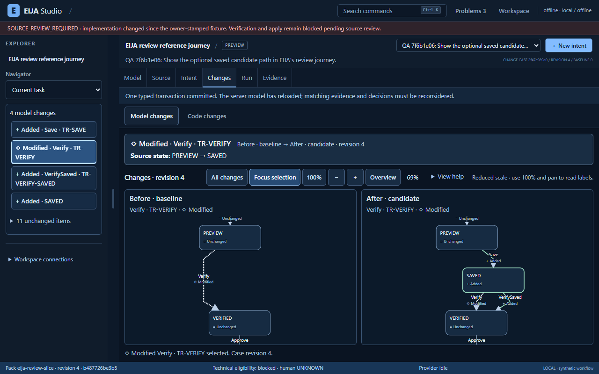
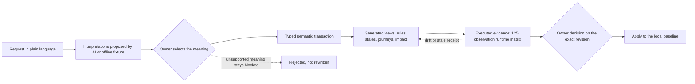

# README history: the integration record before 9 October 2026

The project README was simplified on 9 October 2026 to lead with what PlayIDE does, the videos, setup and an honest status. This page keeps the sections it replaced, unchanged apart from link paths, so the dated checkpoints and their evidence stay findable. Everything here is a historical record, not current status: see the [README](../README.md#how-close-is-it) for that.

## Two outcome goals

1. **A complete, polished IDE experience that makes a world-class WOW demo possible.** Build a coherent, non-linear workbench with an explorer, model editors, source navigation, agent changes, review, evidence, history, keyboard control and clear feedback. Engineers should be able to move freely through the supported workflow, understand what changes and recover safely. Walkthroughs and showcase clips must come from that usable product, not a thin happy-path presentation. The four flagship scenes remain the demonstration roadmap; unfinished capabilities stay labeled as planned.
2. **A reproducible GitHub POC and POF.** Demonstrate the supported IDE experience end-to-end (**proof of concept**) and let another engineer clone, launch, use it and replay its scoped evidence (**proof of feasibility**). Publish clear setup, supported coverage, actual UX and test results, limitations, license/OSS records and demo artifacts together when that product experience is ready.

**Delivery order:** finish the coherent EIJA self-dogfood IDE, exercise normal use and recovery paths, meet the visual and interaction quality bar, then produce the GitHub package and videos from retained runs. A wizard, attractive shell or isolated passing demonstration does not close this goal. The supported semantics remain explicit; a full IDE experience does not mean a universal solver or unmeasured superiority. Current status is **in integration; the full experience and both outcome goals remain unconfirmed**. The [mission and readiness criteria](engineering/MISSION.md) govern these goals; the [run record](engineering/SELF-DOGFOOD-ACCEPTANCE.md#run-record) supplies execution evidence.

**Build on OSS.** Reuse maintained frameworks, parsers, diagram tooling and verification engines. EIJA adds domain contracts, adapters and generators; record adoption decisions before building a replacement engine. Use one coordinated integration path with a named writer for each file and a visible milestone/evidence ledger. [OSS register](oss/REGISTER.md)

The first acceptance target is **EIJA's own checkout**. External applications come after this self-dogfood flow works. Repository intake, structural extraction, behavior bindings and verified properties are separate coverage levels; accepting a codebase does not imply that EIJA understands or verifies all of it. This is an engineering preview, with no measured claim of superior V&V or reduced human comprehension burden.

[](LICENSE)
[](pyproject.toml)
[](docs/TECHNICAL_LEAD_REVIEW.md)
[-lightgrey.svg)](docs/adr/0017-local-quality-gates.md)

[IDE design reference](design/README.md): an interactive ten-surface/state handoff plus generated visual concepts, all explicitly design-only. Prepared examples and concepts are not product execution evidence. Showcase recordings use the real application.


## Recorded integration preview

**The IDE is on main (8 October):** [PR #78](https://github.com/45ck/eija-studio/pull/78) merged the source-connected IDE from #29 and #76 onto `main`. Run it with `eija serve --pack packs/eija-review-slice --repo . --open` (see [Try the connected IDE](#try-the-connected-ide-preview)). The [IDE walkthrough](demos/2026-10-08-IDE-WALKTHROUGH.md) is a 2:34 real-browser recording of EIJA reviewing a change to its own review journey, with stills, provenance and reproduction steps. It is **PARTIAL**: verification is refused with `SOURCE_REVIEW_REQUIRED` until the owner reviews the changed source ([#80](https://github.com/45ck/eija-studio/issues/80)). The [merge record](engineering/2026-10-08-IDE-ON-MAIN.md) lists what landed and the checks run. Fast passes 22/22 and 2,672 tests pass. Full fails in `hci` and `metrics`, both from two HCI budgets awaiting owner re-derivation ([#79](https://github.com/45ck/eija-studio/issues/79)). Full IDE acceptance, live-provider and human-benefit claims remain open. The checkpoints below are earlier, dated records.


*Frame from the recorded walkthrough on Linux/Chromium 141 ([provenance](demos/assets/ide-walkthrough-20261008/provenance.json)).*

**Published merged IDE checkpoint (3 October):** [`ad9394e1`](https://github.com/45ck/eija-studio/commit/ad9394e1d4ae93259ee43ce8448b60c96a826a40) in [draft PR76](https://github.com/45ck/eija-studio/pull/76) combines explicit offline edit proposals, readable paired model changes, exact captured source, formal-evidence context and runtime refusal → rule → return. Its [checkpoint record](engineering/2026-10-03-MERGED-IDE-CHECKPOINT.md) binds **ten offline browser journeys PASS to the same 114 product files**, plus **495 JavaScript tests PASS**. The committed source matches the tested merge of `efd33fa7` and `d861d454`; these results stay bound to `ad9394e1` as subsequent work continues.

The [checkpoint HCI report](https://github.com/45ck/eija-studio/blob/ad9394e1d4ae93259ee43ce8448b60c96a826a40/docs/hci/REPORT.md) captures **18/18 required opened/pinned work states**, while its unchanged budgets retain **two FAILs** (density 50 > 27; predicted KLM 65.31 > 65 seconds) and **two GAPs** (settled-DOM p95 825 ms; one lost-focus activation). **Fast passes 22/22 sessions; full and release are NOT_RUN on this merge.** The published predecessor `efd33fa7` separately passed a fresh GitHub clone, new Python environment, installed CLI startup and four scoped Windows replays; that earlier proof does not cover `ad9394e1`. The [whole-app design](design/README.md), manual accessibility and hands-on UX acceptance remain the bar before the WOW recording and final POC/POF package.

**Earlier agent candidate-edit checkpoint (3 October):** In [draft PR29](https://github.com/45ck/eija-studio/pull/29), a bounded request such as `Move Verify source to SAVED` now produces an explicitly synthetic, untrusted offline proposal. Review its actual before/after UML, explicitly save the candidate edit, follow the same transition through Model, Changes, Rules and captured source, then drag an endpoint and undo. Source remains read-only; this is not live inference or arbitrary code generation.

The [reproducible browser acceptance](../tests/hci/agent_edit_review.md) passed **8/8 checks** in installed Chrome, including refusal and stale-response recovery; **116 backend checks** passed separately. That checkpoint's HCI measurements reported **16 PASS / 2 GAP / 0 FAIL**, with density and tail-latency improvement gaps. The [implementation ledger](design/IMPLEMENTATION-STATUS.md#agent-proposal-to-model-edit) retains the exact subject and scope; repository gates and publication readiness are recorded in PR29. Source review, live-provider usefulness and human value remain open.

**Historical selected-change review checkpoint (3 October):** Changes now shows exact before/after fields above the model comparison; Evidence groups current blockers with keyboard routes. The [source checkpoint](https://github.com/45ck/eija-studio/commit/bdb7a2836e86cda60a511a7c59f550dab97cd040) remains in draft PR29; this docs-only update does not add it to main. The [implementation ledger](design/IMPLEMENTATION-STATUS.md#selected-change-summary-and-evidence-triage) records passing browser/fast checks, retained HCI failures and release's source-review requirement. Full on these new bytes is NOT_RUN. Whole-IDE, human-validation and POC/POF goals remain open.



*Actual 1280×800 capture from draft integration **bdb7a28**, not main's shipped UI. Synthetic QA cases; [source-bound provenance](demos/assets/review-comprehension-20261003/provenance.json).*

**Historical navigation checkpoint (3 October):** The [navigation ledger](design/IMPLEMENTATION-STATUS.md#workspace-navigation-and-keyboard-access) retains `72e0f824`, its scoped passes and HCI/metrics/release limits. Those results describe that earlier implementation.

**Previous workspace checkpoint (3 October):** [Prospective edit review](design/2026-10-03-PROSPECTIVE-EDIT-REVIEW.md) shows the working server-derived comparison before a typed model edit, explicit Apply and no-write Close/Escape. [Watch real preview then Close](https://raw.githubusercontent.com/45ck/eija-studio/8633d7d8e950cc407b458382b5b03ec60be35f30/pr/29/prospective-edit-close-20261003.gif) with zero edit POSTs and unchanged revision/hash. Five final browser runs pass within their declared scopes; fast passes 22/22 sessions and JavaScript 288/288. Full fails HCI and aggregate metrics: 32 successful sessions, two failed, one skipped. Release requires source review despite passing tests. Full US06 gesture parity, ten-surface UX and IDE/POC/POF acceptance remain open. Implementation: **ca95f468206fec706f7a274788faf872877ac4a1**; this docs-only update does not add it to main. The [earlier Run/Evidence record](design/2026-10-03-RUN-EVIDENCE-REVIEW.md) retains its original subjects and recording.

**3 October checkpoint:** the [code/model review observations](design/2026-10-03-CODE-REVIEW-VALIDATION.md) and [historical navigation proof](demos/2026-10-03-NAVIGATION-RECOVERY-PROOF.md) record the new review capabilities, exact evidence subjects and remaining acceptance work. The corresponding implementation is pinned at [`1f1b07f64889`](https://github.com/45ck/eija-studio/tree/1f1b07f648890d8e03f81d4269fa479d80a0f46a). This docs-only update does not add that implementation to main or declare the full IDE/POC/POF goals complete.

The [2 October preview and reproduction record](demos/2026-10-02-IDE-PREVIEW.md) shows the working source-connected model IDE from a fresh GitHub checkout: semantic before/after review, captured source, checked model edits, history and recovery. It includes actual screenshots, an unedited browser recording and the exact tested revision. The implementation remains in [draft PR #29](https://github.com/45ck/eija-studio/pull/29); this documentation does not merge that code onto main.

[Historical 2 October model-workbench screenshot](demos/assets/ide-preview-20261002/working-model.png)

Fresh Windows installation, real CLI startup and 20 recorded browser checks passed within the preview's declared scope. Full IDE acceptance remains open: the HCI density budget fails, source review is required, and human comprehension and live-provider usefulness are unmeasured. The linked generated design concepts describe the target; the linked recording shows the actual product.

The [3 October review checkpoint](design/2026-10-03-CODE-REVIEW-VALIDATION.md) adds paired model graphs and immutable local-commit review with exact historical source, changed syntax references and explicit coverage gaps. The [reproducible navigation proof](demos/2026-10-03-NAVIGATION-RECOVERY-PROOF.md) demonstrates two observed failures in the earlier revision and their repaired behavior. The refreshed HCI report retains its density and predicted-effort failures; these increments do not close full IDE acceptance.

**Historical gate snapshot, 29 September 2026 — stale for the current integration work.** These numbers describe an earlier branch state, not the self-dogfood acceptance result: 2026-09-29, Windows 11, Python 3.12, this branch merged with `main` at `0f51b62`: `nox -t full` succeeded (254 tests passed, 1 skipped because Playwright is not installed; coverage 78.85 %), and the `demos_dry` gate was skipped as `NOT_RUN` for the same reason. The owner-only release fixture check does not pass on `main` (see the quickstart). Reproduce it yourself with `nox -t full`; there is no hosted CI to trust instead of your own run. Hosted CI is unavailable for this repository ([ADR-0017](adr/0017-local-quality-gates.md)).

## Current scope and acceptance

The current integration connects a configured EIJA checkout read-only and indexes supported tracked Python and annotated UI structure. The delivery goal is a coherent IDE around that connection: domain explorer, editable model views, source navigation, repository impact, agent-change review, evidence and history that stay in sync as the engineer moves between them. SVG edits remain server-checked; the agent surface exposes read-only pack context, affordances, edit checks and repository impact. These are **requirements under integration**, not a claim that the full experience has passed. Both [engineering and UX acceptance](engineering/SELF-DOGFOOD-ACCEPTANCE.md) must be demonstrated.

See [self-dogfood acceptance](engineering/SELF-DOGFOOD-ACCEPTANCE.md) for the exact flow, coverage boundaries and [run record](engineering/SELF-DOGFOOD-ACCEPTANCE.md#run-record). The first connection does not rewrite repository source or generate an arbitrary application. `SOURCE_REVIEW_REQUIRED` remains an expected, visible condition until the maintainer reviews the changed source; agents must not restamp it. Live model validation and the engineer study are **NOT_RUN**.

The [product thesis](engineering/PRODUCT-THESIS.md), [current alternatives](research/2026-10-02-current-alternatives.md) and [V&V protocol](research/2026-10-02-vv-protocol.md) explain what is being built and how its value will be tested. The [whole-app design](design/README.md) connects four personas, 15 user stories, ten screen states and explicit HCI criteria to the implementation. Generated concepts set the design target; the [dated browser evidence](engineering/2026-10-02-IDE-SELF-DOGFOOD.md) records actual behavior and remaining gaps.

> **Historical examples below.** The excursion diagrams, v0.2 quickstart and dated `main`/PR gate tables preserve the earlier kernel demonstration. They do not describe current integration readiness. Excursion and library-loan packs remain fixtures for the supported model contract; EIJA itself is the first repository connection target.


## The problem

Agents write code faster than people can read it. A reviewer who is handed a 900-line generated diff has to reconstruct what business rule changed, who now has authority to do what, and what else depends on it, before they can say yes. Under that pressure, a green check and a plausible summary can substitute for understanding. The characteristic failure is not a syntax error; it is a silent change of meaning: an approval step that quietly lost a prerequisite, a role that gained a power.

## Why use it

| You get | How |
|---|---|
| **Review the change to the model, not the diff.** | A change is a typed `SemanticTransaction` over a `Workflow`. The rule table, state diagram and journey text are derived from the same executable transitions and checked for consistency within that model; this does not establish complete source fidelity. |
| **See the ripple.** | A fixed-point impact closure (`domain/impact.py`) lists the rule, runtime, state view, journey, obligation and receipt artefacts a change reaches; the example below prints it. The Studio's visual before/after diff is not on `main` yet. |
| **Agents cannot approve their own work.** | Provider output is an untrusted proposal. There is no approve or apply port for providers, authority is re-checked at commit time, and selecting a meaning, approving and applying are three separate owner actions. |
| **Evidence you can recompute.** | A receipt keeps its raw observations, and eligibility is recomputed from them; a green label on a receipt is not trusted. In this proof of concept human understanding is always `UNKNOWN`: an owner acknowledgement is recorded, but it is not a measurement of understanding. |
| **Local and open.** | Loopback-only server, SQLite, no telemetry, Apache-2.0. Live model calls need explicit flags and per-request consent. |

## The loop



The two diamonds and the final apply are the human actions; a provider can take part in none of them. The kernel rejects a candidate that changes protected authority, and it does not silently rewrite an unsupported meaning into a supported one.


## Build an app from the model

`eija build` turns a workflow model into an app you can run: a local web page, an API and a SQLite database. The build also writes the kernel's answer for every state, action, actor and version, and fails if the app disagrees with any of them.

```console
eija build --pack packs/excursion --out myapp
python myapp/run.py   # http://127.0.0.1:8000, needs eija-studio installed
```

The app calls EIJA's kernel for every decision. The check is exhaustive only for the modelled cases and the pack's fixture actors. Records carry only a title until entities and fields are modelled. See [Build an app from the model](build-an-app.md) and [ADR-0150](adr/0150-build-apps-from-the-model-with-a-kernel-oracle.md).

## PlayIDE: see the model, build it, run it

`eija serve --pack packs/excursion --open` also prints a PlayIDE link (`/play`). It shows the model as a UML state machine and has a **Build & run** button that builds the app, checks it against the kernel and runs it beside the diagram. The **Class diagram** tab shows the pack's data model in UML, and its record class becomes the app's form. The **Use cases** tab draws the use case diagram, and the **Screens** tab designs each use case's screen against the record class, with a design check as you edit. The **Components** tab is the built app's UML component diagram, read from its generated code. Drag states and transitions from the palette to draw changes of your own, and the checks ring in the header fills as you check them. The **chat** in plan mode proposes a change as typed steps you accept or reject and preview on every diagram before anything is saved. **Simulate** sends seeded simulated users through the kernel and shows on the diagram where they got through and where they were refused. See [PlayIDE](playide.md).

## Try the connected IDE preview

The connected IDE is on `main` since [PR #78](https://github.com/45ck/eija-studio/pull/78) (8 October). From a checkout of `main`, create and activate a Python virtual environment as below, then run:

```console
python -m pip install -e ".[dev,hci,source-analysis]"
eija serve --provider offline --pack packs/eija-review-slice --repo . --workspace .eija/self-dogfood --open
```

Use a fresh `.eija/self-dogfood` workspace for this pack. The explorer connects to the current checkout read-only. Start with **New intent**, inspect the offline proposal, choose a supported meaning, then move between Model, Source, Changes and Evidence. The offline provider is a deterministic fixture, not a live model. Source-review and unrun-conformance limits remain visible.

**Code changes** compares two full local Git commit IDs independently of model cases. Inspect the native Git diff, bounded historical source and supported Python/JavaScript syntax changes; missing extraction and incomplete impact stay explicit. The optional `source-analysis` extra supplies pinned JavaScript parsing. Follow the [actual EIJA navigation-change example and its limits](engineering/IMMUTABLE-CODE-REVIEW.md). This is source inspection, not a claim that a model receipt verifies the compared application.

For an isolated, recorded replay, install Chromium with `python -m playwright install chromium`, then run `python tests/hci/self_dogfood_replay.py --record`. The [replay guide](engineering/SELF-DOGFOOD-BROWSER-REPLAY.md) explains its exact checks, subject manifest and limitations. Local endpoint browser rules still apply.

## Historical 60-second quickstart

> **Historical v0.2 walkthrough.** The commands and excursion interaction below preserve the earlier demonstration. Use the [current acceptance flow](engineering/SELF-DOGFOOD-ACCEPTANCE.md#first-flow-contract) and [agent setup](agents/quickstart.md) for the integration milestone; new interface behavior must be confirmed by the current run record.

Requires Python 3.11 or later and git. No Node or frontend build. Installation downloads Python packages, so the first install is not air-gapped.

macOS or Linux:

```bash
git clone https://github.com/45ck/eija-studio.git && cd eija-studio
python3 -m venv .venv && source .venv/bin/activate
python -m pip install -e '.[dev]'
eija doctor
eija serve --open
```

Windows (PowerShell):

```powershell
git clone https://github.com/45ck/eija-studio.git; cd eija-studio
py -3 -m venv .venv
.\.venv\Scripts\Activate.ps1
python -m pip install -e ".[dev]"
eija doctor
eija serve --open
```

Open the private launch URL that `eija serve` prints (keep the `#fragment`; it is the session capability, do not share it). Create a case with the default request, generate interpretations with the offline fixture, select **recommendation only**, and preview the candidate under **Try**.

Without a browser:

```bash
eija compile examples/excursion-candidate.json --out output/compiled   # model, projections, impact
python -m pytest -q                                                     # 254 passed, 1 skipped on the date above
```

> **Known state of `main`.** The verification and apply gates check that the running source matches an owner-stamped release fixture. Kernel changes merged after v0.2.0 (for example the Windows durability fix) mean the fixture does not match, so `eija doctor` reports `release_fixture_matches: false` and `eija demo`, `--verify` and the Studio's Verify button return `SOURCE_REVIEW_REQUIRED`. That is by design and only the maintainer can re-stamp the fixture; agents never do. Until then `eija doctor` and `eija compile` **exit with code 2** even though the compile output is written; read `source_review_required` (expected `true` here) and `policy_errors` in `compiled.json` rather than the exit code. Everything else above works. Full detail, provider setup (OpenRouter, Codex) and the verification commands are in [docs/getting-started.md](getting-started.md).


## Historical assurance inventory: 29 September 2026

"What you see matches the code" is a claim to verify for a stated model, source revision and extraction scope. The following table is the historical `main`/PR inventory from 2026-09-29; its branch states and numbers are stale and are not current acceptance evidence. Use the [self-dogfood run record](engineering/SELF-DOGFOOD-ACCEPTANCE.md#run-record) for the integrated result.

| Claim | Mechanism | Status |
|---|---|---|
| Views match the model | Rules, state cards and journey text are `projections(model)`; nothing is written by AI or by hand | on `main` |
| Diagrams match the model | Mermaid, PlantUML and DOT generated from the typed `Workflow`, plus a visual before/after diff ([ADR-0019](adr/0019-diagrams-generated-from-executable-model.md)); the README example above already comes from `domain.policy` | generators in open PR #6; the README example is added by open PR #14 |
| Receipts are computed, not asserted | `assess_receipt` recomputes claim, subject, observations and coverage from raw data; an HMAC seal gives local integrity, not external certification | on `main` |
| Authority cannot be replayed or borrowed | Current-authority check before operation replay, CAS versions, audit and outbox in the same transaction; providers have no approve or apply port | on `main` |
| One-step behaviour of the candidate | 5 actors x states x 5 actions runtime matrix against the real runtime (125 observations). The oracle is same-author | on `main` |
| Implementation identity | Source must match an owner-stamped fixture before verify or apply | on `main` (currently mismatched; owner re-stamp pending) |
| Local gates | `nox -t fast`, `-t full`, `-t release` ([ADR-0017](adr/0017-local-quality-gates.md)); linting, typing, architecture, complexity and dependency gates are on `main` (merged PR #3, [gate table](quality/gates.md)); the docs, link and README-drift gates are added by open PR #14 | tests and quality gates on `main`; docs gates in open PR #14 |
| Machine-checked laws over all action sequences | Bend 2 laws generated from the model ([ADR-0018](adr/0018-formal-vv-portfolio.md)); evidence kind `bend_proof`; the claim is about the generated model, not the Python runtime ([details](formal/bend.md)) | on `main` (merged PR #18); the proof runs in Docker and is `NOT_RUN` without it |
| Safety invariants over the workflow and commit protocol | TLA+ with TLC, up to declared bounds; `tlc_model_check` | branch `lane/tla` pushed, no PR |
| Policy soundness across the transaction grammar | Z3 SMT proof; bounded exhaustive runtime search | open PR #11 |
| Runtime agrees with an independent reference model | Hypothesis stateful tests; `property_test` | branch `lane/property` pushed, no PR |
| The tests can detect faults | Mutation analysis; `mutation_score` measures detection power, not correctness | planned |

Each technique is a distinct kind of evidence and none may be relabelled as another. A proof about a model is not a proof about the Python runtime; conformance between them is a separate claim. Hashes show integrity, not truth. Read the limits in [Security and trust](SECURITY_AND_TRUST.md).
