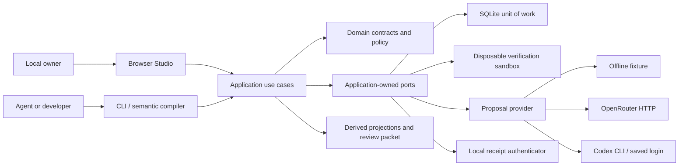
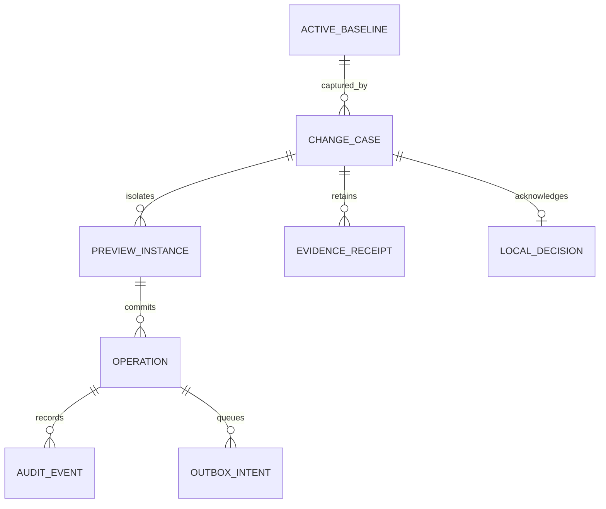

# Architecture and ubiquitous language

## Context and dependencies



This is a dependency view, not a deployment of independent services. `bootstrap.py` is the composition root. Domain/application never import adapters or web/vendor libraries; adapters implement structural protocols from `application/ports.py`. External proposal data enters through a restrictive Proposal contract and canonical interpretation enumeration.

## Context map

| Bounded area | Owns | Published contracts | Implementation |
|---|---|---|---|
| Authoring | Requested intent, alternatives, explicit selection, candidate and edits | ChangeCase, Proposal, SemanticTransaction, LayoutChange | `domain/change_case.py`, `application/service.py` |
| Execution | Trusted fixture actor state, preview instances, command replay, committed effect intents | Workflow, Transition, ExecuteCommand, UnitOfWork | `domain/policy.py`, `application/runtime.py` |
| Assurance | Subject dimensions, verification observations, admissibility and freshness | EvidenceReceipt JSON, compilation/review packet | `domain/evidence.py`, `application/verifier.py`, `application/compiler.py` |
| Governance | Local capabilities, exact-revision acknowledgement, active baseline version | Principal, local decision | `domain/models.py`, `application/service.py` |
| Provider integration | Vendor transport, authentication delegation, limits and response normalization | ProposalProvider, ProviderResult | `adapters/providers.py` |

These are responsibility boundaries inside a deliberately small modular monolith. There is no distributed transaction, event broker or microservice deployment.

## Ubiquitous language

**Change Case:** aggregate linking one original request to interpretations, chosen meaning, baseline, candidate, transactions, receipts and decision. Its revision is not the same as a workflow instance's version.

**Meaning Selection:** a local owner's explicit choice of one canonical supported interpretation. A provider explanation is not this event. Unsupported teacher-final-approval remains blocked rather than being rewritten as recommendation.

**Semantic Transaction:** one typed business-meaning edit. Rule-table and state-view commands produce the same shape. The supported operations are enabling recommendation and changing the registrar rejection source between the declared states.

**Workflow Definition:** immutable typed states/transitions/roles/guards/effect declarations. A normalized semantic hash treats definition order as non-semantic. Identifiers, states, roles and rules remain meaningful.

**Preview Instance:** one isolated persisted execution of the candidate model. It carries model hash and version. A changed candidate makes old instances stale; reset creates a new instance instead of silently migrating it.

**Evidence Receipt:** a dated local verifier observation set attached to technical subject dimensions. Its raw artifact is retained. Applicability is recomputed; a receipt's own green label is not trusted. A local HMAC is an integrity seal, not external certification.

**Review Packet:** a derived view of the current subject, blockers, technical claims, raw receipts, affected nodes and critical questions. It is not another source of truth to edit manually.

**Local Decision:** a capability-checked acknowledgement of an exact subject, scope, current baseline and answers. It is separate from technical eligibility and separate again from apply.

**Effect Intent:** a transactionally queued synthetic notification or audit append. An enqueue is not external delivery. No payment/export/notification delivery adapter is implemented.

**Authority:** permission to perform a domain or governance operation at the moment it commits. A previous successful call, model output or current UI selection cannot establish continuing authority.

## Aggregate and storage model



Receipts and decision are serialized inside the Change Case row, not separate SQL tables. This diagram describes domain relations. SQL tables are `schema_info`, `active`, `cases`, `actors`, `instances`, `operations`, `audit`, `outbox`. Case/instance/active-baseline versions have distinct compare-and-swap checks. Operations have globally unique keys within a workspace and bind their full command and model identity. Audit and outbox rows share the workflow write transaction.

Case lifecycle:

```text
DRAFT -> PROPOSED -> PREVIEW -> SAVED / VERIFIED -> APPROVED -> APPLIED
                        ^         |                  |
                        +---------+-- typed edit ----+
Any editable case -> DISCARDED
```

Saving is a checkpoint, not apply. Stage labels alone never grant eligibility. Verification, save and edit clear the current decision. Old receipts stay available; old decisions are retained in audit. APPLIED and DISCARDED cases are closed to further mutation. A changed active baseline blocks another old case; there is no automatic rebase.

## Runtime commit sequence

Inside `BEGIN IMMEDIATE`: load candidate and instance; compare model identity; load trusted actor; check active/current role/assignment; check operation replay binding; check instance version and source state; update state; append required audit; enqueue required synthetic notification; record operation. The transaction commits before success reaches HTTP. Any raised exception rolls it back. Replay rechecks current authority before returning original results and does not enqueue again.

The owner workspace runs SQLite with `synchronous=FULL` (every commit flushed). Verification runs in disposable sandboxes obtained through the application-owned `SandboxFactory` port: same unit-of-work and atomicity semantics, `synchronous=OFF`, located in `<workspace>/sandboxes/` and deleted on exit (stale leftovers from killed processes are swept after an hour). A sandbox therefore observes transaction semantics, not crash durability; receipts say so.

This is an at-most-once **local enqueue** guarantee under the tested transaction model, not exactly-once external delivery. SQLite durability remains conditional on the OS/filesystem/storage assumptions. Tests include process termination, not physical power loss or disk corruption.

## Compiler and evidence flow

```text
Declared model -> strict structural validation -> protected domain policy
               -> semantic normalization -> projections / mapped impact closure
               -> actual runtime matrix -> typed observation coverage checks
               -> subject-bound local receipt -> eligibility, never auto-approval
```

Technical receipt dimensions are semantic, implementation, policy, environment and harness. Layout/presentation is excluded from runtime applicability but included in the decision subject. Implementation identity includes package Python and browser assets, so changed UI source also requires renewed source review. The shipped source fixture is self-authored and only identifies expected release bytes.

The matrix verifier checks complete declared Cartesian coverage, duplicate/missing cells, observation field/type shape and expected-versus-actual results. It cannot establish other claim kinds by relabelling. An authenticated failing receipt and a passing one produce CONFLICT, not an average. Human understanding is UNKNOWN regardless of browser or synthetic success; `field-use` remains blocked.

## Extension contract

A new proposal provider implements `ProposalProvider`; no domain service should know its SDK. A new persistence backend must reproduce UnitOfWork/CAS/replay semantics before use. A new domain needs its own typed policy, oracle, guard/effect adapters, threat model and source-review fixture; the current policy intentionally rejects arbitrary domains. A new proof backend would emit a distinct evidence kind with declared assumptions and separately implemented admissibility—not label runtime tests “proof”. That contract now exists: `domain/evidence_kinds.py` registers each kind (Bend, Z3, bounded model check today) with a typed artifact shape and a pure check, the kernel recomputes the verdict from raw content, and a missing prerequisite is `NOT_RUN`. See [evidence kinds](../evidence-kinds.md), ADR-0145 and ADR-0146.

There is no automatic repository ingestion, proof assistant, arbitrary business-rule DSL, plugin execution, model routing optimization or MCP protocol implementation in v0.2.0. The architecture leaves places for those capabilities without claiming they exist.
