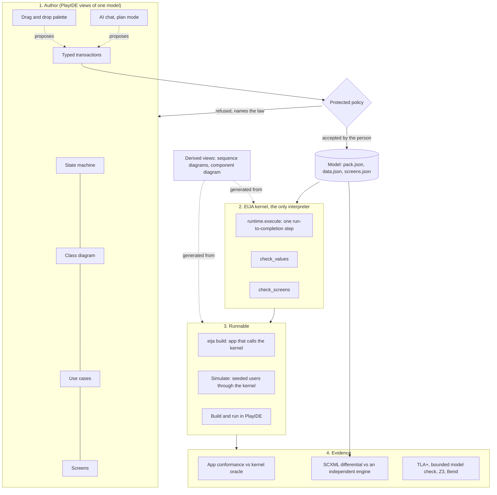

# Executable UML on the EIJA engine

How the diagrams you draw in PlayIDE become a system that runs, with EIJA as the deterministic engine underneath. Decision record: [ADR-0165](../adr/0165-executable-uml-on-the-eija-kernel.md).

## The short answer

A UML model is executable when every element has one precise meaning when it runs, and one piece of software decides that meaning. In EIJA that piece is the kernel: `runtime.execute`, the protected policy and the typed effect adapters. Everything else is either a view of the model, a check against it, or something generated from it.

- **The AI writes the model.** Chat plan mode and drawn edits produce typed transactions (`domain.transactions`), never free text.
- **The kernel decides what the model means.** The policy accepts or refuses each change and names the law it breaks. At run time the kernel commits or refuses each action.
- **Conformance proves the app matches.** A built app runs the kernel itself and is checked case by case against the kernel's own answers (ADR-0150).
- **A standard engine agrees.** The state machine exports to W3C SCXML, and an independent SCXML engine gives the same outcome as the kernel on every one of those cases (ADR-0165).

## The layers



## What each diagram means when it runs

Every view has one of three standings. **Executable**: the kernel runs it. **Checked design**: a check refuses it when it disagrees with the executable part, but it never changes what may happen. **Derived**: generated from the model or from a run, never edited as a source.

| View | Element | Standing | Meaning when it runs | Where |
|---|---|---|---|---|
| State machine | State | executable | A value a record's `state` can hold. An action is refused (`STATE_DENIED`) unless the record is in the transition's source state. | `domain/models.py` `Workflow` |
| State machine | Initial state | executable | The state a new record starts in. | `runtime.initialise` |
| State machine | Transition `action [role]` | executable | One run-to-completion step: check the actor, check the version, move the state, bump the version, perform each required effect in order, record the operation. All in one unit of work. | `runtime.execute` |
| State machine | Guard `actor_active` | executable | The actor is active at commit time, else `ACTOR_REVOKED`. | `runtime.check_actor` |
| State machine | Guard `role_current` | executable | The actor holds the transition's role now, else `ROLE_DENIED`. | `runtime.check_actor` |
| State machine | Guard `actor_assigned` | executable | The actor is assigned in the trusted directory, else `ASSIGNMENT_DENIED`. Optional per action. | `runtime.check_actor` |
| State machine | Guard `state_equals` | executable | The record is in the source state, else `STATE_DENIED`. | `runtime.execute` |
| State machine | Guard `expected_version` | executable | The caller saw the current version, else `STALE_VERSION` (optimistic concurrency). | `runtime.execute` |
| State machine | Guard `operation_binding` | executable | A repeated operation id replays the first result, and a different request under the same id is `OPERATION_CONFLICT`. | `runtime.execute` |
| State machine | Required effect | executable | Written exactly once per commit through its typed adapter: `audit` to the audit log, `notification` to the outbox. An undeclared effect is `EFFECT_DENIED`. | `runtime._perform` |
| State machine | Forbidden effect | executable | A transition may never declare it; the policy refuses the model. | `domain/policy.py` |
| Class diagram | «record» class and its attributes | executable | Values a record is created with, checked by type, choice, length and required-ness (`FIELD_*` codes). | `domain/data.py` `check_values` |
| Class diagram | Other classes and associations | derived design | Drawn and kept with the model; not stored or checked by the app yet. | `domain/data.py` |
| Use cases | Actor, use case, association | checked design | Roles and actions read from the state machine, plus "Create" for the record. They are the same facts, drawn another way. | `domain/screens.py` `use_cases` |
| Screens | Screen, field, button | checked design | Which attributes a use case shows, in what order. `check_screens` refuses a create screen missing a required attribute or a field the record lacks; no app is built from screens it refuses. | `domain/screens.py` |
| Sequence | Commit sequence | derived | The order of calls in one `execute`, drawn from the algorithm. | `application/diagrams.py` |
| Sequence | Simulate trace | derived | What seeded users did, step by step, as the kernel decided it. | `application/simulation.py` |
| Sequence | Scenario (`scenarios.json`): lifelines, messages, state invariants, `neg` fragments | checked design | Each step is run through `execute` by `scenario_run` with the pack's fixture actors; one the model can't do is flagged with the kernel's refusal, and a step drawn in a `neg` must be refused (ADR-0177, ADR-0195). | `application/sequences.py` |
| Component | Components, interfaces | derived | Read from the generated app's code: it shows the app asking the kernel for every decision. | `application/components.py` |

The change vocabulary is closed too. Each kind is a typed record the policy checks before anyone accepts it:

| Change | Meaning |
|---|---|
| `add_state` | Add a state (presentation order only). |
| `rename_state` | Rename a state everywhere it is used. |
| `remove_state` | Remove an unused, non-initial state. |
| `set_initial` | Make another state the initial state. |
| `add_transition` | Add a transition for a declared action; its guards and effects come from the action's declaration. |
| `retarget_transition` | Move one end of a transition (the drag edit). |
| `remove_transition` | Remove a transition. |
| `set_role` | Change who may take a transition. |
| `set_guards` | Change a transition's guards; the base guards can never be removed. |
| `set_effects` | Change a transition's required effects; the policy holds them to the action's declaration. |

`tests/test_executable_uml_profile.py` fails if a guard or change kind exists in the code without a row here.

## Laws: the layer above the UML

The diagrams say what the system does. The laws say what it must never do, whatever any diagram says. They are typed records in each pack's `pack.json` (`domain/laws.py`), for example "only a librarian checks a loan out", "every path to Returned passes through OnLoan" and "a returned loan is closed". They are checked three ways, from cheapest to deepest ([ADR-0166](../adr/0166-laws-proved-over-every-run-for-any-pack.md)):

1. **On the table, on every edit.** The protected policy refuses a model or edit that breaks a law and names it. The AI's plan steps and drawn edits pass through it.
2. **Over every run, for any pack.** `eija laws` and PlayIDE's **Laws** tab explore every configuration a new record can reach. They try every action by every kind of actor through the kernel, and judge every run with the laws' own evaluator. Each law gets a verdict:
   - HOLDS
   - BROKEN, with the shortest run that breaks it, shown on the state machine
   - VACUOUS, when nothing ever reaches what the law is about
   - INACTIVE, when it does not apply to this model
   - EVIDENCE, when review evidence judges it
3. **Deep, independent proofs where they exist.** For the excursion pack, `verification/bend/LAWS.bend` states the laws and `PROOF.bend` proves them for all actors, states and command sequences. TLA+/TLC, Z3 and a bounded model check of the runtime check it too. See [docs/formal](../formal/bend.md).

```console
eija laws --pack packs/library-loan     # every law, its verdict and its evidence
```

In PlayIDE, **Edit the law file** opens the laws exactly as `pack.json` holds them. A draft is checked as the pack loader checks it and proved over every run before anything is kept. Nothing is saved from the IDE, and loosening a law stays the owner's reviewed step. **Formal checks for this pack** lists which deeper checkers cover the pack and how ([ADR-0177](../adr/0177-law-files-and-test-cases-in-playide.md)).

## Test cases: scenarios the kernel runs

Laws say what must never happen. Test cases say what should happen, as stories. Each pack keeps them in `scenarios.json` beside `pack.json`. A scenario is a start state and steps, and each step is a fixture actor taking an action, with either the state the record must reach or the refusal code the kernel must give. The kernel runs every step, so a scenario can never disagree with the model it tests; when the model changes, a scenario that no longer holds fails at the step where behaviour changed ([ADR-0177](../adr/0177-law-files-and-test-cases-in-playide.md)).

The tests a pack has, from narrowest to widest:

| Tests | Written by | Where | Run by |
|---|---|---|---|
| Scenarios | People, in PlayIDE's **Tests** tab or by hand | `packs/<pack>/scenarios.json` | `eija scenarios`, the Tests tab, `tests/test_scenarios.py` |
| Conformance cases: every state, action, fixture actor and version | Generated (`appgen.oracle_cases`) | The built app's `tests/` | `eija build`, then `python -m unittest` in the app |
| The same cases on a second engine | Generated | `verification/scxml/` | `python -m verification.scxml.differential` |
| Every run, by every kind of actor, against the laws | Generated | none (searched on demand) | `eija laws`, the Laws tab |

```console
eija scenarios --pack packs/library-loan   # every scenario, step by step; exit 2 if one fails
```

## Why there is no action language

xtUML and fUML made UML executable by adding an action language (OAL, Alf). That made models precise, and it also made them programs in a different syntax, which is where model-driven architecture stalled: writing a precise model by hand cost as much as writing the code, and the code had better tools.

EIJA takes the other branch. The vocabulary is closed and typed, so every model can be checked exhaustively, every AI proposal can be refused with a reason, and an app built from it can be compared case by case with the kernel. AI changes the economics that stalled MDA: the expensive part, writing and editing a precise model, is what the AI does, in the model's own vocabulary, and the person reviews a diagram rather than a diff.

The cost is expressiveness. A construct is executable only after it has been added as an operator with executable semantics, a refusal when its resolver is missing, projection rules for every view, identity effects, a negative oracle and an evidence policy. Today that rules out the following, each a candidate operator with its own ADR:

| Not executable yet | Why it matters | Likely shape |
|---|---|---|
| Guards over record values (`[amount > 100]`) | Most real workflows branch on data | A typed comparison over a record attribute, checked by `check_values` types |
| Timers and deadlines (`after(14 days)`) | Overdue loans, expiring approvals | A time event fed by a clock port; Simulate gets simulated time |
| Composite and orthogonal states | Large machines stay readable | Flattened by the kernel; SCXML has both natively |
| Actions on associated objects | "Approving the trip books the bus" | Effects on another class's records, each with its own state machine (xtUML's one machine per class) |
| Messages between workflows | Component diagrams that run | Typed signals between packs over a port |

## Why you can trust the state machine's meaning

Two independent checks stand on the same set of cases, `appgen.oracle_cases`: every state, every action plus one undeclared action, every fixture actor plus one unknown actor, and expected versions 0 and 1.

1. **The built app against the kernel** (ADR-0150). The app's storage, transactions and effects must keep the kernel's answer for every case, and replays must be idempotent.
2. **An independent SCXML engine against the kernel** (ADR-0165). `eija scxml` writes the model as a W3C SCXML statechart. [python-statemachine](https://github.com/fgmacedo/python-statemachine) (MIT), which EIJA did not write, runs it, and must reach the same state, version and effects as the kernel on every case. On 2026-10-08: 960 cases over three packs, 0 disagreements. Nine deliberately broken charts each disagree, so the check is not vacuous.

What the SCXML chart contains, for one transition of the library loan pack:

```xml
<state id="Requested">
  <transition event="CheckOut" target="OnLoan"
      cond="_event.data.known and _event.data.active and _event.data.role == &quot;Librarian&quot;
            and _event.data.assigned and _event.data.expected_version == version">
    <assign location="version" expr="version + 1" />
    <assign location="effects" expr="effects + [&quot;Audit:LoanCheckedOut&quot;]" />
    <assign location="effects" expr="effects + [&quot;Notification:MemberNotified&quot;]" />
  </transition>
</state>
```

The actor travels in the event data, resolved by whoever sends the event, as the kernel's `UnitOfWork.actor` port resolves it. Idempotent replay is not in the chart; the app's own conformance run checks it. The committed charts for every pack are in `verification/scxml/generated/`.

## Commands

```console
eija scxml --pack packs/library-loan --out loan.scxml        # the statechart, for any SCXML engine
pip install -e ".[xuml]"                                     # python-statemachine, for the differential
python -m verification.scxml.differential                    # every pack: kernel vs SCXML engine
nox -s scxml_drift scxml_differential                        # the gates
eija laws --pack packs/library-loan                          # every law proved over every run
eija scenarios --pack packs/library-loan                     # the pack's test cases, run by the kernel
eija build --pack packs/library-loan --out build/loan        # the runnable app and its conformance run
```
