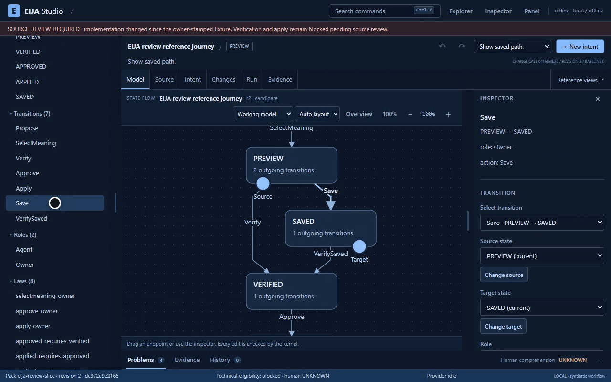
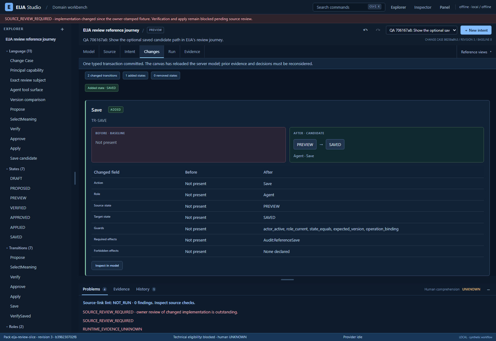
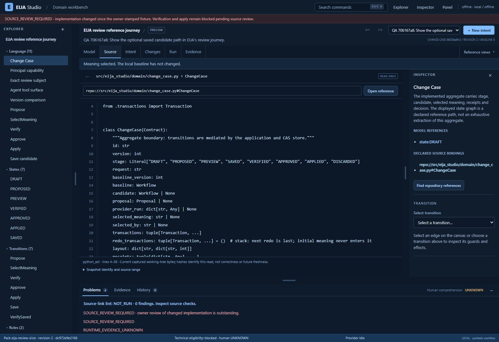

# EIJA IDE preview — 2 October 2026

**A fresh public GitHub clone passed installation, real CLI startup, and all 20 recorded browser checks.** The tested revision is [`c666b6bb76905c0c9bd03e81cac0922136c4cf3e`](https://github.com/45ck/eija-studio/tree/c666b6bb76905c0c9bd03e81cac0922136c4cf3e), from the implementation work in [draft PR #29](https://github.com/45ck/eija-studio/pull/29). This is an implementation preview with open acceptance work, not a completed release or a human validation result.

[Watch/download the unedited browser recording](assets/ide-preview-20261002/ide-preview.webm) · [Machine-readable proof summary](assets/ide-preview-20261002/proof-summary.json)

The 63.60-second recording shows the actual application at 1600×1100. It contains deliberate test pacing and is not performance evidence. The screenshots below come from the same recorded run.

## Short presentation clip



This 9.54-second, 1280×800 GIF shows the actual offline reference model moving from Model to Changes. The candidate was prepared through the application's controls before recording. The existing browser recorder and stock `pr-gif convert` pipeline removed a 14-second startup/case-opening prefix; the remaining scene runs at normal speed with no tail truncation. The full 23.56-second source take is retained in the local evidence package.

Cursor/caption overlays use the existing recorder's isolated bypass-CSP context; the application CSP is unchanged. This is a presentation clip, not security, accessibility, performance or release evidence. The separate unedited 63.60-second functional replay above preserves normal CSP and contains the full 20-check workflow. [Presentation provenance and media hashes](assets/ide-preview-20261002/presentation-provenance.json) record these distinctions.

## What is working

EIJA puts a modeled change, its source references, semantic differences and evidence in one IDE. This preview uses EIJA's own checkout and a bounded, declared review journey. The diagram is not an exhaustive extraction of the application's behavior; source facts, declared intent and behavioral conformance remain distinct.


An offline request produces candidate meanings. Selecting the optional saved path adds a state and transitions. A supported edit changes Save's role from Owner to Agent; the case revision and semantic identity change. A forbidden approval-role edit is refused before an edit request is sent. Undo, redo, history previews and reload preserve the expected models.



Changes compares the actual server-returned baseline and candidate. Save is absent from the original case baseline, so this view correctly shows it as added with the Agent role. The narrower edit within the selected candidate is Owner → Agent. Both comparisons are checked separately.



Selecting Change Case opens the captured Python symbol and source range. Canvas zoom/pan, panels and read-only previews preserve semantic identity. Keyboard controls, desktop readability and 320-pixel reflow are exercised. At 100%, details keep their intended scale; Overview can shrink labels, and short viewports require panning.

## What the fresh-clone run established

The runner cloned the public HTTPS repository with user/system Git configuration excluded and credential prompts disabled, then checked out the exact revision above. It created a new Python environment and ran the documented `python -m pip install -e ".[dev,hci]"` with dependency resolution. `pip check` passed. Interpreter, editable-package metadata and module paths resolved to the fresh clone and its environment.

The installed `eija.exe serve --provider offline --pack packs/eija-review-slice --repo .` command started with a fresh workspace and random loopback port. Public HTML and JavaScript matched the clone's assets; security headers and the owned listener were checked. Private launch output was discarded without reading a capability. No owner API was called. Captured launcher/server process identities exited and no listener remained before workspace cleanup.

The separate normal-identity browser replay passed **20/20 checks**. Git HEAD and cleanliness matched before/after; all **101 captured source/pack/replay files were unchanged**. No personal browser profile was used. The browser, owned servers and temporary workspaces were closed/removed.

| Observation | Result |
|---|---|
| Environment | Existing Windows 11 host; new Python 3.12.10 environment |
| Browser prerequisite | Existing isolated Chromium cache, revision 1243; actual Chromium 153.0.8010.12 |
| Browser libraries | Playwright 1.63.0; axe-playwright-python 0.1.8 |
| Installation | PASS; 32.843 seconds on this host with package caches available |
| Actual CLI startup and cleanup | PASS |
| Recorded browser replay | 20 PASS; no unexpected JavaScript/HTTP errors or approval/apply requests |
| Source preservation | 101 files unchanged; exact commit and clean tree before/after |
| Automatic accessibility audit | Zero violations across four views; contrast incompletes remain |

This is fresh-clone and fresh-environment evidence on an existing host, not clean-machine validation. The full dependency versions, exact check IDs, source identities and media hashes are retained in the proof summary.

## Runtime-preview recovery: separate evidence

The repaired revision preserves the current runtime preview when selecting the same case or when required navigation reads fail, and clears it only after a different case successfully loads. A busy dropdown also restores the displayed case instead of leaving it inconsistent with the loaded model.

This behavior has **five separate browser checks**, including intentional 503 responses and a real action on the retained instance. Those checks are **not part of the 20-check fresh-clone replay**. They ran on unchanged captured dirty source based on `9c22d42`, identified by source hash `47fc02df…`, before the repair was committed. Their exact identities and limits are retained in the [validation record pinned to this preview revision](https://github.com/45ck/eija-studio/blob/c666b6bb76905c0c9bd03e81cac0922136c4cf3e/docs/engineering/2026-10-02-VALIDATION-CHECKPOINT.md#runtime-preview-recovery-checkpoint).

## What remains open

- The [HCI report at this revision](https://github.com/45ck/eija-studio/blob/c666b6bb76905c0c9bd03e81cac0922136c4cf3e/docs/hci/REPORT.md) still fails its visibility-density budget: **68 against an allowed 27**. This is a screen-content proxy, not a measurement of human memory. Its settled-DOM p95 is **777.5ms**, a GAP against the 400ms target. The separate HCI collection reports 16 PASS, one GAP and one FAIL; these are not human-study results or timings from this replay.
- The normal application visibly retains `SOURCE_REVIEW_REQUIRED`. Runtime verification refuses the changed implementation; approval/apply stay disabled. No release fixture was stamped. Human understanding remains `UNKNOWN`.
- Axe retains incomplete contrast checks for 19 Model targets and two targets in each other audited view. Screen-reader use, forced colors, reduced motion and complete accessibility remain unvalidated.
- Changes currently provides transition cards and exact semantic tables. Full paired-graph review and source-code authoring remain open; the source pane is read-only. A complete end-to-end engineering story is not established by this bounded flow.
- Live-provider behavior, external codebases, universal semantic extraction, human task success and reduced comprehension burden are not established by this recording. The reference journey's implementation conformance remains `NOT_RUN`.

Reproduce the browser flow using the [replay guide at the tested revision](https://github.com/45ck/eija-studio/blob/c666b6bb76905c0c9bd03e81cac0922136c4cf3e/docs/engineering/SELF-DOGFOOD-BROWSER-REPLAY.md). The broader [self-dogfood acceptance contract](https://github.com/45ck/eija-studio/blob/c666b6bb76905c0c9bd03e81cac0922136c4cf3e/docs/engineering/SELF-DOGFOOD-ACCEPTANCE.md) remains the completion criterion.

## Reproduce this revision from GitHub

The following PowerShell commands check out the exact revision used for this preview, create a new environment, install with dependency resolution, and run the committed isolated browser replay. Use an empty parent directory and Python 3.11 or newer; the recorded host used Python 3.12.10. Complete any device/browser authorization required on your endpoint first.

```powershell
$ErrorActionPreference = 'Stop'
git clone --no-checkout https://github.com/45ck/eija-studio.git eija-ide-preview
if ($LASTEXITCODE -ne 0) { throw 'Git clone failed' }
Set-Location -LiteralPath eija-ide-preview
git checkout --detach c666b6bb76905c0c9bd03e81cac0922136c4cf3e
if ($LASTEXITCODE -ne 0) { throw 'Pinned checkout failed' }
if ((git rev-parse HEAD) -ne 'c666b6bb76905c0c9bd03e81cac0922136c4cf3e') { throw 'Wrong revision' }
python -m venv .venv
if ($LASTEXITCODE -ne 0) { throw 'Environment creation failed' }
& .\.venv\Scripts\python.exe -m pip install -e '.[dev,hci]'
if ($LASTEXITCODE -ne 0) { throw 'Installation failed' }
& .\.venv\Scripts\python.exe -m pip check
if ($LASTEXITCODE -ne 0) { throw 'Dependency check failed' }
& .\.venv\Scripts\python.exe -m playwright install chromium
if ($LASTEXITCODE -ne 0) { throw 'Browser prerequisite failed' }
& .\.venv\Scripts\python.exe tests/hci/self_dogfood_replay.py --record --out reports/self-dogfood-browser
if ($LASTEXITCODE -ne 0) { throw 'Browser replay did not pass; inspect retained reports' }
git rev-parse HEAD
git status --short
```

`PLAYWRIGHT_BROWSERS_PATH` may point to an existing isolated browser cache. The recorded fresh-clone proof reused that cache on an existing Windows host; it did not copy a virtual environment or personal Chrome profile. A first-time machine may need to download the pinned browser. Dependency installation uses ordinary resolution; the proof summary records the versions actually installed, not a promise that every transitive dependency is locked.

The replay creates its own new temporary workspace and loopback server, uses the normal source-review identity, records real browser interactions, and closes its owned browser/server. It takes no owner URL or workspace argument. It does not enable a live provider, stamp source fixtures, bypass CSP, or invoke approve/apply. Reports remain under `reports/self-dogfood-browser`; the source manifest compares actual bytes before and after. Expected `SOURCE_REVIEW_REQUIRED` stays visible.

The recorded proof also checks the installed console command separately, using a fresh workspace and loopback port:

```powershell
& .\.venv\Scripts\eija.exe serve --provider offline --pack packs/eija-review-slice --repo . --workspace .tmp/cli-preview
```

This last command is an optional interactive launch; stop it after inspection. The automated proof discards its private launch output and checks only public HTML/JavaScript plus exact owned-process cleanup. The 20 authenticated browser checks run against the committed replay's separate disposable server, not the CLI's private capability.

The reusable browser flow and its acceptance scope are documented in [`docs/engineering/SELF-DOGFOOD-BROWSER-REPLAY.md`](https://github.com/45ck/eija-studio/blob/c666b6bb76905c0c9bd03e81cac0922136c4cf3e/docs/engineering/SELF-DOGFOOD-BROWSER-REPLAY.md). Passing this replay does not close HCI density, source review, human-value, live-provider or external-codebase work.
