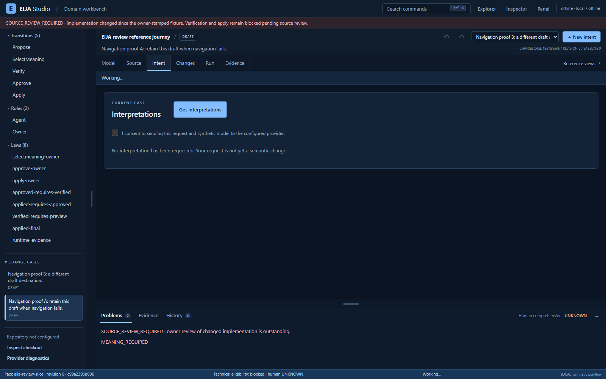

# Historical navigation-recovery proof

A controlled browser run reproduced two navigation defects in [9c22d425ee33e52980a95b33330babec43c6aa59](https://github.com/45ck/eija-studio/commit/9c22d425ee33e52980a95b33330babec43c6aa59) and verified their repair in [c666b6bb76905c0c9bd03e81cac0922136c4cf3e](https://github.com/45ck/eija-studio/commit/c666b6bb76905c0c9bd03e81cac0922136c4cf3e). The [exact source comparison](https://github.com/45ck/eija-studio/compare/9c22d425ee33e52980a95b33330babec43c6aa59...c666b6bb76905c0c9bd03e81cac0922136c4cf3e) and these observations concern that historical pair. They do not establish the current shell's full acceptance status.

Both revisions ran the same script, installed Chromium executable and conditions in separate fresh contexts. Two real unselected DRAFT cases were created per side. The expected current case was A; B was the attempted destination.

| Observable requirement | Before | After |
| --- | --- | --- |
| A failed B detail request leaves every displayed identity on A | Failed: dropdown B, title/case ID/current list A | Passed: all A |
| Selecting B while a real diagnostics request is held leaves A selected during and after completion | Failed: dropdown B, other identity A | Passed: all A |
| Successful retry after failure and successful switch after busy completion | Both passed | Both passed |

The failed-read stimulus was one controlled HTTP 503; the busy stimulus held and then continued the actual diagnostics GET. Successful responses were real. Independent GET snapshots confirmed both saved drafts stayed unchanged, and request observations confirmed no navigation writes. The two fixture creations were the only writes per side. Browser errors, unexpected HTTP errors, service-worker events, forbidden actions, owner actions and provider calls were all zero. Both servers, contexts and the browser closed. Exported source and harness bytes stayed unchanged.

## Evidence and reproduction

The [generated observation excerpt](evidence/navigation-recovery-2026-10-03/proof-summary.json) retains the outcomes, normalized A/B identities, exact commits, script/browser/input hashes, conditions and original receipt digests. It is explicitly an excerpt, not a raw signed receipt. The [export-validation excerpt](evidence/navigation-recovery-2026-10-03/export-validation.json) records independently checked Git tree/blob identities for 100 source files per revision; only app.js differs in the exported runtime scope. The [publication manifest](evidence/navigation-recovery-2026-10-03/manifest.json) binds the supplied files, and both screenshots are unchanged originals.

Follow the [export and browser reproduction guide](../../tests/hci/repository_navigation_pair.md). The successful run used freshly produced exporter output. Source binding comprises exact exported bytes, the configured release-CLI root and an HTTP hash check of served app.js. Unselected DRAFT packets have no implementation subject; none is invented here. Git authorship remains separate from the declared Codex-assisted label, which this proof does not authenticate.

After the analysis-module refactor, the exporter imports its syntax reader from the new owner. A [separate current-tool export check](evidence/navigation-export-recheck-2026-10-03.json) reproduced both 100-file runtime trees byte for byte and the entire comparison JSON. The browser runner is unchanged. The original excerpt retains its original exporter hash; the new record identifies the current exporter separately. This recheck establishes export equivalence, not another browser execution or a new behavior result.

## Retained unsuccessful attempts

All earlier attempts remain NOT_PROVEN; their receipt hashes are in the excerpt.

| Attempt | Why it did not establish the claim |
| --- | --- |
| 1 | The default full-Chromium executable was absent. No browser launched; the already installed headless shell was then selected explicitly. |
| 2 | The harness expected a packet subject on an unselected DRAFT. It was corrected to the actual contract and explicit export/launch/served-app binding. |
| 3 | A current-layout helper expected a diagnostics disclosure absent from both historical UIs. The harness was adapted to their actual controls; source bytes and behavior oracles stayed fixed. |
| 4 | Both scenarios and success controls completed, but the unchanged error gate rejected a sandbox-frame error from Playwright's service-worker blocking initialization. |

The instrumentation error was separately reproduced with only an empty sandbox iframe on a route-fulfilled loopback document, without EIJA code or a server. Block mode caused the same `SecurityError`; browser default did not. An earlier about:blank reproduction did not trigger it, and one diagnostic had a callback-arity error; both were retained. The final runner uses fresh default contexts and aborts worker registration/worker-originated requests, fails on any worker event or active worker, and retains every product-error check. No error was filtered into a pass.

## Limits of this evidence

- One scripted run establishes two displayed-navigation properties on this source pair, one Windows/Chromium environment and controlled transport conditions. It does not estimate reliability across environments.
- The cases stayed unselected DRAFTs. Candidate preview retention, all four changed syntax sites, workflow execution, meaning selection, verification, approval, apply, export and live-provider behavior were not tested.
- This does not establish complete dependencies, general source/model conformance, arbitrary-codebase support, production readiness or software-factory behavior.
- No human comprehension, cognitive burden, satisfaction or usability benefit was measured.
- Code intake and these observations are separate evidence. The original comparison's behavior status was not rewritten into a generic behavior-verification claim.
- Public excerpts omit raw GET payloads, local identities and test-instance identifiers. Original hashes identify retained evidence; independent validation requires reproducing the run.
