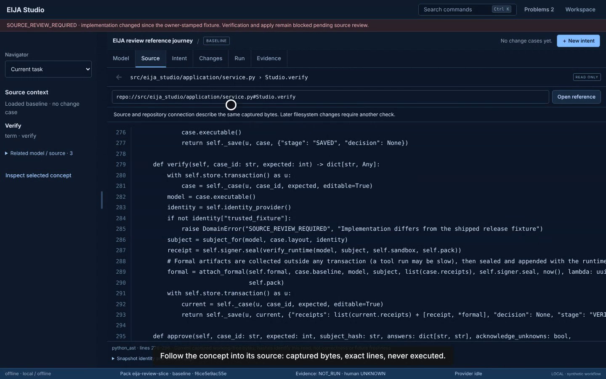
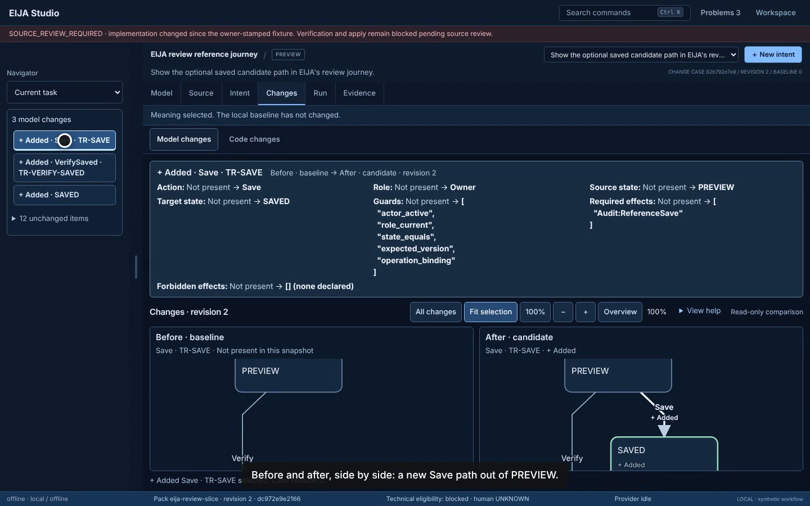
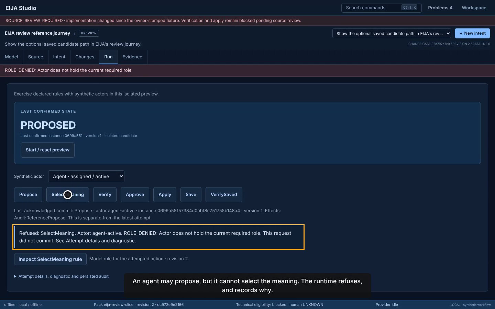
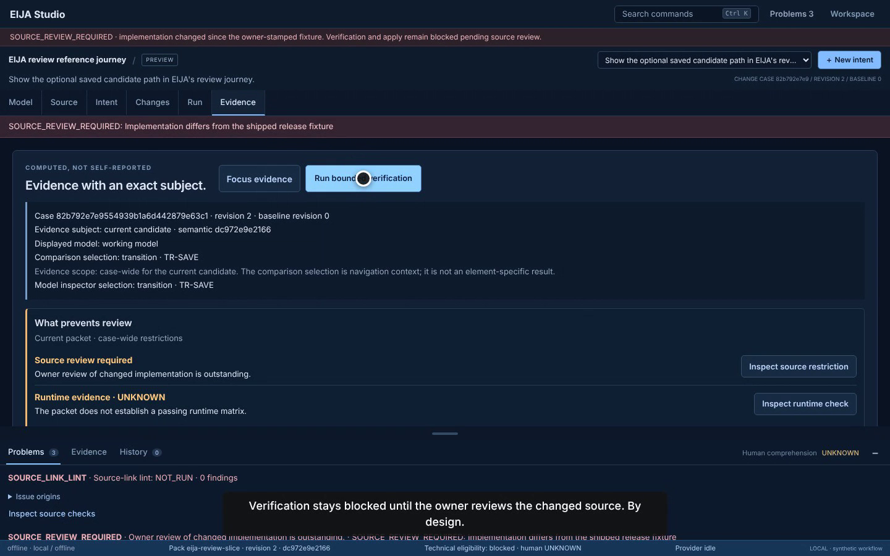

# IDE walkthrough: EIJA reviews a change to itself (8 October 2026)

This is a scripted recording of the real IDE. EIJA is connected read-only to its own checkout and runs the self-dogfood pack with the offline provider. Every click in it is a real browser action against a real `eija serve`, and every step asserts text the Studio actually rendered. The recording is also an end-to-end check: `python -m demos run ide_walkthrough --dry-run` repeats the same clicks and assertions without video.

It is **PARTIAL**. Verify, approve and apply were not exercised, because the release fixture is not restamped for this source, so verification returns `SOURCE_REVIEW_REQUIRED`. The video shows that refusal. Only the owner can restamp; agents never do.

## What the run shows

| Moment | What is real |
|---|---|
| Model of EIJA's review journey | Loaded from `packs/eija-review-slice`; the repository connection is read-only and the checkout's code is never executed. |
| Concept → source | Selecting the term *Verify* lists its declared binding `repo://src/eija_studio/application/service.py#Studio.verify`; opening it shows the captured bytes with line numbers. |
| Intent → meaning | A plain-language request; interpretations come from the deterministic offline fixture (no model call); the owner selects the meaning. |
| Change review | Added/modified/removed model elements, exact field differences and a paired before/after diagram for `TR-SAVE`. |
| Checked edit | Target options the kernel would refuse are labelled before anything is sent. A server-checked preview of the exact edit is shown, then closed with no write. |
| Run | An isolated preview: an agent may propose but its `SelectMeaning` is refused (`ROLE_DENIED`, recorded); the owner's succeeds. |
| Evidence | Evidence is tied to an exact subject; human comprehension stays `UNKNOWN`; Verify is refused with `SOURCE_REVIEW_REQUIRED`. |









*Frames decoded from the recording (lossy video frames, not browser screenshots). See [provenance](assets/ide-walkthrough-20261008/provenance.json).*

## Use the IDE yourself

```bash
python -m venv .venv && source .venv/bin/activate     # Windows: py -3 -m venv .venv; .\.venv\Scripts\Activate.ps1
python -m pip install -e ".[dev,source-analysis]"
eija serve --pack packs/eija-review-slice --repo . --open   # EIJA on its own code, read-only, offline
eija serve --open                                            # the synthetic excursion example instead
```

## Reproduce the recording

```bash
python -m pip install -e ".[demos]"
python -m demos run ide_walkthrough --dry-run   # same clicks and assertions, no video
python -m demos run ide_walkthrough             # writes demos/output/ide_walkthrough.webm and its manifest
```

The committed manifest is [`demos/recordings/ide_walkthrough.json`](../../demos/recordings/ide_walkthrough.json). The published MP4 is the raw take trimmed by 6.0 s of startup loading before the title card, with a short fade at each end. It has no cuts within the run. Its hash is in the provenance file.

## Checks on the recorded source

These ran on Linux with Python 3.13.16. The browser was Playwright's bundled Chromium 141, launched through the `chrome` channel because this container's `/opt/google/chrome/chrome` was a symlink to it. It was not Google Chrome.

- `nox -t fast`: 22/22 sessions pass.
- JavaScript: 503/503 pass.
- `python scripts/verify_release.py`: 2,672 passed, 172 skipped, 2 xfailed. `source_review: SOURCE_REVIEW_REQUIRED`.
- HCI browser session: 39 pass, 2 budget failures. Predicted pointer KLM is 65.31 s against a 65 s limit, and the visible-density proxy is 52 against 27. The limits are unchanged; re-deriving them for the IDE is an owner decision.
- Browser journeys `native_gesture_parity`, `agent_edit_review`, `prospective_edit_review` and `source_first_review`: PASS.
- NOT_RUN: Bend (no Docker), Alloy (no jar), live providers, and any human comprehension study.

## What this does not establish

This run used one machine, the offline fixture and a synthetic workflow. It does not show live-AI usefulness, measured human benefit, external-codebase generality or a trusted release. Source review remains outstanding until the owner reviews the changed implementation and restamps the fixture.
