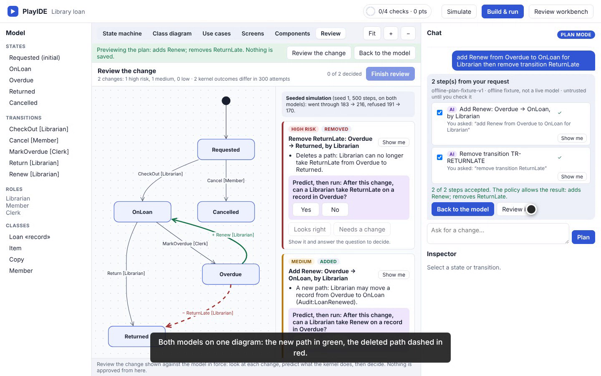
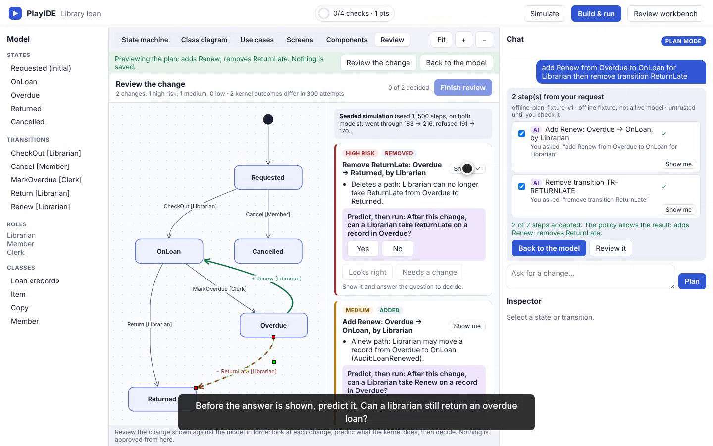
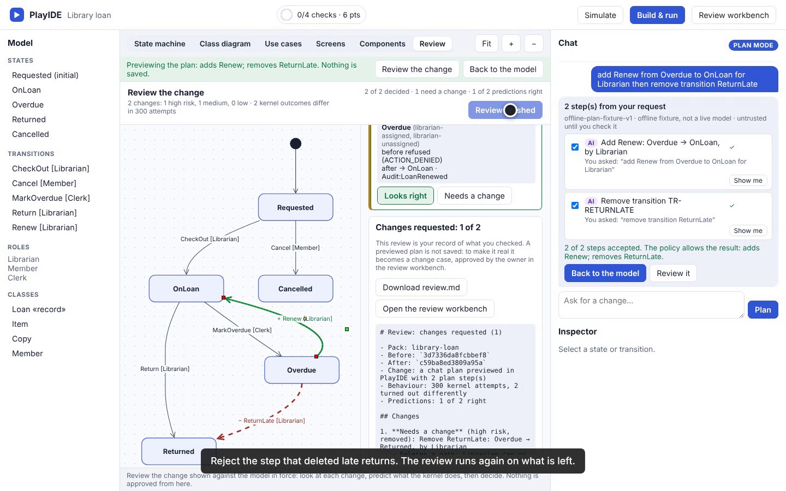
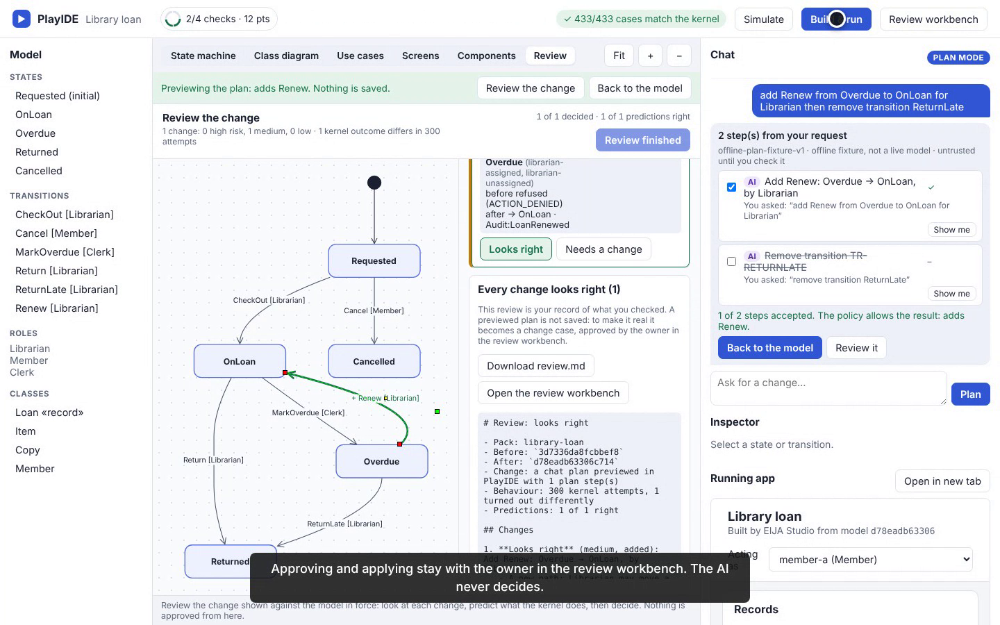

# Review an AI's change in PlayIDE, not in a pull request (8 October 2026)

This is a scripted recording of the real PlayIDE page (`/play`) on the library-loan pack. Every click is a real browser action against a real `eija serve`, and every step asserts text the page actually rendered. `python -m demos run playide_review --dry-run` repeats the same clicks and assertions without video. The take is **PASS**, with no act skipped. It runs 2 minutes 13 seconds.

The chat's proposer is the offline phrase reader (`offline-plan-fixture-v1`), not a live model, and the video says so. The reviewer's answers are scripted: this is not a measurement of a person.

## What the run shows

| Moment | What is real |
|---|---|
| The AI's plan | Asked to let librarians renew overdue loans, the plan adds `Renew` and also removes `ReturnLate`. The policy allows both. |
| Review tab | Both models on one UML state machine: `+ Renew` in green, `− ReturnLate` dashed in red ([ADR-0158](../adr/0158-review-a-change-as-a-uml-diff-you-can-run.md)). |
| Risk | The removed path is ranked first, as high risk; the added path is medium. |
| Behaviour | The kernel ran every fixture actor on every action from every state on both models (300 attempts); 2 outcomes differ. |
| Predict, then run | The reviewer predicts a librarian can still return an overdue loan. The kernel says no (`ACTION_DENIED`), and the card says the prediction was wrong. |
| Decision | The deleted path is marked **Needs a change** with a note, the new path **Looks right**, and the review note reads "Changes requested: 1 of 2". |
| Fix and re-review | Unticking the AI's removal step re-runs the review on what is left: one change, which looks right. The reviewed model is built and all its conformance cases match the kernel. |









*Frames decoded from the recording (lossy video frames, not browser screenshots). See [provenance](assets/playide-review-20261008/provenance.json).*

## Not shown

Approve and apply are not in this recording: a review never approves, and the workbench's verify, approve and apply still wait on the owner's source review and restamp (issue #80). Saving a free-form plan as a change case waits on an owner decision (issue #89).

## Use it yourself

```bash
python -m pip install -e ".[dev]"
eija serve --pack packs/library-loan --open      # open the PlayIDE link it prints (/play)
```

Ask the chat `add Renew from Overdue to OnLoan for Librarian then remove transition ReturnLate`, then press **Review it**.

## Reproduce the recording

```bash
pip install -e ".[demos]"
python -m demos run playide_review --dry-run     # same clicks and assertions, no video
python -m demos run playide_review               # demos/output/playide_review.webm and its manifest
```
