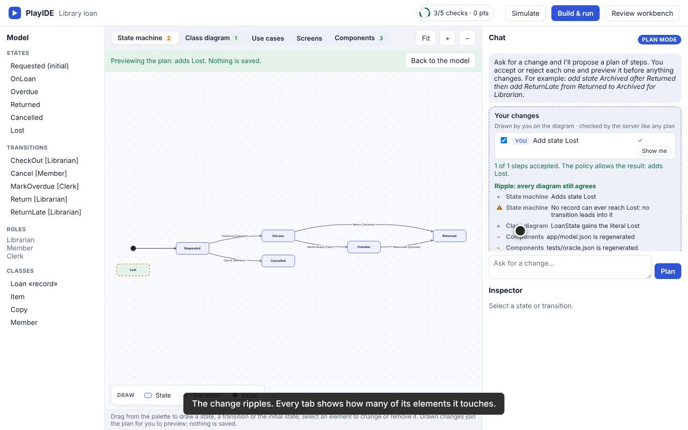
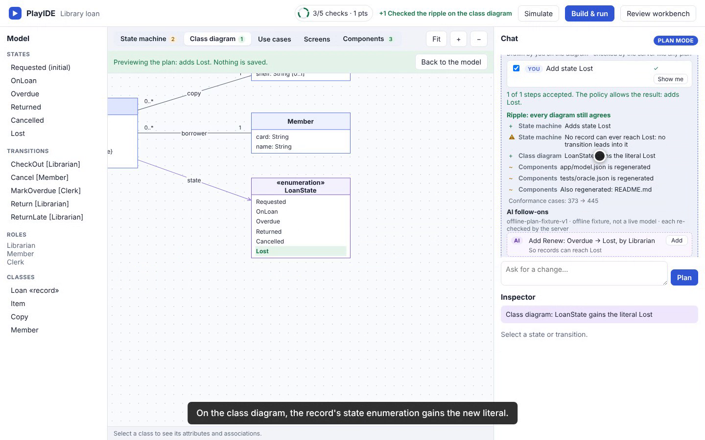
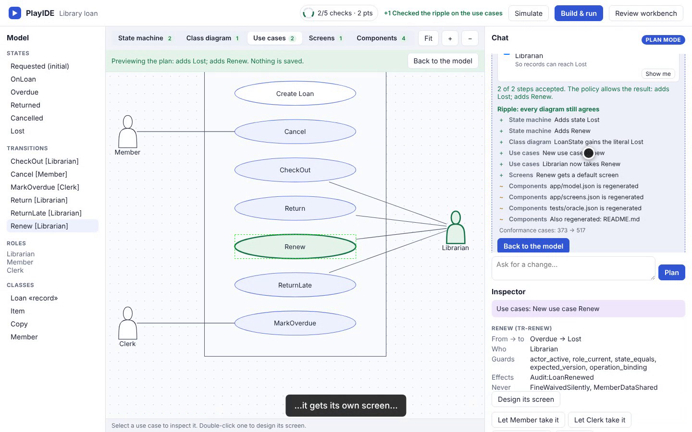
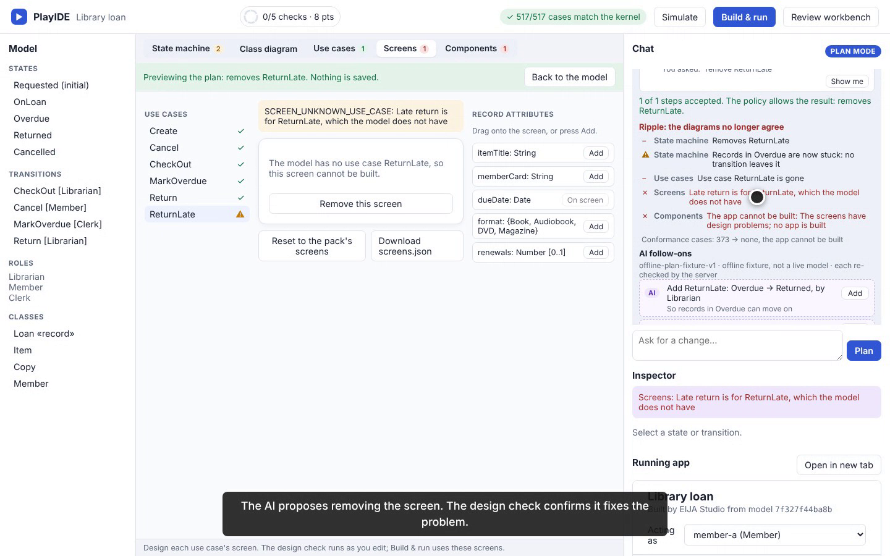
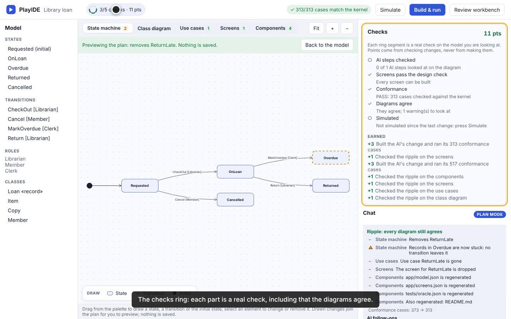

# PlayIDE ripple: change one diagram, see the others follow (8 October 2026)

This is a scripted recording of the real PlayIDE page (`/play`) on the library-loan pack. Every click is a real browser action against a real `eija serve`, and every step asserts text the page actually rendered. `python -m demos run playide_ripple --dry-run` repeats the same clicks and assertions without video. The take is **PASS**, with no act skipped. It runs 2 minutes 7 seconds.

The follow-on edits come from the offline rule-based proposer (`offline-plan-fixture-v1`), not a live model, and the video says so. See [ADR-0158](../adr/0158-ripple-across-diagrams-with-checked-follow-ons.md).

## What the run shows

| Moment | What is real |
|---|---|
| Drag a state | A state dragged onto the state machine becomes a typed step, checked by the policy and previewed (ADR-0157). |
| Ripple | The server compares the saved system with the plan's version, diagram by diagram. Tabs get badges. The class diagram's `LoanState` enumeration gains the literal, and the new state is flagged unreachable (a warning). |
| AI follow-on | The proposer suggests a transition into the new state. The policy re-checks it before it can be added. |
| It ripples on | The new action is a new use case for the Librarian and gets a default screen. The component diagram marks the regenerated files, and the number of conformance cases grows. The app builds and every case matches the kernel. |
| A breaking change | The AI's removal of an action strands its screen, so the app cannot be built. This is caught as the change is made (`SCREEN_UNKNOWN_USE_CASE`). |
| Re-checked fix | The AI's follow-on removes the screen. The design check confirms that it fixes the problem, the ripple says every diagram agrees, and the app builds. |
| Checks ring | The new "Diagrams agree" part is green, and points came only from checking. |











*Frames decoded from the recording (lossy video frames, not browser screenshots). See [provenance](assets/playide-ripple-20261008/provenance.json).*

## Not shown

The proposer is a fixed rule set. Its follow-ons are guesses, for example which action leads into a new state, and the person decides. A live model needs the owner's permission for network use and spend. Plans are not saved (issue #89). Verify, approve and apply wait on the owner's source review and restamp (issue #80).

## Reproduce the recording

```bash
pip install -e ".[demos]"
python -m demos run playide_ripple --dry-run     # same clicks and assertions, no video
python -m demos run playide_ripple               # demos/output/playide_ripple.webm and its manifest
```
