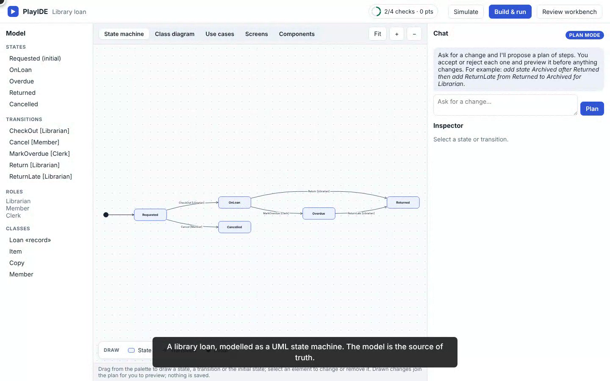
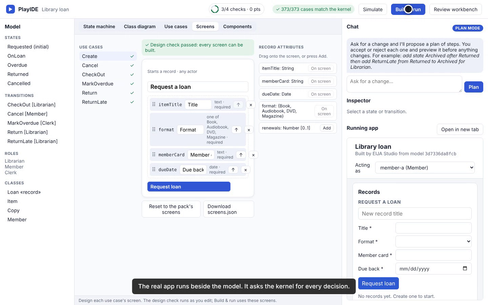
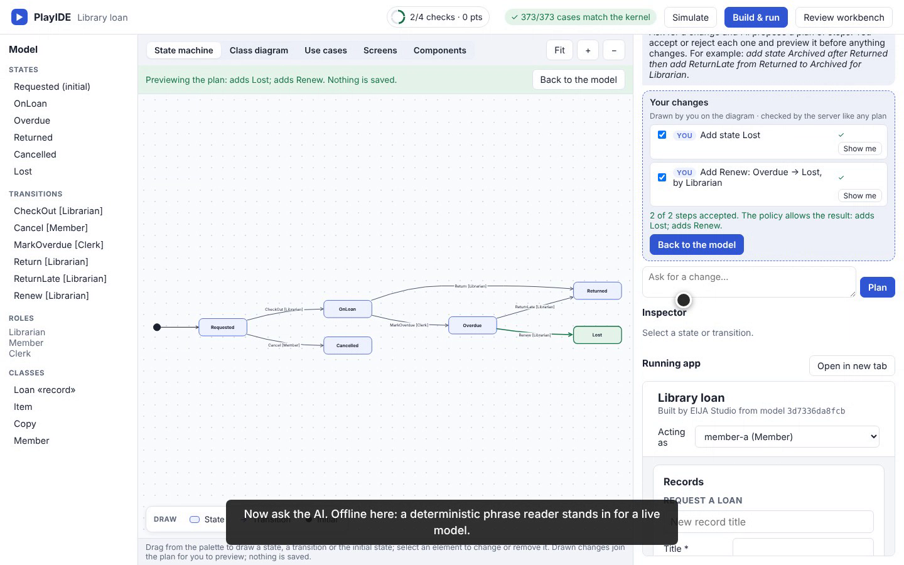
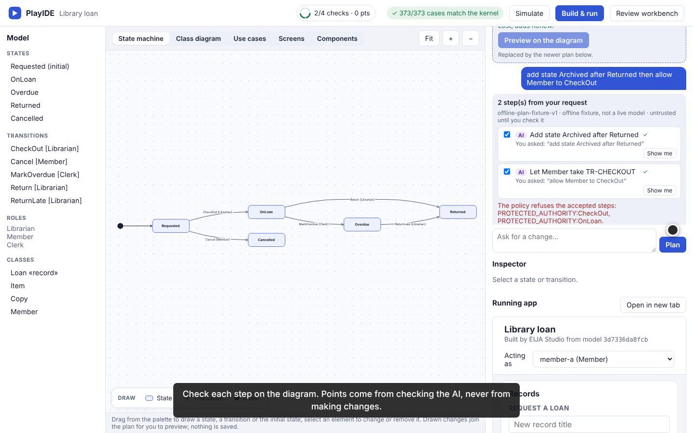
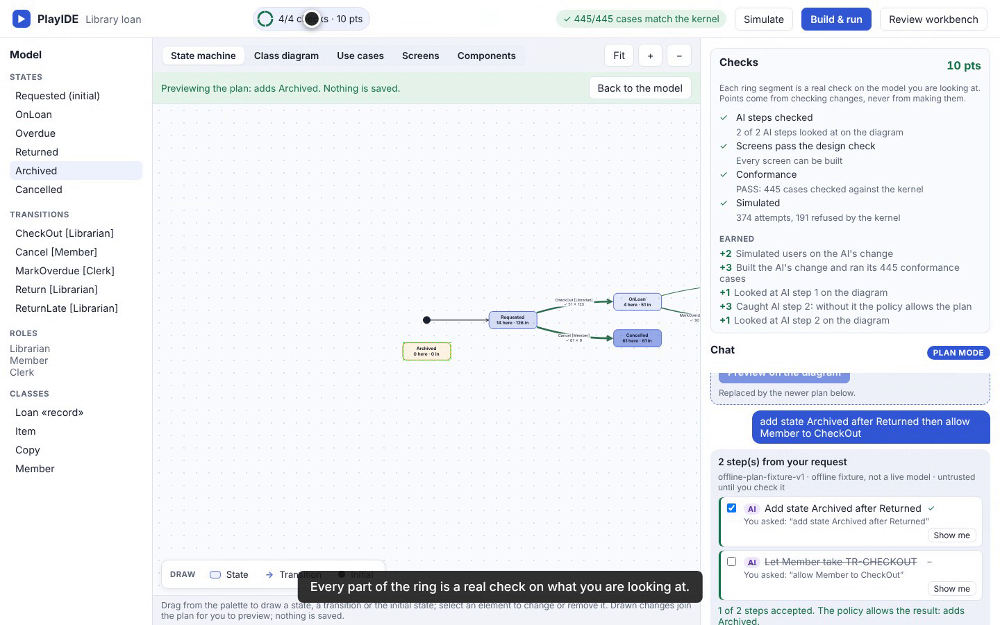

# PlayIDE tour: design, build, simulate and check an AI's change (8 October 2026)

This is a scripted recording of the real PlayIDE page (`/play`) on the library-loan pack. Every click is a real browser action against a real `eija serve`, and every step asserts text the page actually rendered. `python -m demos run playide_tour --dry-run` repeats the same clicks and assertions without video. The take is **PASS**, with no act skipped. It runs 2 minutes 38 seconds.

The chat's proposer is the offline phrase reader (`offline-plan-fixture-v1`), not a live model, and the video says so.

## What the run shows

| Moment | What is real |
|---|---|
| State machine, class diagram, use cases | Drawn from the pack's model and data model (ADR-0151, 0153, 0154). |
| Screens | The screen designer's design check passes for every use case. |
| Build & run | The app is generated, all its conformance cases match the kernel, and it runs beside the model (ADR-0150). |
| Components | The built app's UML component diagram, read from its generated code (ADR-0155). |
| Simulate | Seeded users act through the kernel; busy and refused transitions are drawn on the diagram (ADR-0152). |
| Draw | A state dragged from the palette and a transition added from the inspector become typed steps, checked by the server and previewed (ADR-0157). |
| AI change | The offline proposer turns a request into two typed steps. The policy refuses one (`PROTECTED_AUTHORITY`). Each step is looked at on the diagram, the refused one is rejected, and the rest is built (conformance passes) and simulated (ADR-0156). |
| Checks ring | All four parts fill from real checks on the shown model; points came only from checking the AI's steps. |











*Frames decoded from the recording (lossy video frames, not browser screenshots). See [provenance](assets/playide-tour-20261008/provenance.json).*

## Not shown

Verify, approve and apply are not in this tour. They still wait on the owner's source review and restamp (issue #80). Saving a plan as a change case waits on an owner decision (issue #89).

## Use it yourself

```bash
python -m pip install -e ".[dev]"
eija serve --pack packs/library-loan --open      # then open the PlayIDE link it prints (/play)
```

## Reproduce the recording

```bash
pip install -e ".[demos]"
python -m demos run playide_tour --dry-run       # same clicks and assertions, no video
python -m demos run playide_tour                 # demos/output/playide_tour.webm and its manifest
```
