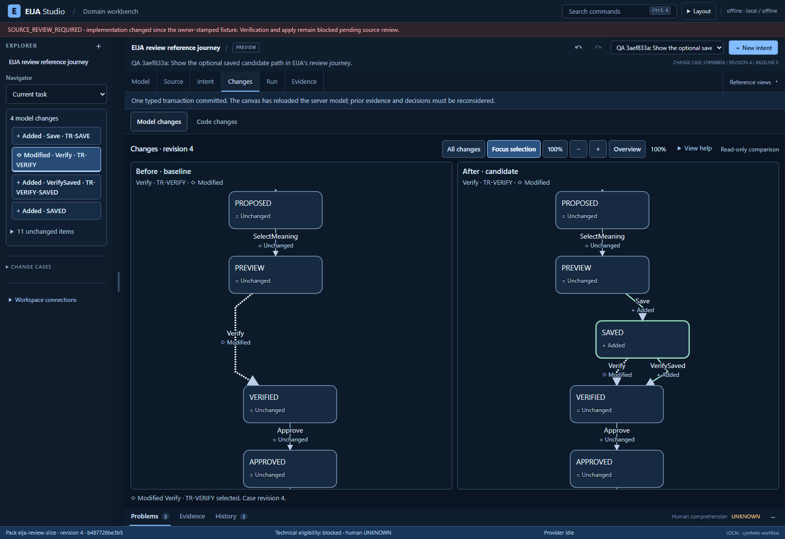
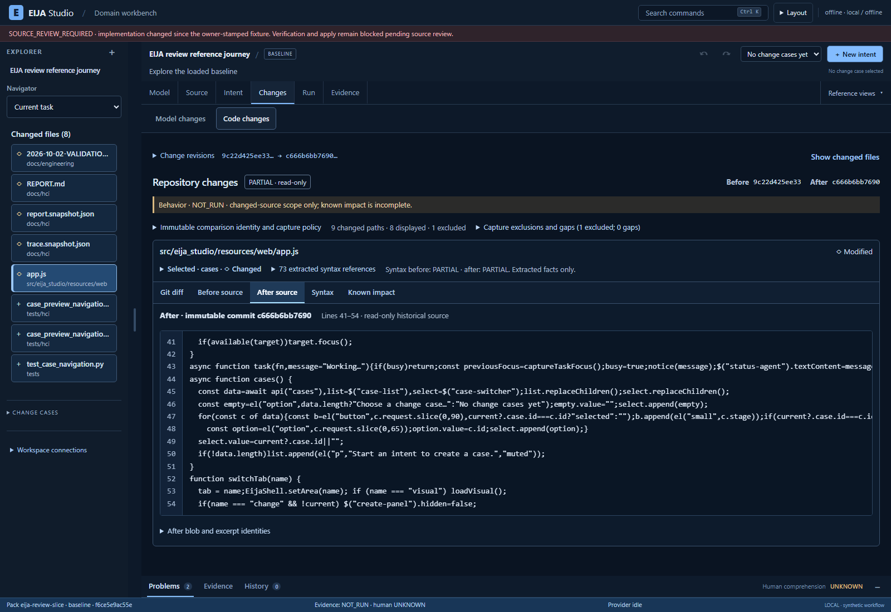

# Code and model review: validation checkpoint

Documentation for [integration checkpoint `1f1b07f64889`](https://github.com/45ck/eija-studio/tree/1f1b07f648890d8e03f81d4269fa479d80a0f46a). This publication adds documentation and evidence to main; it does not merge the IDE implementation. Observations retain their own recorded source subjects and are not a blanket acceptance of every file in this checkpoint.

The byte-exact [dated HCI evidence](../demos/evidence/hci-review-2026-10-03/README.md) belongs to this integration's instrumentation and thresholds. Main's canonical HCI snapshots remain paired with main's own runner.

**3 October 2026 — scoped review browser checks and fast gates pass; full-tier
FAIL retains HCI limits; release remains SOURCE_REVIEW_REQUIRED.**
This note supplements the [whole-app status ledger](IMPLEMENTATION-STATUS.md).
Earlier observations retain their original source subjects and outcomes. They do
not certify the current integration or close the [full IDE acceptance
bar](../engineering/SELF-DOGFOOD-ACCEPTANCE.md).

The implemented shell has six primary work areas — Model, Source, Intent,
Changes, Run and Evidence — plus Reference. Changes contains local **Model
changes** and **Code changes** tabs. Returning to Changes preserves the last
comparison type. The task navigator follows the current review while a pinned
Domain navigator remains available. New Code and model review browser runs
exercise this shell on the source subjects below. Subsequent repository
decomposition and measurement repairs are integrated. Corrected canonical HCI also
fails; post-repair review browser checks pass and the full tier retains that failure.
Both canonical runs remain evidence. A JavaScript physical-line repair is now
integrated after 65 staged checks and exercised by the complete integration runs.

Model review now uses selected-change paired graphs and linked field, source and
evidence inspection. Code review compares immutable local Git revisions, exact
historical excerpts and syntactic facts. A code comparison is read-only and its
behavior status remains `NOT_RUN`; a model receipt does not verify changed source.
Source-review and owner-authority boundaries are unchanged.

## Retained observations and current work

| Record | Observed outcome | Scope and limit |
| --- | --- | --- |
| Earlier review workspace run 2 | All nine main stages passed; overall **FAIL** in the subsequent source-freshness fixture | Scoped paired-model review evidence on its recorded source subject. Retain the overall failure; do not promote the whole run to PASS. |
| Source-freshness-only run 2 | **PASS** | Initial capture, stale-source refusal and explicit refresh of a disposable tracked source fixture; the nine main review stages were **NOT_RUN** in this run. |
| Immutable Code review run 3 | **PASS**, seven checks; source unchanged and browser/server closed | Inventory, historical source, keyboard/absent side, transport retry, stale/corrupt response refusal and scoped responsive/accessibility observations. Its application bytes differ from the current shell. |
| Immutable Code review run 4 | **PASS**, seven checks | Updated six-primary/local-comparison shell, exact historical source, failure/retry and response-identity controls. Scoped axe: **0 violations, 4 incomplete**. Source unchanged; browser/server closed; zero JavaScript errors and forbidden endpoint attempts. |
| Review workspace run 3 | **PASS**, nine main checks plus three source-freshness checks | Paired graph truth and negative controls, source/evidence roundtrip, history/current-subject distinction, cross-case/runtime retention and keyboard/reflow. Scoped axe: **0 violations, 2 incomplete**. The embedded freshness fixture passes capture, stale refusal and explicit refresh; real source remains unchanged and both servers/browsers close. |
| Reproducible historical exporter and pair run 5 | **PASS** | See the [historical navigation-recovery proof](../demos/2026-10-03-NAVIGATION-RECOVERY-PROOF.md) for the exact two before-fail/after-pass navigation properties, success controls, manifests and replay. This verifies the named historical pair, not the current integration. |
| Canonical HCI run 1 on its recorded shell | **FAIL**, exit 1; 15 PASS, 1 GAP, 2 FAIL | KLM 65.31 s exceeds 65 s; recorded density 72 exceeds 27; settled-DOM p95 729.8 ms remains a GAP. A disclosure visibility defect was subsequently confirmed independently; this original outcome is unchanged. |
| Integrated repository decomposition and recursive asset identity | **346 targeted tests PASS**, 166.70 s | Includes architecture/maintainability budgets and new UI asset identity tests; an EOF-only normalization followed. This is targeted integration evidence, not a replacement for browser or complete fast/full gates. |
| Native-disclosure probe regression | Old probe: **3 FAIL, 2 PASS** in five new cases; repaired staged probe: **16 PASS** in the complete visibility file | Native visibility, pointer and actual keyboard observations independently confirm hidden descendants were counted. This validates the scoped instrument repair, not product density or comprehension. |
| Integrated native-disclosure probe | **16 PASS**, 4.15 s pytest time | The integrated probe and test bytes match the staged repair; this is a focused instrument regression, not a complete UX pass. |
| Corrected canonical HCI run 2 | **FAIL**, exit 1, 38.819 s; 15 PASS, 1 GAP, 2 FAIL | Density **56 > 27**, KLM **65.31 s > 65 s**, settled-DOM p95 **747.6 ms** GAP. Recursive identity records 22 UI assets; both scripted modalities complete. |
| JavaScript physical-line repair | **65 staged tests PASS**; original implementation **11 FAIL / 54 PASS** | CR/LF/CRLF byte ranges and real-worker excerpts, including trailing comments, ASI and original literal contents. The parser input alone normalizes bare CR without shifting bytes. The first incomplete repair's failure is retained. Integrated full-suite/browser results remain separate. |
| Final Code review run 5 | **7/7 PASS**, exit 0, 73.173 s | Final backend decomposition and source-range repair; 27 GET requests, wrong-pair/blob/range and late-response controls retained. Axe 0 violations / 4 incomplete. Source unchanged, browser/server closed. |
| Final model review run 4 | **9/9 PASS plus separate freshness 3/3 PASS**, exit 0, 51.807 s | Final backend; exact paired graphs and source/evidence/history/runtime context. Axe 0 violations / 2 incomplete. Source unchanged, browser/server closed, disposable source fixture removed. |

These completed browser runs preceded the repository decomposition below. They
used Chromium **153.0.8010.12**, normal CSP and distinct
captured subjects. Code run 4 retains **115 files**, content SHA-256
`24ba0ae78b6de0483d337e89ab1f4d3d972d474829fe31ecb626547fe6b6fe56`;
model run 3 retains **113 files**, content SHA-256
`8bcb7e4d0b889c5a09d9cbaf9801b3b9af2d81ca47165a277e2417ddb15835e0`.
Their `subject-before.json` and `subject-after.json` agree within each run.
Both capture `app.js` SHA-256
`3b6cfffb2be6f6d906b218801cad0c04c999c43255a169fcab464631d61d110a`
and `index.html` SHA-256
`476006913cebbd7037448d883832f88d25f782e3ced377fe5e6cc0c49688573b`.
The manifests also identify replay helpers and the remaining captured source;
these two asset hashes alone are not the whole tested subject. Later source
changes require a fresh relevance assessment and applicable checks.

Final Code run 5 captured **117 files**, content SHA-256
`82878cec712638cb2936a1faf4183b97a9ceee4202e5bb0a4e7542fb658d8eb8`.
Final model run 4 captured **115 files**, content SHA-256
`72d899d83552733ae57b90fc9344426b77e6a5183ee1dfd97bdf55a587a3d24d`.
Each run preserved its own source/helper manifest. Both observed zero JavaScript
errors and forbidden requests; controlled 503 responses and the freshness
fixture's source/impact 409 refusals remain expected faults. Their scopes differ,
so the counts are separate observations, not a combined full-product score.

These are unchanged screenshots of the working app from those final runs;
the [image manifest](../demos/assets/review-20261003/manifest.json) binds their
bytes, test results and captured subjects. Generated concept images remain a
separate design reference.

Visual review of the initial 1600-pixel Code screenshot places the source start
at approximately **594 px**, previously **783 px**: about **189 px** more vertical
room. This is a screenshot observation, not a comprehension result. The later
`source-region-geometry.json` confirms selected function lines fit at 1600×1100
and 1280×800 after keyboard/disclosure interactions, with the Code panel scrolled
112 px and 307 px respectively. It does **not** establish that the default,
unscrolled 1280 layout fits those lines. Narrow source remains keyboard reachable;
automatic axe results do not resolve the incomplete or manual accessibility work.

The first fast gate remains a recorded **FAIL**: its main test run had **6 failed,
2172 passed, 201 skipped and 2 xfailed**; **3 of 22 sessions failed** (`adr_index`,
`tests`, `vocabulary`). The ADR index itself passed; that session failed in the
tools suite's vocabulary assertions. The six main failures comprise two onboarding
skill-contract checks, two vocabulary checks and architecture/complexity metric
budgets. The integrated onboarding/vocabulary repair subsequently passed **101
targeted tests**. The later integrated decomposition passed **346 targeted tests
in 166.70 s**, including the previously failing architecture/maintainability
checks and recursive UI identity regressions. The subsequent complete fast run
passed **all 22 sessions**, including **2,380 tests passed, 206 skipped and two
expected failures** in 149.25 s for its main suite. The whole fast command took
about four minutes. Skips remain unexecuted checks; this is a new run and does
not relabel the earlier failure. The separate full-tier result is below.

The implementation now separates Git capture/revalidation/request ordering in
`repository_changes.py`, bounded retention eligibility in
`repository_change_cache.py`, immutable data/projections/excerpts in
`repository_change_snapshot.py`, and captured-byte syntax/partial impact in
`repository_analysis.py`. The JavaScript worker moved into the analysis module;
its former module was retired. Python analysis directly reuses existing codelink
parsing, selection and digest primitives, removing temporary-file rereading and
a redundant extraction pass. Repository query validation/dispatch now sits beside
its application port, while Studio retains its public method signatures. Existing
Git, parser and Weave components remain the implementation basis; no new engine,
target-code execution, authority or metric relaxation was introduced. The
compatibility checks support the tested corpus, not universal syntax correctness.

Original failed and inconclusive runs remain evidence, including Code review
runs 1–2 and earlier historical-pair attempts. A repaired harness warrants a new
named run; it does not change the old outcome. The applicable runnable scopes are
the [model review guide](https://github.com/45ck/eija-studio/blob/1f1b07f648890d8e03f81d4269fa479d80a0f46a/tests/hci/ide_review_workspace.md), [Code review
guide](https://github.com/45ck/eija-studio/blob/1f1b07f648890d8e03f81d4269fa479d80a0f46a/tests/hci/repository_change_review.md) and [historical pair
guide](https://github.com/45ck/eija-studio/blob/1f1b07f648890d8e03f81d4269fa479d80a0f46a/tests/hci/repository_navigation_pair.md).

## Full-tier and release verification

The complete `nox -t full` run exited **1** after **35 sessions in about 21
minutes**: **32 successful, two failed and one NOT_RUN**. The failed `hci`
session retains density **56 > 27** and predicted pointer time **65.31 > 65 s**;
its separate settled-DOM p95 observation is **741.1 ms**, a GAP against
400/4000 ms. The `metrics` session fails `LANE-01` because it aggregates that HCI
failure. Its architecture and maintainability budgets pass. The Docker-dependent
`formal_bend_quick` session is **NOT_RUN** because the Docker daemon is stopped.

The coverage session passed **2,380 tests**, with **206 skipped and two expected
failures**, in **194.36 s**; total branch coverage is **92.95%** against the
unchanged 78% floor. Authority-policy mutation testing killed **107 non-equivalent
mutations**, with none surviving. SMT, bounded checking and the TLA+ model and
runtime-conformance session passed their configured scopes. Per-pack unsupported
laws, optional-tool skips and known expected failures remain in their reports;
a successful nox session does not turn those missing checks into PASS.

The required `scripts/verify_release.py` run passed **2,380 tests**, with **206
skipped, 26 deselected and two expected failures**, in **501.86 s**. Its test
exit code is **0**, but the command exits **2** with **SOURCE_REVIEW_REQUIRED**
and `trusted_fixture: false`. The measured implementation identity is
`b573bcd80a224fb60fdc482ea21b035cc1c4c46029982e12511a978055d76cd8`.
No source fixture has been stamped and no real owner authority action has occurred. This checkpoint
is published for review with the failed full-tier outcome visible, under the
user's instruction to commit and push progress; it is not release approval.

## HCI acceptance remains open

The fresh canonical run completed its 22-action pointer and keyboard journeys in
**41.3068 s** command elapsed time, using Google Chrome **154.0.8037.58**, three
pointer repetitions and the explicitly labelled synthetic `pytest-harness`
identity. Its retained `report.json`, `REPORT.md` and `trace.json` are under run
`hci-code-review-1`. The actual result remains **15 PASS, one GAP and two FAIL**:
modelled pointer time **65.31 s > 65 s**, viewport density **72 > 27**, and
settled-DOM p95 **729.8 ms** above the 400 ms target but below the 4000 ms limit.
Command elapsed time, KLM modelled task time and DOM latency are different
quantities. None measures human comprehension or satisfaction.

QA independently confirmed that the old visibility probe counted descendants of
closed native `details` elements. An inert fixture showed seven measured controls
where native visibility, pointer witnesses and actual Tab traversal identified
three. The repaired probe preserves the first direct summary and its descendants,
respects every closed disclosure ancestor, and avoids counting hidden direct
body text. Raw geometry and existing clipping/pointer-occlusion rules are unchanged.
The old probe failed three of five new cases; the staged repair passed all **16
visibility cases**, including the existing eleven. The integrated file also passes
**16 tests in 4.15 s**, with the same probe SHA-256
`6af751d9043c28721ddb77b11b5a9c478c2f3da73fa2d8ea3d2c7562dd6babd1`.

Corrected canonical run `hci-code-review-2` completed in **38.819 s**, exit **1**,
on the same Google Chrome version and harness identity: **15 PASS, one GAP, two
FAIL**. Its density is **56**, still above **27**; KLM remains **65.31 s > 65 s**;
settled-DOM p95 is **747.6 ms**, still a GAP against **400/4000 ms** target/limit.
Both scripted modalities complete. All 15 UI assets recorded by run 1 have the
same hashes in run 2. The lower count follows the corrected instrument; it is
**not evidence of a layout improvement or human benefit**, and density still fails.

The worst **56** is the Rules & ripple audit state: **31 controls + 25 text-parent
groups**, reported at `impact-tab` and its deliberate `change-selected` audit
checkpoint. It is not a density result for the paired Changes layout. This trace
does not name each of the 25 text groups or retain a screenshot, so choosing what
to simplify requires state inspection and task review. KLM uses fixed pointer
operator costs; a density/CSS change alone cannot remove the **65.31 s** failure.

Canonical UI identity now recursively hashes shipped assets with portable relative
paths and refuses assets resolving outside its web root. The new pure identity
tests are included in the 346 integrated passes. This fixes future subject
coverage; run 2 includes **22 assets**, adding seven nested vendor assets to the
unchanged 15 earlier UI files. It does not retroactively expand run 1's recorded
identity. Both raw traces/reports remain unchanged under the same frozen
thresholds. The post-decomposition review browser checks passed in Code5 and
model4; their results do not replace the full-tier failure or release identity check.

The preceding historical HCI snapshot recorded **16 PASS, one GAP and one FAIL**:
maximum viewport density **68** (30 controls + 38 text-parent groups) exceeds the
unchanged limit **27**; settled-DOM p95 **777.5 ms** exceeds the 400 ms target but
remains below the 4000 ms regression limit. These are instrument observations,
not human memory or perceived-paint measurements. The old trace also lacks the
now-required explicit review-opening action, so it was marked incomplete when
re-derived against the updated journey. These are historical observations, not the
current committed HCI snapshot.

The exact canonical run 2 trace/report has now been published to `docs/hci` after
checking that fresh derivation equals its recorded JSON. `quality.hci check
--strict` passes for that derivation and all **22 current UI asset hashes**.
Publication performs **no new measurement**. The current committed HCI verdict is
still **FAIL** with density **56**, KLM **65.31 s** and settled p95 **747.6 ms**;
strict evidence freshness does not turn a failed UX budget into a pass.

The canonical global choice selector counts the six primary buttons and Reference
as seven alternatives. It does not assess the local Model/Code decision or visit
Changes, Model and Source as a complete review journey. Its narrow-layout audit
still covers Intent, Rules & ripple, Run and Evidence. Separate scoped review
journeys must cover the added comparison surfaces and open, populated, pinned,
loading, error and stale states. A tidy default screen cannot establish that
required context fits the density budget.

Keep the frozen budgets and required failure scenarios. Retain every GAP even if
the aggregate lane exits successfully. A newly required action has real
KLM and focus costs; do not remove that action from measurement to preserve an
old score. Source freshness must include the complete shipped asset subject;
the canonical direct-file hash map alone omits nested vendor files.

## Remaining product claims

- **Supported full IDE:** US01–US12 remain incomplete until the exact integration
  covers the relevant normal, non-linear, failure, dense-model, keyboard and
  recovery states. Linked evidence and counterexample investigation, consistent
  terminology and visible unknowns require whole-app acceptance, not one replay.
- **Accessibility and responsiveness:** retain axe incomplete findings; complete
  manual assistive-technology, forced-colour, focus and reduced-motion checks.
  The proposed paint-aware timing targets remain unmeasured and separate from
  legacy DOM timing. Density and latency failures stay open until new evidence.
- **Agent factories:** S09 and US13–US14 still need worktree/session ownership,
  conflict witnesses, combined-result verification, fresh-base checks and
  authorized landing/recovery. US15 domain rename/split/merge is also planned.
- **Repository support:** EIJA is the first connected target. External projects
  follow the first accepted working flow. Extracted syntax, declared bindings and
  verified properties remain distinct; universal-codebase correctness is unproved.
- **Human value:** persona assumptions and comprehension improvement remain
  unvalidated. Compare representative engineers' decisions, errors and effort
  against their existing code-review workflow before claiming reduced burden.
- **WOW and GitHub proof:** record the usable product after the scoped checks and
  open limitations are reviewable; reproduce the final published revision in a
  clean environment. Video, source hashes and test counts do not establish full
  product acceptance. Code authoring remains in the engineer's existing editor
  or agent under the current [form-factor contract](WHOLE-APP-UX.md).

This checkpoint itself performs no browser run and grants no release or owner
approval. The mission remains the complete working IDE; this increment supplies
review capabilities and bounded evidence toward it.
