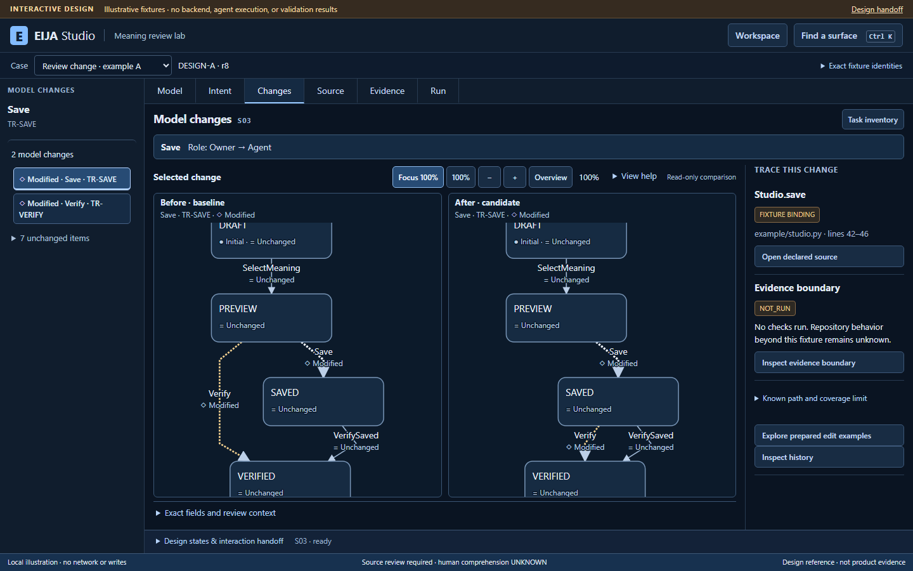
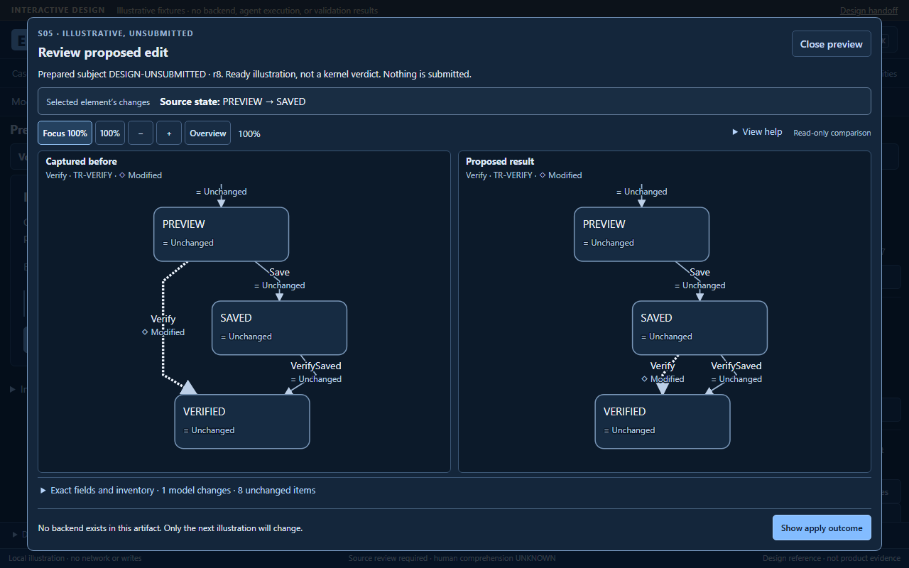

# Interactive whole-app design review

**3 October 2026 — design fixture review, not product acceptance.** The [portable interactive reference](interactive/README.md) makes all ten proposed surfaces and their states inspectable. QA5 passed **10/10 scoped browser groups in 19.735 s**, preserving all **24 frozen artifact files**. It supports the [four hypothesis personas and fifteen stories](WHOLE-APP-STORIES.md) and [whole-app UX contract](WHOLE-APP-UX.md); it does not establish their acceptance or measured human benefit.

The [interaction/state handoff](interactive/HANDOFF.md) covers Model, Intent, Changes, Source, Edit preview, Evidence, Run, History, planned Factory and Connection/help. All cases, source excerpts, witnesses and outcomes are prepared illustrations. The artifact has no backend, persistence, live agent or executable factory. Product behavior and its remaining HCI/release failures are recorded separately in the [prospective-edit checkpoint](2026-10-03-PROSPECTIVE-EDIT-REVIEW.md).

*QA5 at 1440×900: the prepared Save comparison shows its exact Owner → Agent role change. This is a capture of the interactive design reference, not an executed product edit.*

*QA5 at 1280×800: the independent prepared source preview shows PREVIEW → SAVED and its paired projection. DESIGN-UNSUBMITTED is a fixture identifier, not an execution receipt.*

## What the browser checked

| Scoped group | Observed boundary |
| --- | --- |
| Unreset nonlinear return | Ordinary navigation followed by Verify → Source → Evidence → Return preserves Verify; a new detour starts with the current selection. |
| Initial exact values | Complete old/new role, source and guard entries remain explicit. |
| Ten surfaces and context return | All ten routes are reachable; contextual return preserves its captured selection. |
| Independent fixture identities | Prepared acknowledged/unknown outcomes, removed elements and witness scope do not inherit the parked case's identity. |
| Prepared examples preserve selection | Global Workspace → prepared Source example → open/Escape → Changes leaves both parked cases' Save selection, exact delta and source binding intact. Other variant/entry combinations are not accepted by this path. |
| Preview values and modal focus | Exact role/source/guard values remain visible at desktop sizes; Close/Escape restore the invoker. |
| Recovery, history and Factory | Prepared recovery and historical context remain explicit; Factory remains planned with no execution or landing command. |
| Keyboard and narrow layout | Workspace/inventory dialogs and keyboard returns work; the sampled 320px document has no horizontal page overflow. This is not full mobile authoring acceptance. |
| Actual clipped graph geometry | Ten desktop comparison/preview framing observations pass at 1440×900 and 1280×800, checking selected endpoints, paths and labels against actual clipping boundaries. |
| Opened raw-record keyboard use | At 320px, named Run/Evidence JSON regions receive visible focus; ArrowRight causes horizontal movement and Tab exits. The first 1px was observed, not traversal of every line. Exact record text remains unchanged. |

The runner recorded no page/console errors, failed or unexpected requests, or graph-framing failures. Browser and server closed; before/after inventories match. The five sampled axe scans found **zero automated violations**, with incomplete checks still requiring review:

| Sample | Incomplete checks |
| --- | ---: |
| Comparison, 1440px | 2 |
| Planned Factory, 1440px | 1 |
| Run, 320px | 1 |
| Opened Run record, 320px | 1 |
| Opened Evidence record, 320px | 1 |

Incomplete rules include `aria-valid-attr-value` in all five samples and `color-contrast` in the comparison. These samples do not establish accessibility conformance, screen-reader behavior, every state or human usability.

## Retained defects and bounded repairs

| Earlier observation | Repair and retained limit |
| --- | --- |
| Factory inventory mixed parked-case and planned-branch context | The observed Factory has three planned branch entries, no ordinary case-change controls, and no merged subject or combined-result evidence. This is fixture ownership, not an operational factory. |
| Global browsing left a stale Save return origin | Contextual entry now captures the current selection; arriving at its origin ends the trail. The prior-stage handler counterexample retains three PASS/three FAIL; QA5 includes the unreset route. |
| Source/guard previews clipped selected endpoints at 1280px | Parent-based sizing and a larger dialog expose the selected route at natural scale; duplicate inventory moves into a disclosure. All ten current framing observations pass. |
| QA3 Run320 raw diagnostic lacked keyboard access | Named focusable raw regions retain literal text and native scrolling. QA5 observes horizontal movement, focus and exit in both overflowing Run/Evidence records and scans them opened. The original serious axe finding is retained. |
| Prepared edit selection silently changed the parked case | Example selection is local; the entry says “Explore prepared edit examples.” The same handler test against the prior stage retains zero PASS/three FAIL. Eleven current handler/helper checks pass separately from the browser run. |

The retained counterexamples in the [frozen checks](interactive/static-checks.json) are labelled with their original subjects. Original public log derivatives replace host-root text and normalize encoding/newlines. Publication additionally strips trailing horizontal whitespace from six blank lines in each of the two counterexample logs; all nonblank bytes and outcomes remain unchanged. These are not fresh reruns. Passing checks on this revision do not erase the earlier failures.

**Remaining visual concern:** selected routes cross their own labels in the reviewed comparison. Current checks establish containment and exact values, not painted-text separation or human route comprehension. This remains a non-blocking legibility concern; it is not evidence of wrong topology and is not claimed repaired. Review label placement/spacing through the existing Dagre integration, then use an independent route-identification task.

## Exact reviewed identity and reuse

| Record | SHA-256 |
| --- | --- |
| [Original frozen QA5 artifact manifest](assets/interactive-20261003/frozen-design5-manifest.json), 24-file inventory | `f5a875d080585a76708d3f414b7907522c68b1e9a6857bfaf344f3fe71ea65a0` |
| [Derived publication manifest](interactive/asset-manifest.json) | `9b2c046b39235db5ac91ccd565de339006932f5fb69d8149758c3b98f95d2c8e` |
| QA5 browser script | `5437fd49f967f733f42485351bbab6444454bd949c08e3f2dda50a28a6e8a86d` |
| QA5 raw result | `b8133febfc434c67c20a54797312b3f9ded72eb68c83aa53423fed5f6080acba` |

The nine copied component/license files match [immutable implementation ca95f46](https://github.com/45ck/eija-studio/tree/ca95f468206fec706f7a274788faf872877ac4a1) byte for byte. Existing EIJA comparison/canvas/review components and pinned Dagre provide their existing responsibilities. Authored design JavaScript supplies prepared fixtures and presentation state; no replacement diff, layout, policy or orchestration engine is introduced. The frozen manifest keeps its original capture HEAD and dirty-source provenance unchanged.

The artifact's creation-time NOT_RUN statements remain intact. This later source-bound review adds the observations above without rewriting that history. The full IDE, all story states, live-agent/source behavior, product HCI budgets and human comprehension remain open acceptance work.

The published folder is a documented packaging derivative of frozen design5: only the two counterexample log copies, README provenance and asset manifest differ. Twenty of the 24 original folder files remain byte-identical, including all 12 runtime/component/license files. The original frozen manifest is archived verbatim beside this review's assets. QA5's screenshots and receipts retain their original identity; no browser rerun or QA6 is claimed.
