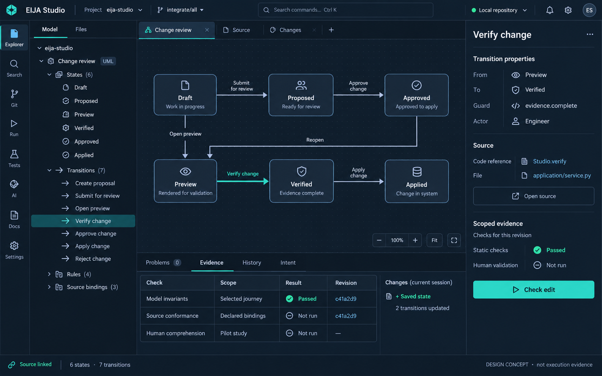

# IDE design reference

The [3 October code/model review checkpoint](2026-10-03-CODE-REVIEW-VALIDATION.md) records the implemented review workspace, its bounded observations and remaining acceptance work. The [immutable Code review guide](../engineering/IMMUTABLE-CODE-REVIEW.md) applies to the pinned integration checkout, not the code currently on main. The [earlier UX build rationale](https://github.com/45ck/eija-studio/blob/1f1b07f648890d8e03f81d4269fa479d80a0f46a/docs/design/NEXT-UX-PASS.md) remains a proposal/history record; the checkpoint states what was actually observed.

The [whole-application UX contract](WHOLE-APP-UX.md) defines linked screens and HCI acceptance. The [personas and user stories](WHOLE-APP-STORIES.md) turn those screens into tasks with observable outcomes. These documents guide implementation; their planned journeys are not claims of completed validation.

The [current implementation and HCI ledger](IMPLEMENTATION-STATUS.md) maps all four personas, fifteen stories and ten screens to scoped observations and remaining work, including the exact public-clone preview. It preserves the density failure, latency gap and unmeasured human benefit.

This generated concept sets a visual quality target for the working IDE. It is not a screenshot, test result, executable model, or claim of shipped functionality. Diagram arrows, counts, example hashes, and status labels are illustrative; the running application must derive these from its actual model and evidence.

The target is a productive desktop workspace: compact project chrome, searchable explorer, readable semantic canvas, contextual inspector, source navigation, and persistent evidence/history/intent panels. Independent scrolling, keyboard navigation, resizing, empty/error states, and trustworthy feedback matter as much as the still image. Every visible product control must work or explain its unavailable state.

Generated on 2026-10-02 with the built-in imagegen tool. The prompt is recorded in [eija-ide-concept-v1.prompt.md](eija-ide-concept-v1.prompt.md). This is a design asset; showcase videos and proof of feasibility must use the real application.

## Connected concept screens

| Screen | Design purpose | Prompt |
|---|---|---|
| [Visual change review](eija-visual-change-concept-v1.png) | Compare baseline and candidate concepts before inspecting source; keep additions, removals and coverage gaps legible | [Generation prompt](eija-visual-change-concept-v1.prompt.md) |
| [Evidence and runtime investigation](eija-evidence-runtime-concept-v1.png) | Explain a refused change, navigate a counterexample and inspect evidence scope | [Generation prompt](eija-evidence-runtime-concept-v1.prompt.md) |
| [Parallel agent coordination](eija-agent-coordination-concept-v1.png) | Inspect potential overlap and a combined change; this capability remains planned | [Generation prompt](eija-agent-coordination-concept-v1.prompt.md) |

All four images are generated visual references, not executable specifications. Example source, counts, arrows, agent activity and check results are illustrative. In particular, the evidence illustration does not define an authority policy or suggest changing permissions to pass a check. Implementation derives behavior and authority from the existing kernel and uses real observations for status. The design contract, rather than incidental generated details, defines the acceptance criteria.
