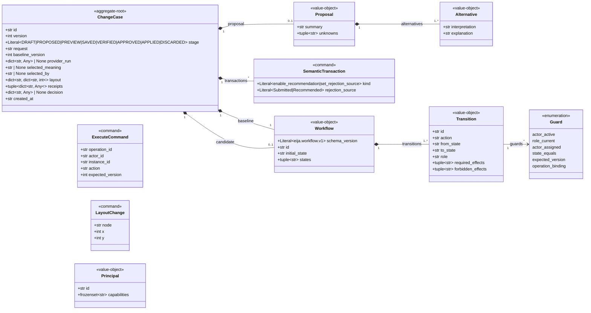

<!-- GENERATED by scripts/generate_diagrams.py from the executable model; do not edit. `python scripts/generate_diagrams.py --check` fails when this file drifts. -->
# Domain contracts

Introspected from the frozen Pydantic contracts in `eija_studio.domain`. Stereotypes are the curated vocabulary of `docs/architecture/ARCHITECTURE.md`.

