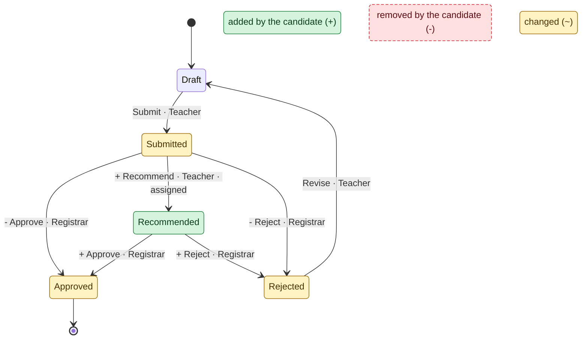

<!-- GENERATED by scripts/generate_diagrams.py from the executable model; do not edit. `python scripts/generate_diagrams.py --check` fails when this file drifts. -->
# Visual diff: baseline vs candidate

Green is added, red dashed is removed, amber is changed. Edge labels start with `+`, `-` or `~`.

| Change | Detail |
|---|---|
| added states | Recommended |
| removed states | none |
| added actions | Recommend |
| removed actions | none |
| changed `Approve` | from_state: Submitted → Recommended |
| changed `Reject` | from_state: Submitted → Recommended |

