<!-- GENERATED by scripts/generate_diagrams.py from the executable model; do not edit. `python scripts/generate_diagrams.py --check` fails when this file drifts. -->
# Ripple: what the change touches

From `domain.impact.model_impact`: changed rules flow through runtime, state view, journey, obligation and receipt into the review packet and the local decision. The mapping is the model's own, not every real-world consequence.

```mermaid
%% eija: baseline: workflow excursion semantic_hash=5d3ef3a19c31d956a185b9c5ba4b1b79e651d0356e162436c5c67054d2ad4cdf
%% eija: candidate: workflow excursion semantic_hash=b26c9af5ae4cd958099956232721a70e73cb7e6efe1b213ff32417829b588e56
%% eija: closure: complete within this mapping
%% eija: envelope: All dependencies encoded by this excursion projection mapping; not every real-world consequence.
flowchart LR
    classDef changed fill:#fff3c4,stroke:#9a6700,color:#4a3200
    classDef affected fill:#ffe8cc,stroke:#bc4c00,color:#4d2000
    subgraph c_Approve["Action Approve"]
        n_journey_Approve["Journey · Approve"]
        n_obligation_Approve["Obligation · Approve"]
        n_receipt_Approve["Receipt · Approve"]
        n_rule_Approve["Rule · Approve"]
        n_runtime_Approve["Runtime · Approve"]
        n_state_view_Approve["State view · Approve"]
    end
    style c_Approve fill:#ffffff,stroke:#8c959f
    subgraph c_Recommend["Action Recommend"]
        n_journey_Recommend["Journey · Recommend"]
        n_obligation_Recommend["Obligation · Recommend"]
        n_receipt_Recommend["Receipt · Recommend"]
        n_rule_Recommend["Rule · Recommend"]
        n_runtime_Recommend["Runtime · Recommend"]
        n_state_view_Recommend["State view · Recommend"]
    end
    style c_Recommend fill:#ffffff,stroke:#8c959f
    subgraph c_Reject["Action Reject"]
        n_journey_Reject["Journey · Reject"]
        n_obligation_Reject["Obligation · Reject"]
        n_receipt_Reject["Receipt · Reject"]
        n_rule_Reject["Rule · Reject"]
        n_runtime_Reject["Runtime · Reject"]
        n_state_view_Reject["State view · Reject"]
    end
    style c_Reject fill:#ffffff,stroke:#8c959f
    subgraph c_Revise["Action Revise"]
        n_journey_Revise["Journey · Revise"]
        n_obligation_Revise["Obligation · Revise"]
        n_receipt_Revise["Receipt · Revise"]
        n_rule_Revise["Rule · Revise"]
        n_runtime_Revise["Runtime · Revise"]
        n_state_view_Revise["State view · Revise"]
    end
    style c_Revise fill:#ffffff,stroke:#8c959f
    subgraph c_Submit["Action Submit"]
        n_journey_Submit["Journey · Submit"]
        n_obligation_Submit["Obligation · Submit"]
        n_receipt_Submit["Receipt · Submit"]
        n_rule_Submit["Rule · Submit"]
        n_runtime_Submit["Runtime · Submit"]
        n_state_view_Submit["State view · Submit"]
    end
    style c_Submit fill:#ffffff,stroke:#8c959f
    n_local_decision["Local decision"]
    n_review_packet["Review packet"]
    n_journey_Approve --> n_obligation_Approve
    n_journey_Recommend --> n_obligation_Recommend
    n_journey_Reject --> n_obligation_Reject
    n_journey_Revise --> n_obligation_Revise
    n_journey_Submit --> n_obligation_Submit
    n_obligation_Approve --> n_receipt_Approve
    n_obligation_Recommend --> n_receipt_Recommend
    n_obligation_Reject --> n_receipt_Reject
    n_obligation_Revise --> n_receipt_Revise
    n_obligation_Submit --> n_receipt_Submit
    n_receipt_Approve --> n_review_packet
    n_receipt_Recommend --> n_review_packet
    n_receipt_Reject --> n_review_packet
    n_receipt_Revise --> n_review_packet
    n_receipt_Submit --> n_review_packet
    n_review_packet --> n_local_decision
    n_rule_Approve --> n_runtime_Approve
    n_rule_Recommend --> n_runtime_Recommend
    n_rule_Reject --> n_runtime_Reject
    n_rule_Revise --> n_runtime_Revise
    n_rule_Submit --> n_runtime_Submit
    n_runtime_Approve --> n_state_view_Approve
    n_runtime_Recommend --> n_state_view_Recommend
    n_runtime_Reject --> n_state_view_Reject
    n_runtime_Revise --> n_state_view_Revise
    n_runtime_Submit --> n_state_view_Submit
    n_state_view_Approve --> n_journey_Approve
    n_state_view_Recommend --> n_journey_Recommend
    n_state_view_Reject --> n_journey_Reject
    n_state_view_Revise --> n_journey_Revise
    n_state_view_Submit --> n_journey_Submit
    class n_rule_Approve,n_rule_Recommend,n_rule_Reject changed
    class n_journey_Approve,n_journey_Recommend,n_journey_Reject,n_local_decision,n_obligation_Approve,n_obligation_Recommend,n_obligation_Reject,n_receipt_Approve,n_receipt_Recommend,n_receipt_Reject,n_review_packet,n_runtime_Approve,n_runtime_Recommend,n_runtime_Reject,n_state_view_Approve,n_state_view_Recommend,n_state_view_Reject affected
    linkStyle 0,1,2,5,6,7,10,11,12,15,16,17,18,21,22,23,26,27,28 stroke:#bc4c00,stroke-width:2px
    subgraph legend["Legend"]
        legend_changed["changed rule (root of the ripple)"]
        legend_affected["affected downstream"]
        legend_same["unaffected"]
    end
    style legend fill:#ffffff,stroke:#8c959f
    class legend_changed changed
    class legend_affected affected
```

