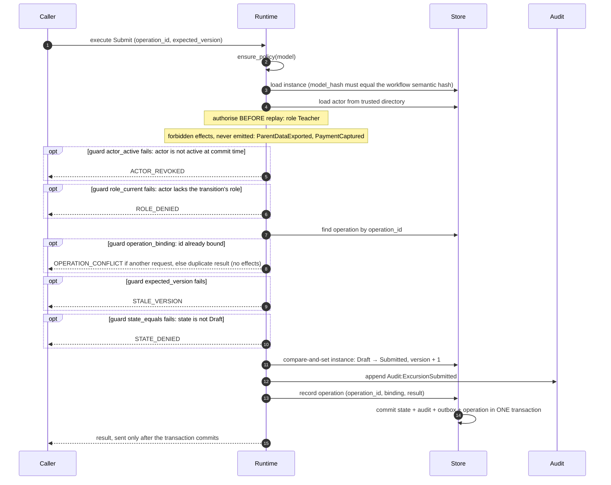

<!-- GENERATED by scripts/generate_diagrams.py from the executable model; do not edit. `python scripts/generate_diagrams.py --check` fails when this file drifts. -->
# Commit protocol: Submit

Derived from the `Submit` transition's guards and effects, in the order `application.runtime.execute` runs them.

