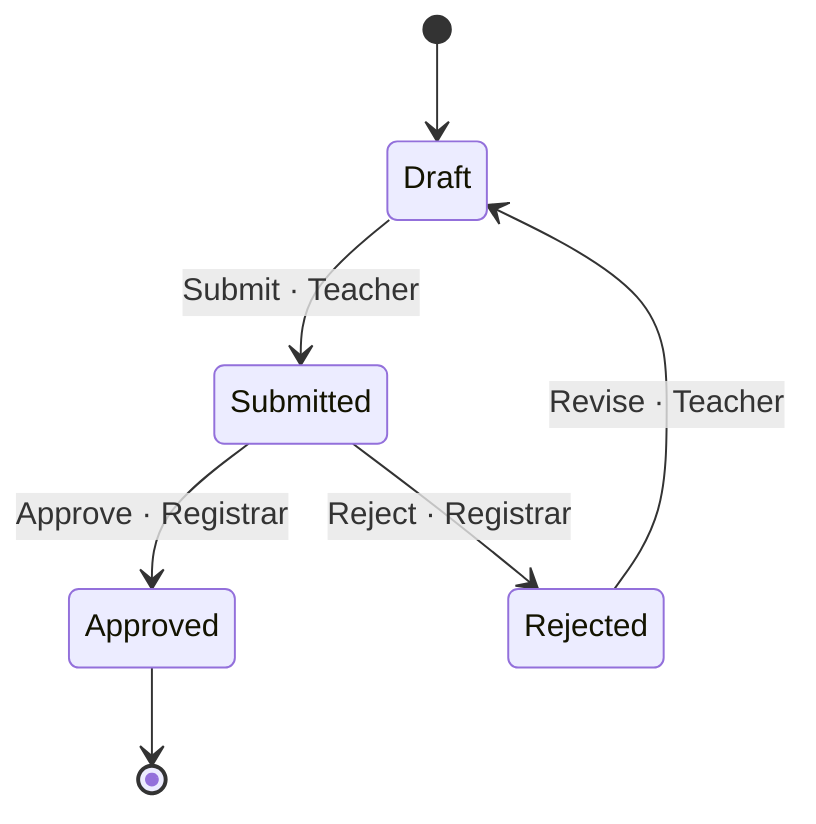

<!-- GENERATED by scripts/generate_diagrams.py from the executable model; do not edit. `python scripts/generate_diagrams.py --check` fails when this file drifts. -->
# State machine: baseline

The active workflow of the default pack, as the runtime interprets it.

