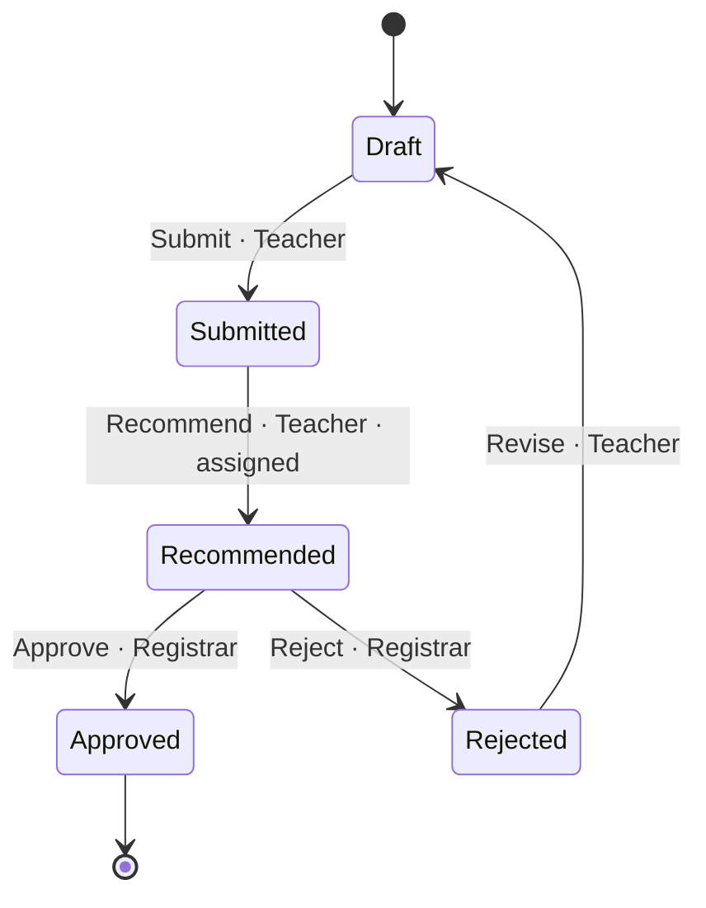

<!-- GENERATED by scripts/generate_diagrams.py from the executable model; do not edit. `python scripts/generate_diagrams.py --check` fails when this file drifts. -->
# State machine: recommend-only candidate

The candidate produced by the `enable_recommendation` semantic transaction.

