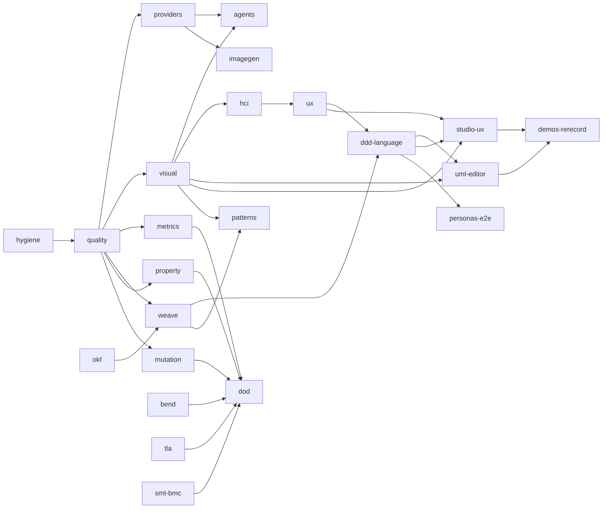

# Lane map: ownership, dependencies, merge order

How the parallel workstreams fit together and in what order they land. Guiding idea: [the domain model and its language are the primary object](PRODUCT-THESIS.md); everything else (diagrams, UI, agents, evidence) is a view of it or a check on it. Live status is the GitHub PR list; this file records the *reasoning*. Last reviewed 2026-09-29.

## Lanes

| Lane | Delivers | ADR block | Touches `src/` | Depends on |
|---|---|---|---|---|
| `quality` | ruff, mypy, import-linter layering, complexity/coverage ratchets, noslop hooks | 0035–0036 | annotations only | — |
| `providers` | Codex, Claude Code, OpenCode, Gemini CLI, OpenRouter proposal adapters | 0021–0022 | `adapters/providers/`, `bootstrap`, `cli` | quality |
| `demos` | scripted live-demo harness and scenario registry | 0047–0048 | no | — |
| `visual` | diagrams generated from the model, semantic diff, Studio "Visual" view | 0023–0024 | `application/`, `http`, `cli`, web UI | quality |
| `agents` | MCP server (never approve/apply), agent quickstarts | 0041–0042 | `interfaces/` | providers, visual |
| `bend` `tla` `smt-bmc` | Bend laws, TLA+/TLC, Z3 + bounded model checking | 0025–0030 | no | — |
| `property` `mutation` | Hypothesis stateful tests; mutation score ratchet | 0031–0034 | tests only | quality (calibrate on final code) |
| `metrics` | package metrics, latency, fitted scaling models, dashboard | 0037–0038 | no | quality |
| `hci` | measured HCI budgets on the running Studio | 0039–0040 | no | visual (UI stable) |
| `okf` | OKF v0.2 wiki linked to code by content hash | 0045–0046 | no | most code merged (see below) |
| `oss` | README, community files, roadmap, docs site | 0043–0044 | no | everything (claims must be true) |
| `ux` | HCI research, HCI-ADRs, design tokens, executable HCI model, prototype | 0057–0088 | no | hci (reuse harness) |
| `weave` | deterministic linked graph, compiler and linter, formal models | 0089–0112 | no | quality, okf |
| `dod` | definition of done, claims ledger, scorecard, evals | 0113–0136 | no | metrics, quality, formal lanes |
| wave 2: `ddd-language` | ubiquitous-language editor and DDD tree in the Studio | 0051–0052 | UI + kernel | weave, ux |
| wave 2: `uml-editor` | drag-and-drop UML and flow diagrams issuing typed semantic transactions: **the centre of gravity of the product** | 0049–0050 | UI + kernel | visual, ddd-language, ux |
| wave 2: `studio-ux` | the **IDE workbench shell** (explorer, tabbed/split editors, Problems panel, command palette, status bar): port of the redesign into the real Studio, replacing the wizard-style tabs | (HCI-ADRs) | web UI | visual, ux, ddd-language |
| wave 2: `imagegen` | consent-gated image generation via the provider port | 0053–0054 | providers | providers |
| wave 2: `personas-e2e` | personas/ICP and persona-driven e2e scenarios | 0055–0056 | tests | ddd-language |
| wave 2: `patterns` | design patterns shown visually: recognised in the model and code, applied as checked refactorings; abstractions as tree and as graph | 0137–0144 | UI + kernel | weave, visual, ddd-language |

## Dependency graph

## Merge order and why

1. **Hygiene** (this change): removes the shared-file hot spots once, so the other merges are mechanical.
2. **`quality` first**: enforcement should precede the code it enforces; every later merge is then checked by ruff, mypy and the layering contracts. It changes only annotations in nine kernel files, so it is cheap to land early and expensive to rebase onto later.
3. **`providers`, then `demos`**: adapters land before their consumers (`agents`, `imagegen`, `weave` agent tools). `demos` is independent.
4. **`visual`** (largest, touches service, http, cli and the web UI), then **`agents`** (needs the render tool).
5. **`property`, `mutation`, `bend`, `tla`, `smt-bmc`**: independent directories; landed after the kernel settles so the mutation and coverage ratchets are calibrated on the final code, not on code about to change.
6. **Generated-artifact lanes last: `metrics`, `hci`, `okf`, `oss`.** Their committed snapshots and generated pages drift whenever code changes; merging them early would make every later PR regenerate them. They land once, then a single regeneration pass follows.
7. **Isolated-directory work** (`ux` research and design docs, `weave` research and design docs) is risk-free and can merge at any time. Their *code* (`design/uxmodel`, `graph/eijagraph`) waits for `quality` so it is born under the gates.
8. **Wave 2 in thesis order**: `ddd-language` before `uml-editor` (the language is the root; the canvas is one view of it), then `studio-ux`, `imagegen`, `personas-e2e`; re-record the demos last.
9. **Release checkpoint**: after the kernel-touching lanes settle, the *owner* restamps the release fixture once (`scripts/stamp_release.py --acknowledge-self-authored-fixture`). Agents never stamp. Until then `eija doctor`, `scripts/http_smoke.py` and the Studio's Verify button report `SOURCE_REVIEW_REQUIRED` by design.

## Shared-file protocol

| File | Problem | Mechanism |
|---|---|---|
| `pyproject.toml` | every lane adds an extra or a tool section | one blank-line-separated block per lane; key-level merge driver `quality/tools/tomlmerge.py` (install once per clone: `python -m quality.tools.install_merge_drivers`); two lanes pinning the same package differently is a *conflict*, never a union |
| `docs/adr/README.md` | every lane added a table row | the index is **generated** from the ADR files (`python -m quality.tools.adr_index --write`), checked by the `adr_index` gate; add a file, not a row; on a merge the `eija-generated` driver keeps whichever side still carries the generator marker and you regenerate; all planned ADR number blocks are already reserved in the hand-written table |
| `docs/oss/REGISTER.md`, `AGENTS.md`, `.gitignore` | append-only | `merge=union` in `.gitattributes` |
| `src/eija_studio/interfaces/cli.py` | `providers`, `agents`, `visual` each add commands | resolved manually in merge order; if a fourth lane needs it, extract a command registry first |
| `src/eija_studio/application/service.py` | `quality` annotations vs `visual` additions | `quality` lands first; `visual` rebases |

## Where lanes overlap or diverge, and the decision

| Overlap | Decision |
|---|---|
| `hci` (measure the running Studio) vs `ux` (design-time model, slop metrics, prototype) | `hci` owns the **measurement harness** for the real Studio; `ux` reuses its extraction and adds prediction and design-time rubrics. `hci` merges first. |
| `metrics` vs `quality` vs `dod` all collect complexity, coverage, coupling | one collector per metric: `metrics` owns collection, `quality` gates consume its output, `dod` reads reports only. Reconcile when both are on `main`. |
| `okf` vs `weave` both link docs to code by content hash | `okf` is a **projection** of the weave graph. `okf` lands first as the simple version; `weave` consumes and later generates it. |
| `visual` vs `uml-editor` vs `studio-ux` all change the web UI | `visual` owns `resources/web` until it merges; `uml-editor` and `studio-ux` start after. The `ux` prototype lives in `design/prototype` and never edits `src/`. |
| four demo scenarios need lanes that do not exist | tracked as wave-2 lanes above; the demo registry keeps them `blocked`. |
| each lane wrote its own headless-Chrome helper | acceptable while lanes are isolated; extract one shared helper after merge if three or more copies remain. |
| the UI redesign changes selectors used by the demos | the `demos_dry` gate is the tripwire; the re-recording is the last step. |

## Ready to merge means

1. An independent adversarial review found no unresolved blocker or major (recorded as a PR comment).
2. `main` has been merged into the branch and the fast and full gates pass on the **merge result**, not just on the branch.
3. Claims are honest: predictions versus measurements, `NOT_RUN` where a prerequisite was missing, no mocked result called live.
4. Kernel guards, the owner-only fixture stamp and the agents-never-approve rule are untouched.
5. Shared files use the protocol above.

## Owner-only actions

Restamping the release fixture; supplying API keys (`eija serve --ask-key`, never through an agent); consenting to live provider spend; anything that approves or applies a change case.

## Ship horizons (re-estimated after the owner's decisions of 2026-09-29)

| Horizon | What is shown | Needs | Rough estimate* |
|---|---|---|---|
| H1a | an agent's rule change as a semantic diff and ripple, with formal evidence and UNKNOWN visible, on the excursion domain; README with GIF | visual, agents, providers, formal lanes, oss; owner restamp | days |
| H1b | drag-and-drop UML that updates the software (typed change, or a rule blocks it with a reason) | `uml-editor`, `ddd-language`, IDE workbench shell | 1-3 weeks |
| H1c | side by side with vibe coding; parallel agents landing through the gated queue | comparison harness, worktrees and conflict prediction, `weave` | weeks |
| H2 | the same on a real repository: extraction from code, design patterns view, redesigned UI | `weave`, `patterns`, `studio-ux` | 4-8+ weeks |

*Rough guesses, not commitments; the biggest unknown is the live agent loop, which has only been tested with mocks so far.
