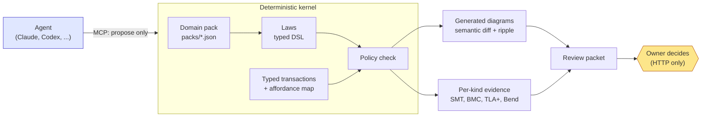
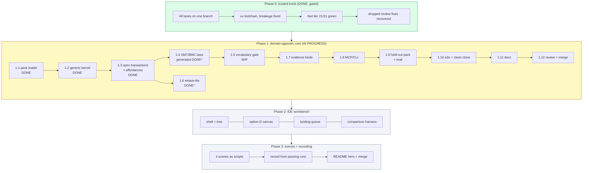

# Where we are (paused 2026-09-29)

Work is paused on purpose so the plan is saved and the repository is ready to continue. This page is the picture; [the tracker issue #30](https://github.com/45ck/eija-studio/issues/30) is the live checklist; [WBS.md](WBS.md) is the plan; [FUTURE-WORK.md](FUTURE-WORK.md) holds what we chose not to build yet.

**One branch holds everything:** `integrate/all` (draft [PR #29](https://github.com/45ck/eija-studio/pull/29)), 144 commits and about 1,170 files ahead of `main`. `main` is still the last-known-good version and is untouched. This branch is a working snapshot: Phase 0 is gated, Phase 1 is partly built and has **not** had a full gate run on the combined tree.

## What EIJA Studio is

A modern IDE-style workbench for **domain models and their language**, where agents propose changes, a deterministic kernel checks them, and the owner decides. The kernel never lets an agent approve or apply.

## Progress

`*` built and committed, but not yet reviewed or run through the full gate tier as part of the combined tree (issues #32 and #33).

| Phase | Item | State | Issue |
|---|---|---|---|
| 0 | Trusted trunk: uv, breakage fixes, all fast gates, dropped review fixes, registry | **done** | [#30](https://github.com/45ck/eija-studio/issues/30) |
| 1 | 1.1 pack loader, schema, `packs/excursion`, `packs/library-loan` | **done** (`9b9d9d2`) | |
| 1 | 1.2 generic kernel driven by the pack; typed law DSL | **done** (`711bf0f`) | |
| 1 | 1.3 open change vocabulary, affordance map, drag-refusal proof | **done** (`27f6567`, `736d0af`) | |
| 1 | 1.4 SMT laws generated from the pack; BMC via `evaluate_run` | built (`349917d`); equivalence gate to verify | [#32](https://github.com/45ck/eija-studio/issues/32) |
| 1 | 1.5 vocabulary fitness gate | **WIP checkpoint** (`725cc9b`) | [#31](https://github.com/45ck/eija-studio/issues/31) |
| 1 | 1.6 weave-lite index, rules, impact | built (`d6c6b3b`); review pending | [#33](https://github.com/45ck/eija-studio/issues/33) |
| 1 | 1.7 to 1.12 | not started | [#34](https://github.com/45ck/eija-studio/issues/34) to [#39](https://github.com/45ck/eija-studio/issues/39) |
| 2 | IDE workbench, canvas, landing queue, harness, HCI, pr-gif | not started | [#41](https://github.com/45ck/eija-studio/issues/41) to [#47](https://github.com/45ck/eija-studio/issues/47) |
| 3 | Four scenes, recording, README hero | not started | [#48](https://github.com/45ck/eija-studio/issues/48), [#49](https://github.com/45ck/eija-studio/issues/49) |
| later | Dogfooding, more proofs, more languages, deferred edge cases | parked | issues labelled `later` |
| owner | Restamp, API keys, publication, hook and OKF glance, standing policy | **yours** | issues labelled `owner-only` |

## What the repository contains

| Area | Files | What it is |
|---|---|---|
| `src/eija_studio` | 80 | The kernel: domain, application, adapters, interfaces (CLI, HTTP, MCP). Domain knowledge now comes from a pack. |
| `packs/` | 3 packs | `excursion` (the original domain), `library-loan` (structurally different), `default`. |
| `verification/` | 65 | Z3 SMT proofs, bounded model checking, TLA+/TLC, Bend 2 laws. |
| `quality/` | 77 | The gates (nox sessions), metrics, OKF knowledge-base tooling, HCI harness, mutation. |
| `graph/` | 71 | Weave design and reference oracles (the deterministic link graph). |
| `demos/` | 20 | Scenario registry, recorder, `pr-gif` tooling. |
| `design/`, `docs/` | 39, 173 | Design tokens, layouts, task flows; 55 ADRs; HCI research; this plan. |
| `okf/` | 601 | The knowledge base, deterministically linked to the code. |
| `tests/` | 143 | 1,569 tests passed on the last full run (152 skipped as NOT_RUN: Docker/Bend, browser, TLC jar). |

## What has been measured (and what has not)

**Measured** (on this machine): `nox -t fast` 21 of 21 sessions green; coverage 93.88 %; mutation baseline for the policy module 205 of 205 mutants killed; HCI 17 passed with 6 known gaps; the gate run is dominated by waiting (77 % of one two-hour agent run was tool time, mostly slow gates); pytest now runs on 4 xdist workers.

**Not yet measured:** `nox -t full` on the Phase 1 tree; the Z3 equivalence of generated vs hand-written laws; anything about generality on a held-out pack; any UI timing on the new workbench (it does not exist yet).

**Honest limits today:** the release fixture is not restamped, so the Studio shows `SOURCE_REVIEW_REQUIRED`; live providers are NOT_RUN except a claude/codex smoke; Bend and TLA+ proofs are still hand-written for the excursion domain only; the UI is still the old five-tab wizard.

## How to resume

1. Read [the tracker](https://github.com/45ck/eija-studio/issues/30) and the issues in the current milestone; start at **#31 (1.5)**.
2. `git worktree add C:\Dev\eija-wt\integrate integrate/all` (the only worktree you need), then `uv venv --python 3.12 .venv` and install the extras.
3. Run `nox -t fast` first to confirm the snapshot.
4. The workflow scripts that drive the agents are saved in [`workflows/`](workflows/): `phase1.js` (remaining Phase 1), `phase2.js` (Phases 2 and 3) and `mkissues.py`. They assume the worktree paths in their headers.
5. Rules of the road: one writer per worktree; commit and push after every step; `nox -t fast` per step and `nox -t full` once at a milestone; never restamp, never supply keys, never let an agent approve or apply.

**Cost note (for planning):** on the Claude Code plan the Phase 0 + Phase 1 push used about $50 and 13 weekly points per two to three hours of parallel agents. Phases 2 and 3 are expected to need a fresh weekly budget.
