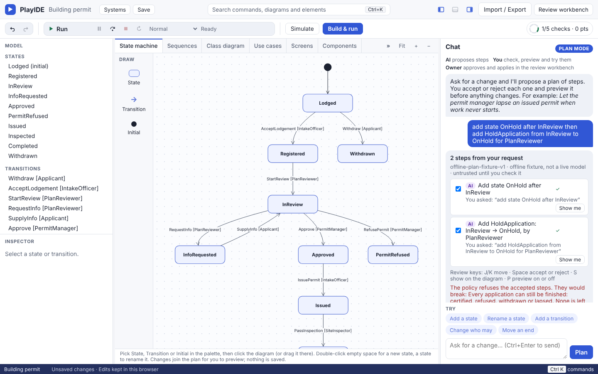

# Sector packs

Five packs model real systems from different sectors. Each is a template in PlayIDE (**Systems › New system › A template**, or `eija new "My clinic" --from specialist-referral`), and each can be opened directly:

```console
eija serve --pack packs/card-payment --open
```

Every pack has a state machine, roles with fixture users (an assigned one, an unassigned one and a revoked one), a data model (`data.json`), one designed screen per use case (`screens.json`), seven or eight scenarios (`scenarios.json`) and 11 to 14 laws. On each one the scenarios pass, the laws hold over every run the kernel allows, `eija build` passes conformance (1,135 to 2,216 cases), and Simulate runs. `tests/test_sector_packs.py` pins this.

| Pack | Sector | States / transitions / roles | The change the chat plans | The unsafe change the laws refuse |
|---|---|---|---|---|
| `specialist-referral` | Healthcare | 8 / 8 / 5 | Specialists reply with advice instead of an appointment | Patients book themselves (`patient-never-books`) |
| `card-payment` | Payments | 9 / 10 / 4 | Customers take back a refund request | Support agents issue refunds (`finance-approves-refunds`, `support-never-refunds`) |
| `parcel-delivery` | Logistics | 9 / 10 / 5 | Drivers leave a parcel in a safe place | The hub clears customs (`customs-clears`, `hub-never-clears`) |
| `saas-subscription` | SaaS | 7 / 9 / 4 | Owners downgrade to a free plan | Owners lift their own suspension (`success-reactivates`) |
| `building-permit` | Government | 10 / 10 / 5 | A permit lapses when work never starts | Fast-track approval without a plan review (`approval-after-review`, `approved-only-via-approve`) |

What each sector shows that the older packs don't:

- **Specialist referral.** A loop back (a missed appointment returns the referral to be rebooked), a rota assignment guard on clinical triage, and a law that nobody is seen on an untriaged referral.
- **Card payment.** A system actor (the gateway) holding most transitions, four final states, and money authority kept with finance: support can turn a refund down but never issue one.
- **Parcel delivery.** A customs hold that loops back to the hub, a retry loop after a missed delivery, and two path laws (nothing delivered without a hub scan, nothing returned without a failed attempt).
- **SaaS subscription.** Dunning (past due, suspended, reactivated), automated suspension as a protected authority, and a trust-and-safety freeze the owner can never touch.
- **Building permit.** A request-for-information loop with the applicant, a delegated decision maker for the area, three path laws that chain review, approval, issue, inspection and certificate, and a law that no application gets stuck (`no-application-stuck`, ADR-0221): from anywhere an application can get to, it can still be certified, refused, withdrawn or lapsed. Type `add state OnHold after InReview then add HoldApplication from InReview to OnHold for PlanReviewer` in the chat and the policy refuses the plan with `APPLICATION_STUCK`, because nothing takes an application off hold.

## Screens

Captured on 9 October 2026 from the real `/play` page (Linux, Chromium) while the packs were written; PlayIDE has been polished since, so details differ from today's screens. For each pack: the state machine, the use case diagram, a scenario as a sequence diagram, a Simulate run, and a previewed plan.

| Pack | Screens |
|---|---|
| Specialist referral | [states](demos/assets/sector-packs-20261009/specialist-referral-states.png) · [usecases](demos/assets/sector-packs-20261009/specialist-referral-usecases.png) · [sequences](demos/assets/sector-packs-20261009/specialist-referral-sequences.png) · [simulate](demos/assets/sector-packs-20261009/specialist-referral-simulate.png) · [preview](demos/assets/sector-packs-20261009/specialist-referral-preview.png) |
| Card payment | [states](demos/assets/sector-packs-20261009/card-payment-states.png) · [usecases](demos/assets/sector-packs-20261009/card-payment-usecases.png) · [sequences](demos/assets/sector-packs-20261009/card-payment-sequences.png) · [simulate](demos/assets/sector-packs-20261009/card-payment-simulate.png) · [preview](demos/assets/sector-packs-20261009/card-payment-preview.png) |
| Parcel delivery | [states](demos/assets/sector-packs-20261009/parcel-delivery-states.png) · [usecases](demos/assets/sector-packs-20261009/parcel-delivery-usecases.png) · [sequences](demos/assets/sector-packs-20261009/parcel-delivery-sequences.png) · [simulate](demos/assets/sector-packs-20261009/parcel-delivery-simulate.png) · [preview](demos/assets/sector-packs-20261009/parcel-delivery-preview.png) |
| SaaS subscription | [states](demos/assets/sector-packs-20261009/saas-subscription-states.png) · [usecases](demos/assets/sector-packs-20261009/saas-subscription-usecases.png) · [sequences](demos/assets/sector-packs-20261009/saas-subscription-sequences.png) · [simulate](demos/assets/sector-packs-20261009/saas-subscription-simulate.png) · [preview](demos/assets/sector-packs-20261009/saas-subscription-preview.png) |
| Building permit | [states](demos/assets/sector-packs-20261009/building-permit-states.png) · [usecases](demos/assets/sector-packs-20261009/building-permit-usecases.png) · [sequences](demos/assets/sector-packs-20261009/building-permit-sequences.png) · [simulate](demos/assets/sector-packs-20261009/building-permit-simulate.png) · [preview](demos/assets/sector-packs-20261009/building-permit-preview.png) |

The building permit's law that every application can still be finished, refusing a plan that adds an on-hold state with no way out:



## What the model cannot say yet

Writing these packs as a real team would turned up the following gaps. Each pack also lists its own in `fixtures.proposals.unknowns`.

| Gap | Where it bites | Issue |
|---|---|---|
| An action labels only one transition | Withdraw, cancel or "lost" from several states | [#148](https://github.com/45ck/eija-studio/issues/148) |
| No separation of duties between actors | Maker-checker refunds, reviewer vs decision maker | [#149](https://github.com/45ck/eija-studio/issues/149) |
| One notification per action | A decision goes to the applicant and the objectors. The runtime and `eija build` already cope; the Verify receipt check (a trusted kernel file) admits one outbox row per step, so it waits on the source review in #80 | [#150](https://github.com/45ck/eija-studio/issues/150) |
| Law kinds: bounded repetition, conditional paths | Three delivery attempts; customs only for international parcels | [#151](https://github.com/45ck/eija-studio/issues/151) |
| Value guards, timers, composite states | Refund ≤ captured; trial and statutory deadlines; billing and abuse as independent regions | [#93](https://github.com/45ck/eija-studio/issues/93) |
| Who may start a record | Only a GP creates a referral | [#142](https://github.com/45ck/eija-studio/issues/142) |

Time-driven steps (a trial ending, a dispute arriving) are given to a system role (`BillingSystem`, `Gateway`) until the kernel has timers. That is the closest honest approximation, and it is why those roles appear on the use case diagrams. Both are declared as external systems (role kind `system`, ADR-0210). The card payment pack's `people-approve-refunds` law says only a person (kind `human`) approves a refund, so a future agent or system role can't take that step.

Some state and role names were made more specific (`FundsCaptured`, `PermitRefused`, `WorkspaceOwner`, `Vetted`) while the vocabulary gate treated every pack word as a whole-word search in generic code. The gate now reads a plain English word (`Active`, `Owner`) only where it names something in Python code (an identifier or a string literal). Compound names such as `FundsCaptured` are still checked everywhere ([#154](https://github.com/45ck/eija-studio/issues/154)).

The offline chat proposer plans the supported meaning that a request matches. When a request matches only an unsafe meaning it says it could not read it ([#152](https://github.com/45ck/eija-studio/issues/152)); type the step instead, for example `change who may ApproveRefund to SupportRep`, to see the policy refuse it and name the law.
