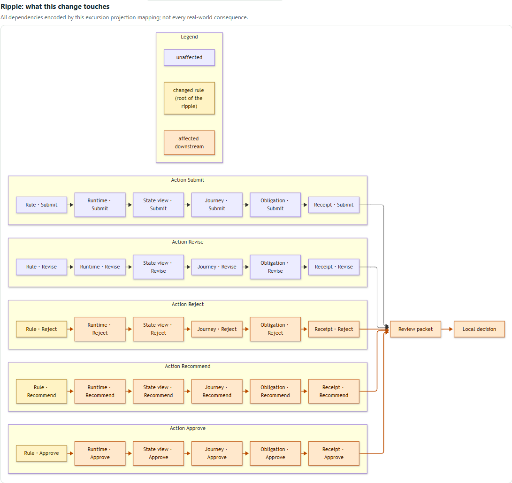

# Visual model: UML generated from the executable model

The point of this lane: **see** what a change does, especially an agent's change, and how it ripples into the other models, with a guarantee that what you see is what the code does. Every diagram is generated from the typed `Workflow` (and `domain.impact.model_impact`) that the runtime executes ([ADR-0019](adr/0019-diagrams-generated-from-executable-model.md), [ADR-0023](adr/0023-generated-uml-and-visual-diff.md)). Nothing is hand-drawn or editable, so a picture cannot promise something the kernel refuses.




## What is generated

| View | Derived from | Formats |
|---|---|---|
| `state` | `Workflow` states and transitions (role, `assigned` guard in the label) | Mermaid, PlantUML, DOT |
| `diff` | baseline vs candidate: added, removed and changed transitions; added, removed and changed states; legend | Mermaid, PlantUML, DOT |
| `impact` | `model_impact`: changed rules, then runtime, state view, journey, obligation, receipt, review packet, local decision; affected nodes highlighted | Mermaid, PlantUML, DOT |
| `sequence` | the commit protocol of one action, from its guards and required effects, in the order `application.runtime.execute` runs them | Mermaid, PlantUML |
| `class` | the frozen Pydantic contracts, introspected (fields, multiplicities, enumerations) | Mermaid, PlantUML |
| `journey` | one lane per role, only the transitions that role may perform | Mermaid, PlantUML, DOT |

Status colours: green added, red dashed removed, amber changed (in the ripple: amber is the changed rule, orange is affected downstream). Mermaid cannot colour state-diagram edges, so edge labels also start with `+`, `-` or `~`. A state is `changed` when one of its incident edges differs, which makes the neighbourhood of an edit visible.

Generated pages you can read on GitHub: [docs/diagrams/](diagrams/README.md).

## Use it

```bash
# text on stdout (UTF-8, LF); pipe it into any renderer
eija render CASE_ID --view diff --format mermaid
eija render --model examples/excursion-candidate.json --view impact --format dot
eija render --model examples/excursion-candidate.json --view sequence --action Recommend --format plantuml
# a self-contained page (vendored Mermaid inline, no network); --view all draws every view
eija render CASE_ID --view all --format html --out reports/case.html
```

`--model FILE` draws a workflow JSON file as the candidate against the shipped baseline; `CASE_ID` uses the case's own baseline and candidate (`--workspace` selects the workspace). Unsupported combinations (`sequence` or `class` as DOT) return a stable error code, exit status 2.

In the Studio, open a case and choose **05 / Visual**: before, after and diff side by side, the ripple, the commit protocol for the selected action, journeys and the contracts. The header line shows the workflow hashes the diagrams were generated from and whether the candidate hash matches the review packet's evidence subject. The same text is available from `GET /api/cases/{id}/diagrams?format=mermaid|plantuml|dot` (same session, host and origin guards as every other endpoint).

## Why the picture matches the code

* **Pure generators.** Builders take domain values only; the tests forbid adapter, HTTP and vendor imports in `application/`.
* **Deterministic.** Reordering states, transitions, guards and effects of the same workflow leaves every output identical (parametrised over all views and formats).
* **Golden files.** `tests/golden/` pins each view and format; regenerate deliberately with `EIJA_UPDATE_GOLDEN=1 python -m pytest tests/test_diagrams.py` and review the diff.
* **Drift gate.** `docs/diagrams/*.md` must equal a fresh render. `python scripts/generate_diagrams.py --check` (nox session `diagrams_drift`, in `fast` and `full`) fails on a differing, missing or unexpected file; `--write` regenerates.
* **Conformance to the runtime.** A test recovers the edges from the emitted state diagram with an independent parser and compares them with the workflow's transitions. Another triggers each guard failure through the real runtime and compares the codes with those drawn in the sequence; a guard the transition does not have (`actor_assigned` on Approve) is not drawn and never raised.
* **Introspection.** The class diagram covers every field of every listed contract; adding a field to a model changes the diagram with no generator edit.
* **Provenance.** Each diagram begins with `eija: ... workflow excursion semantic_hash=...`.

## Rendering, the CSP and the vendored Mermaid

Mermaid 12.0.0 is vendored unmodified from the npm package (`src/eija_studio/resources/web/vendor/`, MIT licence kept, sha256 and npm integrity in `mermaid.VENDOR.json`; a test re-checks the hashes). No CDN is used at runtime. Mermaid needs inline styles, so it runs in a sandboxed frame with its own narrow policy and the Studio page keeps `style-src 'self'`; see [ADR-0024](adr/0024-sandboxed-frame-for-mermaid-rendering.md) and [SECURITY_AND_TRUST.md](SECURITY_AND_TRUST.md).

## Gates and evidence

| Gate | Command | Tier |
|---|---|---|
| Unit, golden, determinism, runtime conformance, HTTP/CSP/CLI tests | `python -m pytest -q` | fast, full |
| Docs drift | `nox -s diagrams_drift` | fast, full |
| Renderers accept every emitted diagram (Mermaid in Chrome, PlantUML `-syntax`, pydot/`dot`) | `nox -s diagrams_syntax` (`EIJA_PLANTUML_JAR=path/to/plantuml.jar`) | release |
| Studio Visual view in Chrome, CSP check, refresh `docs/assets/*.png` | `nox -s visual_screenshots` | release |

The release gates need Chrome, and PlantUML needs Java and the jar (`pip install -e ".[visual]"` adds Playwright and pydot). A missing prerequisite prints `NOT_RUN` for that renderer, never `PASS`. Graphviz `dot` is optional: without it DOT is checked by grammar only and layout is not exercised.

## Limits

* A diagram is a review aid. It does not show the change is correct, safe or understood; the evidence packet and the local owner's decision remain separate.
* The ripple shows the dependency mapping encoded in `domain.impact`, not every real-world consequence (the `envelope` note is repeated in the diagram).
* The `sequence` diagram is the commit protocol of one action in the modelled runtime; it is not a trace of a real execution.
* Layout is Mermaid's. Large models will need a different view before they need a different generator.
* DDD stereotypes on the class diagram are a curated vocabulary from `docs/architecture/ARCHITECTURE.md`, not derived.
* `scripts/browser_component_smoke.py` still needs the owner-stamped release fixture to reach its verification step, so any implementation change makes it stop there until a maintainer restamps; that is expected and not done in this lane.
