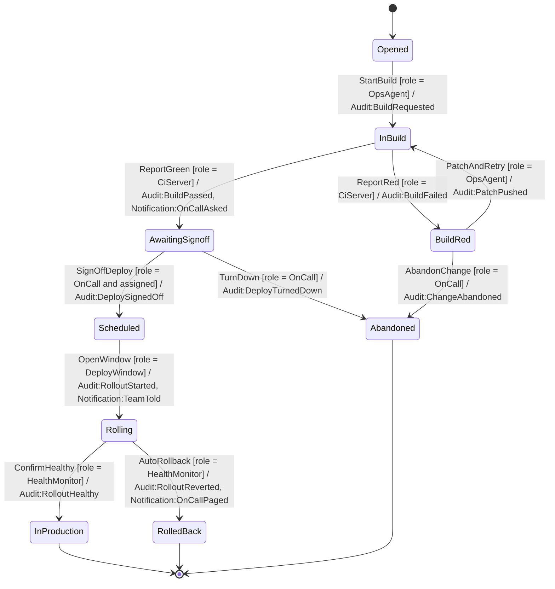
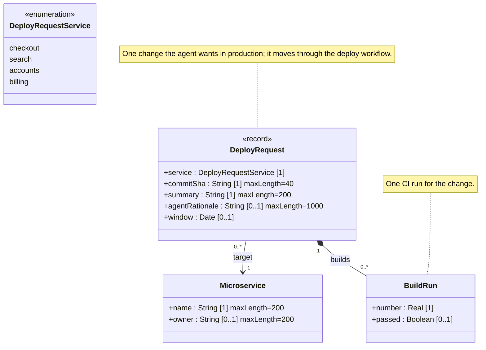

<!-- GENERATED by PlayIDE (eija.uml-interop.v1) from pack ai-ops 1.0.0, model 9d0596a78d6e7dde317a801346277682d0ec0b4670bba0fe6d0c8207a65721f5. -->
# AI ops deploys

## State machine

## Class model

