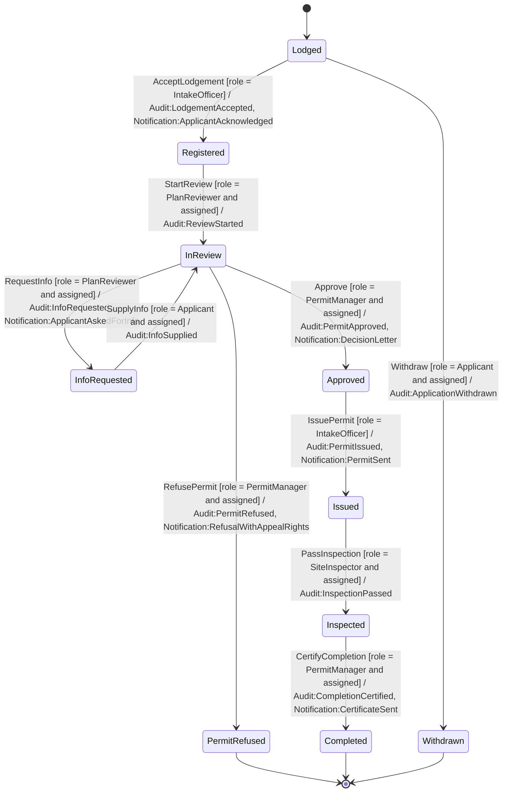
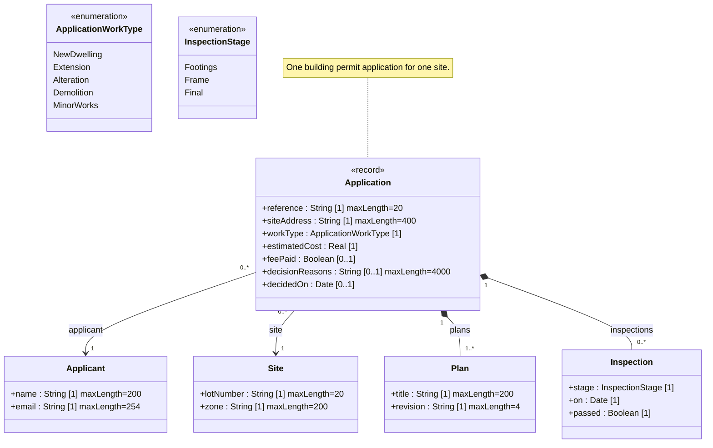

<!-- GENERATED by PlayIDE (eija.uml-interop.v1) from pack building-permit 1.0.0, model af872051f9e54a3a92c1fa27405a75c2b797ff9a48c41363490b4623c11e4b4a. -->
# Building permit

## State machine

## Class model

