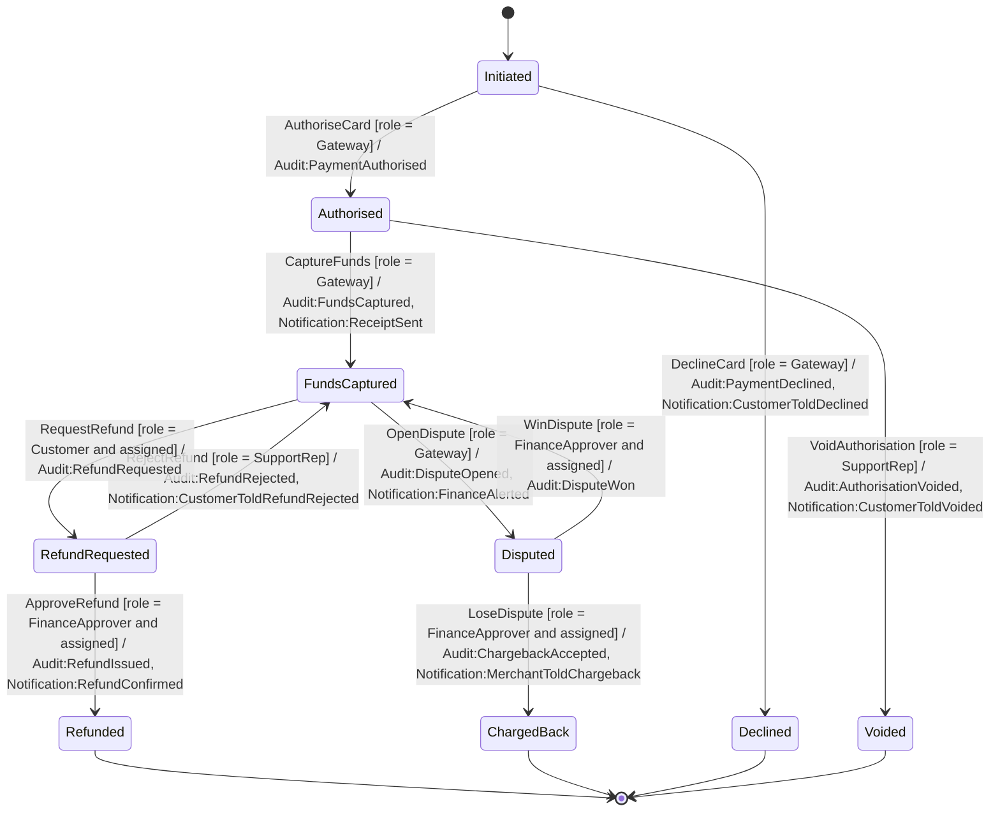
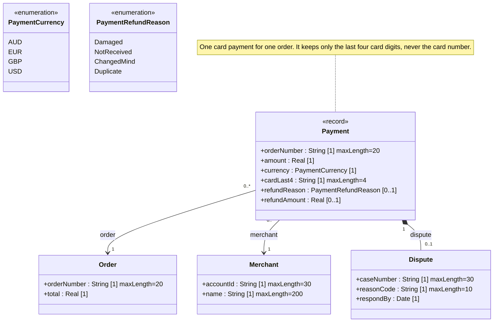

<!-- GENERATED by PlayIDE (eija.uml-interop.v1) from pack card-payment 1.0.0, model f9f5dd39c0773ce3f3226397afc42f0ef1dc6a75e44fe532332d718925d24d2f. -->
# Card payment and refund

## State machine

## Class model

