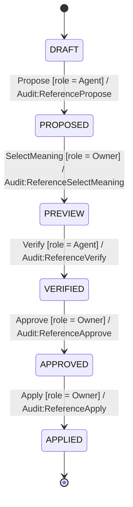

<!-- GENERATED by PlayIDE (eija.uml-interop.v1) from pack eija-review-slice 0.1.0, model c99a2396d0064ebb12624e2ecea732088762b82c0ffe31061f262e9eb4b60876. -->
# EIJA review reference journey

## State machine

