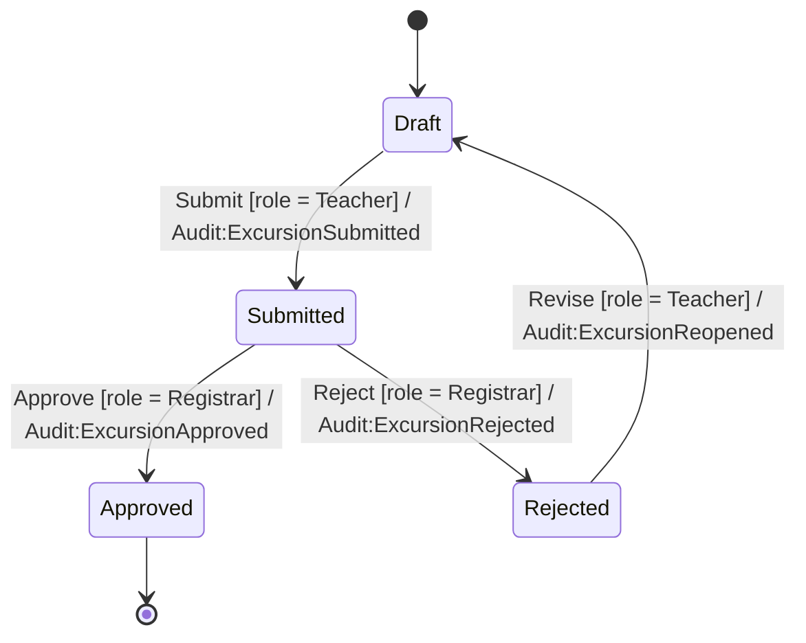
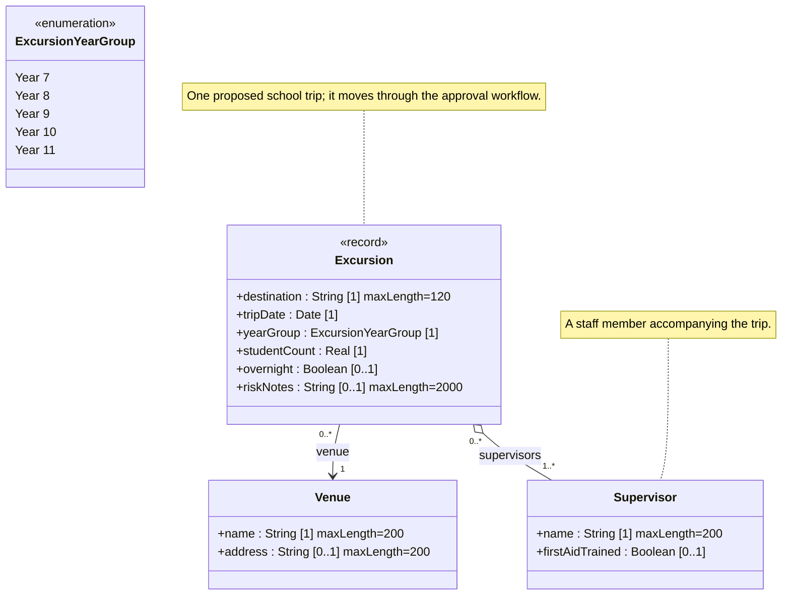

<!-- GENERATED by PlayIDE (eija.uml-interop.v1) from pack excursion 1.0.0, model 5d3ef3a19c31d956a185b9c5ba4b1b79e651d0356e162436c5c67054d2ad4cdf. -->
# School excursion approval

## State machine

## Class model

