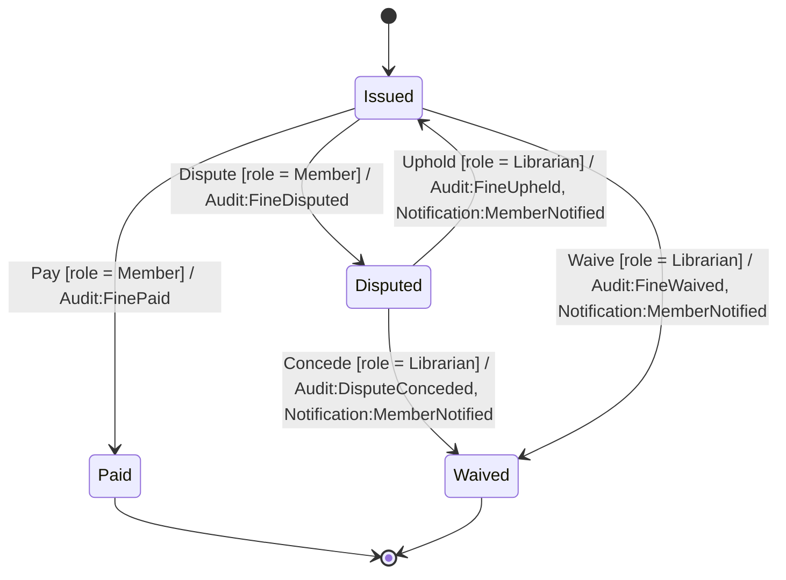
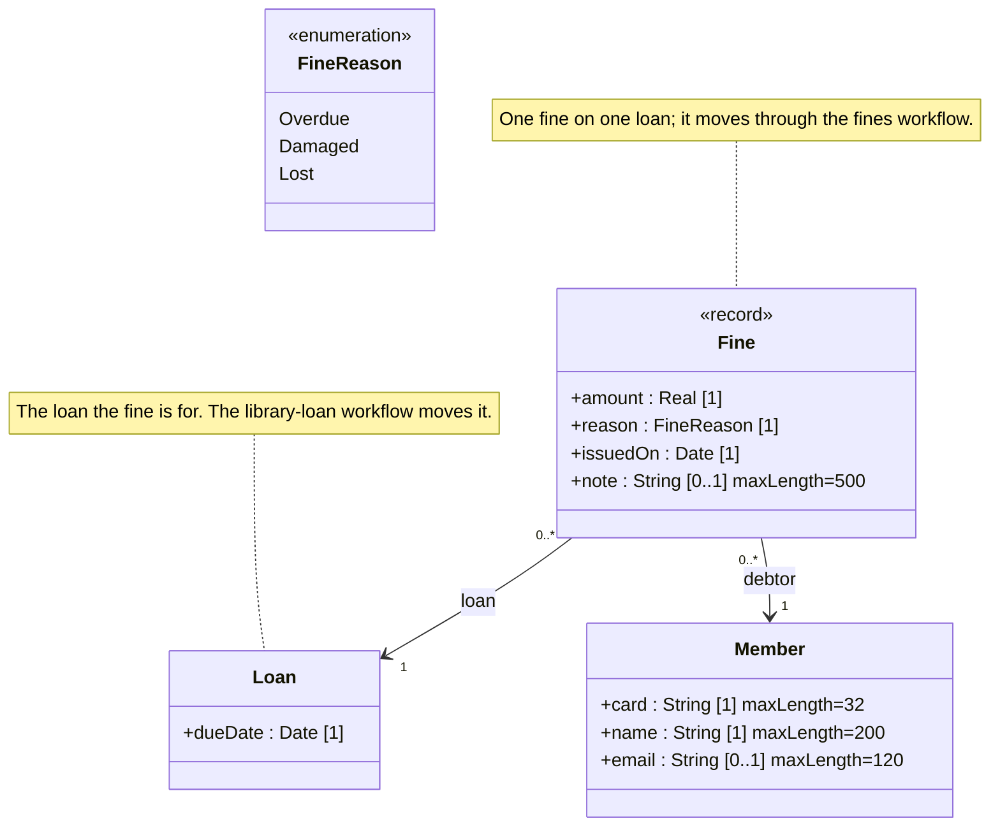

<!-- GENERATED by PlayIDE (eija.uml-interop.v1) from pack library-fines 0.1.0, model 4502254e3e4881461554d7a067242623dbe74c0ded3cceaad179b75722537a6d. -->
# Library fines

## State machine

## Class model

