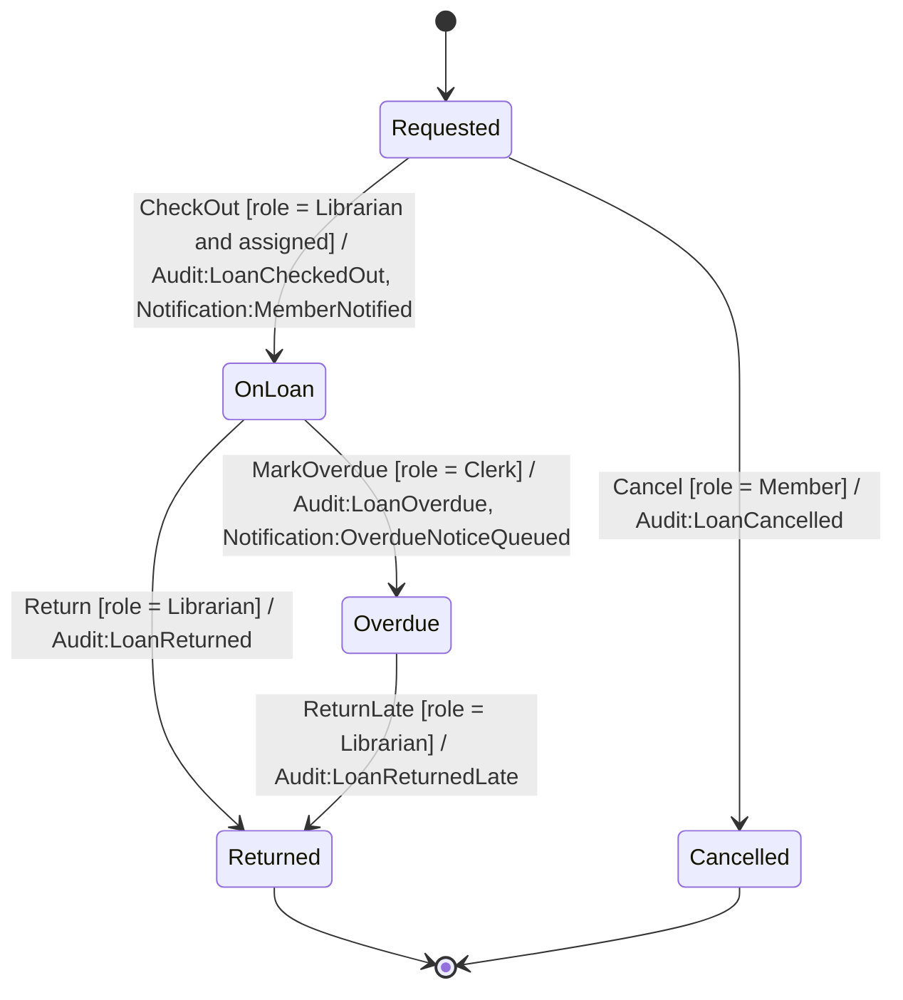
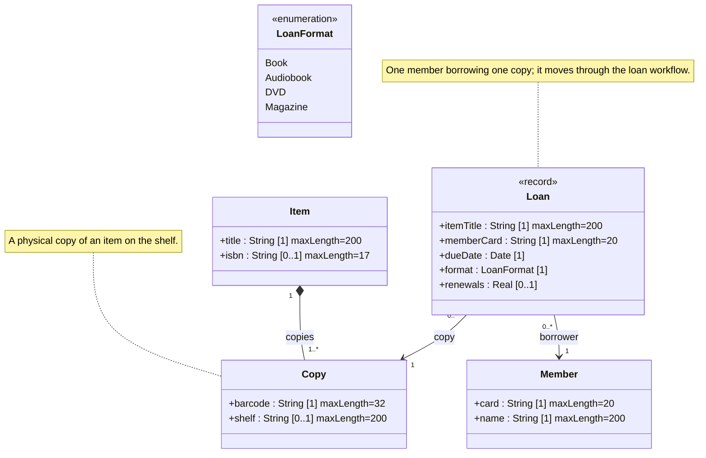

<!-- GENERATED by PlayIDE (eija.uml-interop.v1) from pack library-loan 1.0.0, model 3d7336da8fcbbef8c91c916f3740826fdf2393d6be4e82219cf009413477ffa8. -->
# Library loan

## State machine

## Class model

