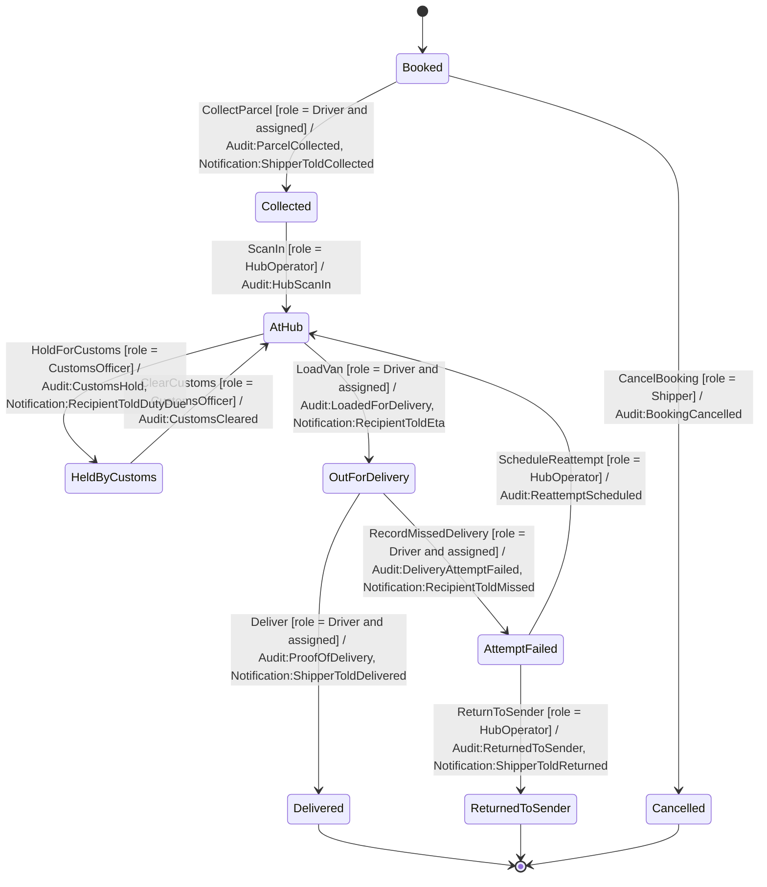
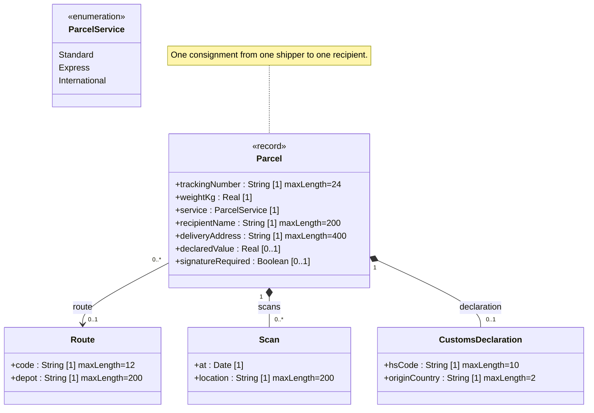

<!-- GENERATED by PlayIDE (eija.uml-interop.v1) from pack parcel-delivery 1.0.0, model ddbf6170629aa6ea6c1a76c04c351a63ab6c8aed70c73403a35d565e13a2cbd9. -->
# Parcel delivery

## State machine

## Class model

