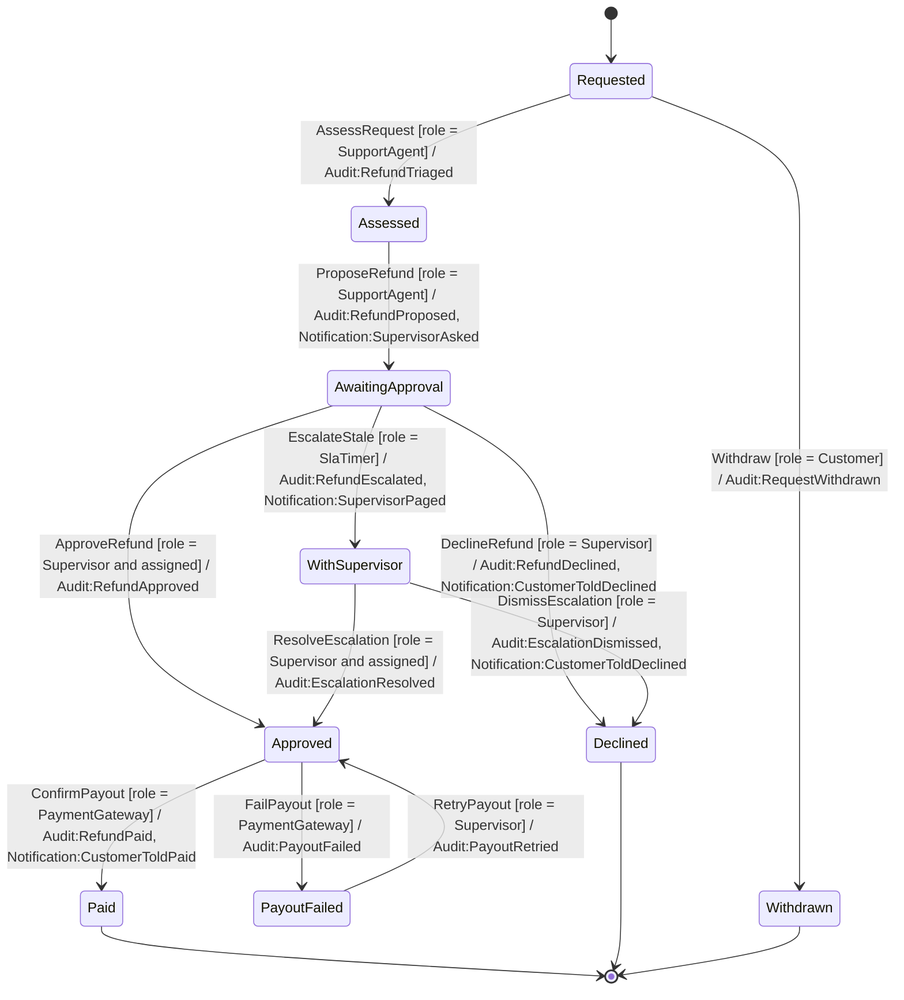

<!-- GENERATED by PlayIDE (eija.uml-interop.v1) from pack refund-desk 1.0.0, model 7be4c5c4a3a1ed7800a15fd2d82492c2f372381138fb39b14ea452b05ebf178b. -->
# Refund desk

## State machine

## Class model

```mermaid
classDiagram
    class Refund {
        <<record>>
        +orderNumber : String [1] maxLength=20
        +reason : RefundReason [1]
        +amount : Real [1]
        +agentNote : String [0..1] maxLength=500
        +decidedOn : Date [0..1]
    }
    class Customer {
        +email : String [1] maxLength=120
        +name : String [1] maxLength=200
    }
    class Order {
        +number : String [1] maxLength=20
        +total : Real [1]
    }
    class Payout {
        +reference : String [0..1] maxLength=40
        +settled : Boolean [0..1]
    }
    class RefundReason {
        <<enumeration>>
        Damaged
        Late
        Wrong item
        Changed mind
    }
    Refund "0..*" --> "1" Order : order
    Order "0..*" --> "1" Customer : customer
    Refund "1" *-- "0..*" Payout : payouts
    note for Refund "One refund request#59; it moves through the refund workflow."
    note for Payout "What the payment system reports back for one refund."
```

