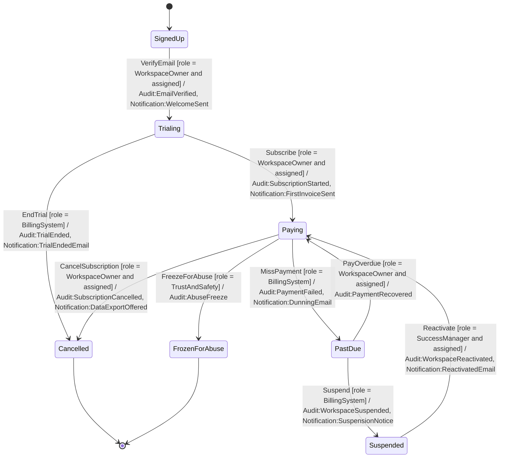
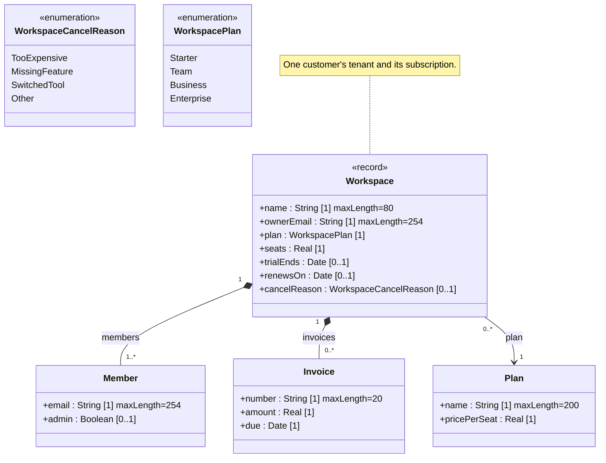

<!-- GENERATED by PlayIDE (eija.uml-interop.v1) from pack saas-subscription 1.0.0, model f6efee78933be46d69a4508eddb6048c2e832c0e5a4bb2864bf961819e76eb11. -->
# SaaS workspace subscription

## State machine

## Class model

