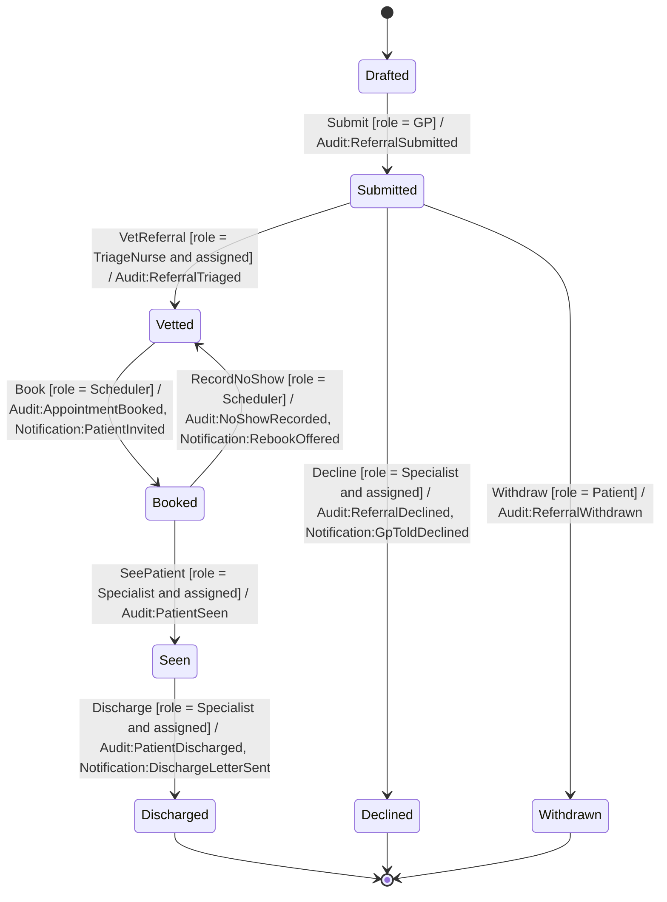
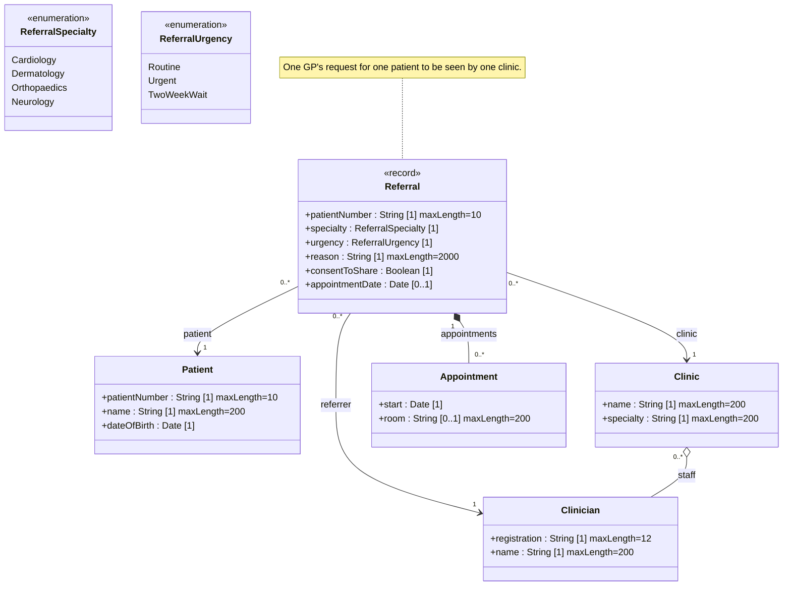

<!-- GENERATED by PlayIDE (eija.uml-interop.v1) from pack specialist-referral 1.0.0, model c5a8c728038ab411e9a189e5197a3f7dd7a725e39106998879e1df5f9803219d. -->
# Specialist referral

## State machine

## Class model

